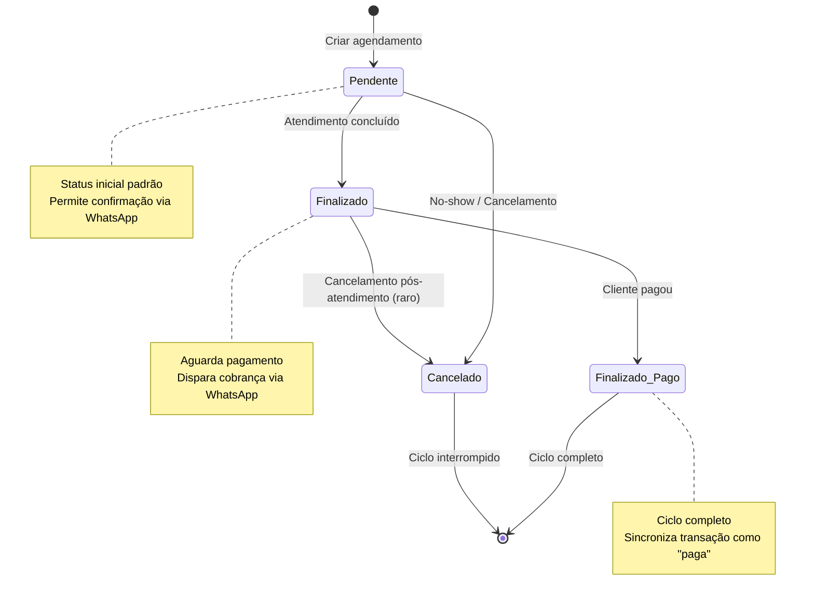

# Análise Profunda do Add-on AGENDA - DPS by PRObst

**Data da análise**: 2025-12-08  
**Autor**: Análise técnica automatizada  
**Versão do add-on analisada**: 1.0.1  
**Versão do documento**: 1.0.0

---

## Sumário Executivo

O add-on **AGENDA** é o coração operacional do sistema de Banho e Tosa no DPS by PRObst. Ele gerencia todos os atendimentos do dia, permitindo à equipe visualizar, confirmar, acompanhar e finalizar serviços de forma ágil e intuitiva. Este documento apresenta uma análise profunda de todos os aspectos técnicos, operacionais e de usabilidade do add-on, além de propor um plano de implementação em fases para melhorias prioritárias.

### Principais Funcionalidades Atuais
- ✅ Visualização de agenda diária, semanal, mensal (calendário) e completa
- ✅ Atualização AJAX de status de atendimentos (pendente, finalizado, pago, cancelado)
- ✅ Filtros por cliente, status e serviço
- ✅ Visualização de detalhes de serviços via modal
- ✅ Exportação CSV da agenda
- ✅ Agrupamento por cliente
- ✅ Indicação de TaxiDog e link para GPS
- ✅ Links diretos para WhatsApp (confirmação e cobrança)
- ✅ Dashboard de KPIs (resumo do dia, taxa de cancelamento, média diária)
- ✅ Ações em lote (atualização de múltiplos agendamentos)
- ✅ Reagendamento rápido
- ✅ Histórico de alterações por agendamento

### Áreas que Necessitam Melhorias
- ⚠️ Integração com Mercado Pago existe mas é gerenciada por outro add-on (Payment)
- ⚠️ Confirmação de atendimentos via WhatsApp, mas sem registro estruturado de confirmações
- ⚠️ Layout denso com muitas informações simultâneas
- ⚠️ Alguns fluxos de status pouco claros (ex.: diferença entre "finalizado" e "finalizado_pago")
- ⚠️ Falta de notificações automáticas para a equipe
- ⚠️ Performance pode degradar com muitos agendamentos simultâneos

---

## 1. ENTENDIMENTO GERAL DO ADD-ON AGENDA

### 1.1 Objetivo e Propósito

O add-on AGENDA é responsável por:

1. **Visualização centralizada** de todos os atendimentos agendados
2. **Gestão operacional** do dia a dia (confirmações, status, finalizações)
3. **Acompanhamento logístico** (TaxiDog, GPS, localização de clientes)
4. **Integração financeira** (cobrança após atendimento, status de pagamento)
5. **Reporting básico** (KPIs, exportação, métricas operacionais)

**Público-alvo principal**: Equipe interna (recepcionistas, administradores, tosadores)  
**Permissões**: Apenas usuários com capability `manage_options` (administradores)

### 1.2 Arquitetura Geral

```
┌─────────────────────────────────────────────────────────────┐
│                   AGENDA ADD-ON                              │
├─────────────────────────────────────────────────────────────┤
│                                                              │
│  [Shortcode: dps_agenda_page]                               │
│          │                                                   │
│          ├─ Renderização (trait DPS_Agenda_Renderer)        │
│          ├─ Consultas (trait DPS_Agenda_Query)              │
│          └─ AJAX Handlers                                   │
│                                                              │
│  Frontend Assets:                                            │
│  ├─ CSS: agenda-addon.css (1481 linhas)                     │
│  ├─ JS: agenda-addon.js (420 linhas)                        │
│  └─ JS: services-modal.js                                   │
│                                                              │
│  Integrações:                                                │
│  ├─ Finance Add-on (sincronização de status → transações)   │
│  ├─ Payment Add-on (geração de links Mercado Pago)          │
│  ├─ Services Add-on (cálculo de preços por serviço)         │
│  └─ Communications Add-on (envio de WhatsApp)               │
│                                                              │
└─────────────────────────────────────────────────────────────┘
```

### 1.3 Fluxo Geral de Uso pela Equipe

#### Manhã (antes dos atendimentos)
1. Recepcionista acessa página "Agenda de Atendimentos"
2. Visualiza dashboard de KPIs do dia
3. Revisa lista de agendamentos pendentes
4. **Confirma atendimentos** via WhatsApp (link direto na interface)
5. Identifica atendimentos com TaxiDog para coordenação

#### Durante o dia (operação)
1. Cliente chega → recepcionista atualiza status para "em andamento" (se implementado)
2. Atendimento concluído → tosador ou recepcionista marca como "Finalizado"
3. Se pagamento à vista → marca como "Finalizado e Pago"
4. Se pagamento posterior → deixa como "Finalizado" e envia cobrança via WhatsApp

#### Final do dia (fechamento)
1. Revisa agendamentos não finalizados
2. Marca cancelamentos (no-shows)
3. Exporta agenda do dia para Excel/CSV
4. Confere KPIs (taxa de conclusão, cancelamentos, faturamento)

### 1.4 Tecnologias e Padrões

**Backend**:
- PHP 7.4+
- WordPress 6.0+
- Traits para organização de código (Renderer, Query)
- AJAX com nonces para segurança
- Versionamento otimista de agendamentos (controle de conflitos)

**Frontend**:
- jQuery para manipulação DOM e AJAX
- CSS puro (sem frameworks, estilo minimalista/clean)
- Modal customizado para exibição de serviços
- Exportação client-side (CSV via Blob API)

**Integrações**:
- Hooks do WordPress (`do_action`, `add_filter`)
- Meta fields dos CPTs do núcleo (`dps_agendamento`, `dps_cliente`, `dps_pet`)
- APIs de outros add-ons (Finance, Payment, Services)


---

## 2. MODELO DE DADOS E ESTADOS DE ATENDIMENTO

### 2.1 Entidades Principais

#### 2.1.1 Atendimentos (CPT: `dps_agendamento`)

**Metadados principais**:
```php
appointment_date          // Y-m-d (ex: "2024-12-08")
appointment_time          // H:i (ex: "14:30")
appointment_client_id     // ID do cliente (CPT dps_cliente)
appointment_pet_id        // ID do pet (CPT dps_pet)
appointment_services      // Array de IDs de serviços
appointment_service_prices // Array associativo [service_id => preço]
appointment_status        // pendente|finalizado|finalizado_pago|cancelado
appointment_taxidog       // "1" se requer TaxiDog, vazio caso contrário
appointment_total_value   // Valor total em centavos (int)
subscription_id           // ID da assinatura (se agendamento recorrente)
_dps_appointment_version  // Versionamento otimista (int, incrementa a cada save)
_dps_appointment_history  // Array com histórico de alterações
```

**Observações**:
- Versionamento otimista previne conflitos quando múltiplos usuários editam o mesmo agendamento
- Histórico registra quem alterou, quando e o quê (status_change, rescheduled, etc.)
- Suporta agendamentos multi-pet (via Finance Add-on agrupa pets do mesmo cliente)

#### 2.1.2 Clientes (CPT: `dps_cliente`)

**Metadados relevantes para a Agenda**:
```php
client_phone    // Telefone (formatado para WhatsApp)
client_address  // Endereço em texto
client_lat      // Latitude (para GPS)
client_lng      // Longitude (para GPS)
```

#### 2.1.3 Pets (CPT: `dps_pet`)

**Metadados relevantes para a Agenda**:
```php
pet_aggressive  // Flag de agressividade (exibe ⚠️ na interface)
pet_size        // Porte do pet (usado para cálculo de preço)
```

#### 2.1.4 Serviços (CPT: `dps_service`)

**Metadados**:
```php
service_price         // Preço base em centavos
service_price_small   // Preço para porte pequeno
service_price_medium  // Preço para porte médio
service_price_large   // Preço para porte grande
```

### 2.2 Status de Atendimento

#### 2.2.1 Status Existentes

| Status | Constante | Cor | Ícone | Descrição |
|--------|-----------|-----|-------|-----------|
| **Pendente** | `STATUS_PENDING` | `#f59e0b` (amarelo) | ⏳ | Agendamento criado, aguardando atendimento |
| **Finalizado** | `STATUS_FINISHED` | `#0ea5e9` (azul) | ✓ | Atendimento concluído, pagamento pendente |
| **Finalizado e Pago** | `STATUS_PAID` | `#22c55e` (verde) | 💰 | Atendimento concluído E pago |
| **Cancelado** | `STATUS_CANCELED` | `#ef4444` (vermelho) | ❌ | No-show ou cancelamento |

**Definição no código**:
```php
// Linha 98-101 de desi-pet-shower-agenda-addon.php
const STATUS_PENDING = 'pendente';
const STATUS_FINISHED = 'finalizado';
const STATUS_PAID = 'finalizado_pago';
const STATUS_CANCELED = 'cancelado';
```

#### 2.2.2 Fluxo Ideal de Transição de Estados



#### 2.2.3 Análise Crítica: Problemas e Inconsistências

**Problema 1: Falta estado "Confirmado"**
- Atualmente não há diferença entre "agendamento criado" e "agendamento confirmado pelo cliente"
- A confirmação é feita via WhatsApp mas não é registrada no sistema
- **Impacto**: Dificulta saber quais clientes confirmaram presença

**Problema 2: Falta estado "Em Andamento"**
- Não há como marcar que o atendimento está em execução
- Pula direto de "Pendente" para "Finalizado"
- **Impacto**: Dificulta controle em tempo real (quem está sendo atendido agora)

**Problema 3: Ambiguidade entre "Finalizado" e "Finalizado e Pago"**
- Para agendamentos de assinatura, não deveria existir "Finalizado e Pago" (linha 1016-1022)
- Lógica mistura status de atendimento com status financeiro
- **Impacto**: Confusão conceitual, códigos condicionais espalhados

**Problema 4: Status "Cancelado" sem granularidade**
- Não diferencia "cancelado pelo cliente" de "no-show"
- Não registra motivo do cancelamento
- **Impacto**: Perda de informação valiosa para analytics

### 2.3 Proposta de Melhoria: Novos Estados

#### 2.3.1 Estados Propostos (Opcional, para Fase 4)

```
1. agendado           → Status inicial (criado no sistema)
2. confirmado         → Cliente confirmou presença via WhatsApp
3. em_andamento       → Pet sendo atendido no momento
4. finalizado         → Atendimento concluído (status operacional)
5. cancelado_cliente  → Cliente cancelou com antecedência
6. cancelado_noshow   → No-show (cliente não compareceu)

Estados financeiros (gerenciados por Finance Add-on):
- pagamento_pendente
- pagamento_pago
- pagamento_parcial
```

**Benefícios**:
- ✅ Separação clara entre status operacional e status financeiro
- ✅ Rastreamento de confirmações
- ✅ Visibilidade de atendimentos em execução
- ✅ Métricas mais precisas (taxa de no-show vs. taxa de cancelamento)

#### 2.3.2 State Machine Proposta (Completa)

```
[Criado] → [Confirmado] → [Em Andamento] → [Finalizado]
   ↓            ↓              ↓               ↓
   └─→ [Cancelado Cliente] ←──┘               └→ [Arquivado]
        [No-Show] ←─────────────────────────────┘
```

**Nota**: Esta mudança requer refatoração significativa e deve ser implementada apenas após validação com a equipe.


---

## 3. ANÁLISE DE CÓDIGO E ARQUITETURA

### 3.1 Qualidade e Organização do Código

#### 3.1.1 Estrutura de Arquivos

```
desi-pet-shower-agenda_addon/
├── desi-pet-shower-agenda-addon.php  (2829 linhas) ⚠️ MUITO GRANDE
├── includes/
│   ├── trait-dps-agenda-renderer.php (métodos de renderização)
│   └── trait-dps-agenda-query.php    (métodos de consulta)
├── assets/
│   ├── css/
│   │   └── agenda-addon.css          (1481 linhas) ✅ BEM ORGANIZADO
│   └── js/
│       ├── agenda-addon.js           (420 linhas) ✅ MODULAR
│       └── services-modal.js         (modal customizado)
├── README.md                          (bem documentado)
└── uninstall.php                      (cleanup na desinstalação)
```

**Avaliação**:
- ✅ **BOM**: Uso de traits para separar responsabilidades (Renderer, Query)
- ✅ **BOM**: Assets externalizados (CSS e JS em arquivos dedicados)
- ✅ **BOM**: Nomenclatura clara de métodos e variáveis
- ⚠️ **ATENÇÃO**: Arquivo principal muito grande (2829 linhas)
- ⚠️ **ATENÇÃO**: Muitos métodos privados longos (>100 linhas)

#### 3.1.2 Padrões de Projeto Utilizados

**Strategy Pattern** (parcial):
- Uso de traits `DPS_Agenda_Renderer` e `DPS_Agenda_Query`
- Permite substituir lógica de renderização sem tocar em queries

**Template Method** (implícito):
- Método `render_agenda_shortcode()` orquestra o fluxo
- Delega renderização para métodos auxiliares

**Repository Pattern** (parcial):
- Traits de Query encapsulam acesso ao banco
- Queries otimizadas com cache e batch loading

**Avaliação**:
- ✅ Boa separação de responsabilidades com traits
- ✅ Uso consistente de helpers globais (`DPS_Money_Helper`, `DPS_WhatsApp_Helper`)
- ⚠️ Falta uma camada de serviço para lógica de negócio complexa
- ⚠️ Muito código inline no método `render_agenda_shortcode()`

### 3.2 Aderência às Boas Práticas WordPress

#### 3.2.1 Segurança

**Nonces** ✅:
```php
// Linha 360-367: Nonces criados para cada ação AJAX
'nonce_status'  => wp_create_nonce( 'dps_update_status' ),
'nonce_services'=> wp_create_nonce( 'dps_get_services_details' ),
'nonce_export'  => wp_create_nonce( 'dps_agenda_export_csv' ),
'nonce_bulk'    => wp_create_nonce( 'dps_bulk_actions' ),
```

**Verificação de Nonces** ✅:
```php
// Linha 1316-1318: Verificação em AJAX handlers
if ( ! $nonce || ! wp_verify_nonce( $nonce, 'dps_update_status' ) ) {
    wp_send_json_error( [ 'message' => __( 'Falha na verificação de segurança.', 'dps-agenda-addon' ) ] );
}
```

**Capabilities** ✅:
```php
// Linha 419: Verificação de permissões
if ( ! is_user_logged_in() || ! current_user_can( 'manage_options' ) ) {
    return '<p>Acesso negado...</p>';
}
```

**Sanitização** ✅:
```php
// Linha 428, 432, etc.: Sanitização consistente
$selected_date = isset( $_GET['dps_date'] ) ? sanitize_text_field( $_GET['dps_date'] ) : '';
$view = isset( $_GET['view'] ) ? sanitize_text_field( $_GET['view'] ) : 'day';
```

**Escape de saída** ✅:
```php
// Uso consistente de esc_html, esc_attr, esc_url em toda renderização
echo '<h3>' . esc_html__( 'Agenda de Atendimentos', 'dps-agenda-addon' ) . '</h3>';
```

**Avaliação de Segurança**: ⭐⭐⭐⭐⭐ (5/5)
- Nonces obrigatórios em todas as ações sensíveis
- Capabilities verificadas antes de operações administrativas
- Sanitização e escape aplicados corretamente
- Versionamento otimista previne race conditions

#### 3.2.2 Performance e Otimização

**Queries Otimizadas** ✅:
```php
// Linha 800: no_found_rows elimina COUNT(*) desnecessário
'no_found_rows' => true,

// Linha 847: Pre-cache de metadados (evita N+1)
update_meta_cache( 'post', $appointment_ids );

// Linha 917: Prime post caches (carrega posts em batch)
_prime_post_caches( $related_ids, false, false );
```

**Cache Transient** ✅:
```php
// Linha 630-647: Cache de listas de clientes e serviços (1 hora)
$clients_cache_key = 'dps_agenda_clients_list';
$clients = get_transient( $clients_cache_key );
if ( false === $clients ) {
    $clients = get_posts( [...] );
    set_transient( $clients_cache_key, $clients, HOUR_IN_SECONDS );
}
```

**Paginação** ✅:
```php
// Linha 736-751: Limite de 50 agendamentos por página
const APPOINTMENTS_PER_PAGE = 50;
'posts_per_page' => self::APPOINTMENTS_PER_PAGE,
'paged'          => $paged,
```

**Carregamento Condicional** ✅:
```php
// Linha 321-338: Assets carregados apenas em páginas relevantes
if ( $is_agenda_target_page || $has_agenda_shortcode ) {
    wp_enqueue_style( 'dps-agenda-addon-css', ... );
}
```

**Problemas de Performance Identificados**:
- ⚠️ Linha 786-801: Query diária sem limite configurável (pode retornar 200+ agendamentos)
- ⚠️ Linha 954-1065: Loop de renderização muito pesado (muitas chamadas get_post_meta)
- ⚠️ Ausência de AJAX para recarregar apenas partes da tela (recarrega página inteira)

**Avaliação de Performance**: ⭐⭐⭐⭐ (4/5)
- Excelente uso de cache e batch loading
- Paginação implementada
- Melhoria possível: AJAX parcial e virtualização de listas grandes

#### 3.2.3 WP_Query e $wpdb

**Uso de WP_Query** ✅:
```php
// Queries seguem padrões WordPress
$appointments = get_posts( [
    'post_type'      => 'dps_agendamento',
    'meta_query'     => [ ... ],
    'orderby'        => 'meta_value',
    'no_found_rows'  => true,
] );
```

**Avaliação**: Não usa $wpdb diretamente (bom), todas as queries via API WordPress.

### 3.3 Trechos de Código Problemáticos

#### 3.3.1 Método `render_agenda_shortcode()` Muito Grande

**Problema**: Método principal com ~400 linhas (linhas 410-808)

**Sugestão de Refatoração**:
```php
public function render_agenda_shortcode() {
    // 1. Verificar permissões
    if ( ! $this->check_user_permissions() ) {
        return $this->render_access_denied();
    }
    
    // 2. Parse parâmetros
    $params = $this->parse_request_params();
    
    // 3. Renderizar componentes
    ob_start();
    echo '<div class="dps-agenda-wrapper">';
    
    $this->render_header();
    $this->render_dashboard( $params );
    $this->render_bulk_actions_bar();
    $this->render_navigation( $params );
    $this->render_filters( $params );
    
    if ( $params['view'] === 'calendar' ) {
        $this->render_calendar_view( $params['selected_date'] );
    } else {
        $this->render_appointments_list( $params );
    }
    
    echo '</div>';
    return ob_get_clean();
}
```

#### 3.3.2 Renderização de Tabela Muito Acoplada

**Problema**: Função anônima `$render_table` dentro do método (linhas 894-1127)

**Sugestão**: Extrair para método privado `render_appointments_table( $appointments, $column_labels )`

#### 3.3.3 Queries com Magic Numbers

**Problema**: Limites hardcoded sem explicação
```php
// Linha 786
'posts_per_page' => $daily_limit, // Vem de constante, OK

// Mas em alguns lugares:
'posts_per_page' => -1, // ⚠️ Perigoso! Pode retornar milhares de registros
```

**Sugestão**: Sempre usar constantes ou filtros configuráveis


---

## 4. FLUXO OPERACIONAL PARA A EQUIPE (USABILIDADE INTERNA)

### 4.1 Experiência Atual da Equipe

#### 4.1.1 Visualização do Dia Atual

**Como funciona hoje**:
1. Usuário acessa página "Agenda de Atendimentos"
2. Sistema carrega automaticamente agendamentos do dia atual
3. Dashboard de KPIs exibe resumo (linhas 441-443, 2769-2814):
   - Pendentes
   - Finalizados
   - Faturamento estimado
   - Taxa de cancelamento semanal
   - Média diária (7 dias)

**Pontos Fortes** ✅:
- Dashboard limpo e informativo
- Métricas relevantes para gestão diária
- Cores intuitivas (amarelo=pendente, azul=finalizado, verde=pago)

**Problemas de UX** ⚠️:
- **P1**: Não destaca agendamentos atrasados (passaram do horário mas ainda estão pendentes)
- **P2**: Não agrupa visualmente por período (manhã/tarde)
- **P3**: KPIs não são atualizados em tempo real após mudanças de status

#### 4.1.2 Facilidade de Mudar Status

**Como funciona hoje**:
- Select dropdown em cada linha da tabela
- Mudança AJAX sem reload (linhas 14-75 do JS)
- Feedback visual com mensagem e reload após 700ms

**Pontos Fortes** ✅:
- AJAX rápido e responsivo
- Versionamento otimista previne conflitos
- Mensagens de erro claras

**Problemas de UX** ⚠️:
- **P4**: Reload completo da página após atualização (perde scroll, foco)
- **P5**: Select dropdown requer 2 cliques (abrir + selecionar)
- **P6**: Não há botões de ação rápida na linha (ex.: "Finalizar" com 1 clique)
- **P7**: Confirmação desnecessária via reload (poderia atualizar apenas a linha)

**Contagem de Cliques** (pior cenário):
```
Status atual: Pendente → Finalizado e Pago
1. Clicar no select
2. Rolar para "Finalizado e Pago"
3. Clicar em "Finalizado e Pago"
4. Aguardar reload (700ms + tempo de carregamento)
Total: 3 cliques + espera
```

#### 4.1.3 Filtros e Buscas

**Filtros disponíveis** (linhas 617-724):
- Por cliente (dropdown com lista completa)
- Por status (todos os status)
- Por serviço (dropdown com lista completa)
- Por data (date picker)
- Por visualização (dia/semana/mês/todos)

**Pontos Fortes** ✅:
- Filtros preservados na URL (bookmarkable)
- Botão "Limpar filtros" conveniente
- Cache transient de listas (performance)

**Problemas de UX** ⚠️:
- **P8**: Dropdowns muito grandes (300 clientes, 200 serviços) sem busca
- **P9**: Não há filtro de texto livre (buscar por nome de pet/cliente)
- **P10**: Filtros ficam "escondidos" abaixo da navegação
- **P11**: Aplicação de filtros recarrega página (não é instantânea)

### 4.2 Layout e Organização Visual

#### 4.2.1 Hierarquia de Informações

**Estrutura atual**:
```
┌─────────────────────────────────────────────────────┐
│ Título: Agenda de Atendimentos                      │
├─────────────────────────────────────────────────────┤
│ Dashboard KPIs (5 cards)                            │
├─────────────────────────────────────────────────────┤
│ Barra de ações em lote (oculta por padrão)         │
├─────────────────────────────────────────────────────┤
│ Navegação (Anterior | Hoje | Próximo | Dia/Semana) │
│           (Calendário | Todos | Agrupar | Exportar) │
├─────────────────────────────────────────────────────┤
│ Formulário de seleção de data                       │
├─────────────────────────────────────────────────────┤
│ Filtros (Cliente | Status | Serviço | Aplicar)     │
├─────────────────────────────────────────────────────┤
│ Tabela de Agendamentos                              │
│ ┌─┬──────┬──────┬──────────┬─────────┬────────┬───┐│
│ │□│Data  │Hora  │Pet       │Serviço  │Status  │...││
│ └─┴──────┴──────┴──────────┴─────────┴────────┴───┘│
└─────────────────────────────────────────────────────┘
```

**Avaliação**:
- ✅ Hierarquia clara (KPIs → Navegação → Filtros → Dados)
- ⚠️ **Muita informação "above the fold"** (precisa scroll para ver agendamentos)
- ⚠️ **3 barras de navegação/filtros** (poderia consolidar)

#### 4.2.2 Tabela de Agendamentos

**Colunas atuais** (linha 813-822):
1. ☐ (Checkbox para ações em lote)
2. Data
3. Hora
4. Pet (Cliente)
5. Serviço (link para modal)
6. Status (dropdown editável)
7. Mapa (Google Maps + indicador TaxiDog)
8. Confirmação (link WhatsApp)
9. Cobrança (link WhatsApp)
10. Ações (histórico, reagendar)

**Total: 10 colunas** ⚠️ MUITO DENSO

**Problemas**:
- **P12**: Tabela muito larga (horizontal scroll em telas <1400px)
- **P13**: Informações importantes "escondidas" (serviços só visíveis via modal)
- **P14**: Ícones sem legenda clara (usuário precisa "descobrir" o que cada um faz)
- **P15**: Responsividade apenas com `data-label` (tabela vira lista, mas ainda confusa)

#### 4.2.3 Cores e Feedback Visual

**Paleta atual** (definida em CSS):
```css
--dps-accent: #2563eb;        /* Azul principal */
--dps-background: #f8fafc;    /* Fundo neutro */
--dps-border: #e2e8f0;        /* Bordas sutis */

Status:
- Pendente: #f59e0b (amarelo)
- Finalizado: #0ea5e9 (azul)
- Pago: #22c55e (verde)
- Cancelado: #ef4444 (vermelho)
```

**Pontos Fortes** ✅:
- Paleta minimalista consistente com diretrizes do projeto
- Cores de status intuitivas e acessíveis
- Sem sombras exageradas ou animações desnecessárias

**Problemas** ⚠️:
- **P16**: Sem indicação visual de agendamentos atrasados (vermelho/laranja forte)
- **P17**: Linha "em andamento" não tem estilo diferenciado
- **P18**: Pet agressivo usa apenas ⚠️ (poderia ter fundo amarelo claro na linha inteira)

### 4.3 Sugestões de Melhorias de UX

#### 4.3.1 Ações Rápidas (Prioridade ALTA)

**Proposta**: Adicionar botões de ação rápida na linha ao invés de dropdown

**Mockup**:
```
┌─────────────────────────────────────────────────────────────┐
│ 14:30 | Rex (João Silva) | Banho + Tosa | [Pendente ▼]     │
│                                                              │
│  Ações: [✅ Finalizar] [💰 Finalizar e Pagar] [❌ Cancelar] │
└─────────────────────────────────────────────────────────────┘
```

**Benefícios**:
- ✅ 1 clique para ações comuns (vs. 3 cliques atuais)
- ✅ Visualmente mais claro quais ações estão disponíveis
- ✅ Mantém dropdown para casos especiais

**Implementação** (estimativa):
- Modificar `render_table` para adicionar div `.dps-actions` após status
- JS: event listener em `[data-quick-action]` que chama mesmo AJAX de update_status
- CSS: botões compactos com ícones

#### 4.3.2 Agrupamento por Período (Prioridade MÉDIA)

**Proposta**: Dividir agenda do dia em blocos visuais

**Mockup**:
```
┌─ MANHÃ (8h-12h) ──────────────────── 8 agendamentos ─┐
│ 08:30 | Rex ...                                       │
│ 09:00 | Belinha ...                                   │
│ ...                                                    │
└───────────────────────────────────────────────────────┘

┌─ TARDE (12h-18h) ─────────────────── 12 agendamentos ─┐
│ 13:00 | Thor ...                                       │
│ 14:30 | Luna ...                                       │
│ ...                                                     │
└────────────────────────────────────────────────────────┘
```

**Benefícios**:
- ✅ Facilita visualização rápida de carga por período
- ✅ Ajuda a identificar "buracos" na agenda

#### 4.3.3 Indicação de Atendimentos Atrasados (Prioridade ALTA)

**Proposta**: Destacar agendamentos que passaram do horário

**Lógica**:
```php
$now = current_time( 'H:i' );
$is_late = ( $date === current_time( 'Y-m-d' ) && $time < $now && $status === 'pendente' );

if ( $is_late ) {
    echo '<span class="dps-late-badge">⚠️ Atrasado</span>';
    $row_class .= ' is-late';
}
```

**CSS**:
```css
tr.is-late {
    background: #fef3c7; /* Amarelo claro */
    border-left: 4px solid #f59e0b;
}
```

#### 4.3.4 Filtro de Busca Textual (Prioridade MÉDIA)

**Proposta**: Campo de busca livre no topo

**Mockup**:
```
┌────────────────────────────────────────────────────┐
│ 🔍 Buscar: [____________] (nome do pet ou cliente) │
└────────────────────────────────────────────────────┘
```

**Implementação**:
- JavaScript: filtra tabela client-side para busca instantânea
- Fallback: submete form para busca server-side se muitos resultados

#### 4.3.5 Atualização Parcial via AJAX (Prioridade BAIXA)

**Proposta**: Atualizar apenas a linha modificada ao invés de reload completo

**Benefícios**:
- ✅ Mantém scroll e foco
- ✅ UX mais fluida
- ✅ Reduz carga no servidor

**Trade-off**: Complexidade aumentada (precisa retornar HTML da linha via AJAX)


---

## 5. CONFIRMAÇÃO DOS ATENDIMENTOS DO DIA

### 5.1 Fluxo Atual de Confirmação

#### 5.1.1 Como Funciona Hoje

**Processo**:
1. Recepcionista visualiza agenda do dia (status "Pendente")
2. Para cada agendamento, clica no link "Confirmar via WhatsApp" (linhas 1067-1115)
3. Abre WhatsApp Web com mensagem pré-formatada:
   ```
   Olá [Nome Cliente], tudo bem? Poderia confirmar o atendimento
   do(s) pet(s) [Pet1, Pet2] agendado para [DD/MM/YYYY] às [HH:MM]
   ([Serviço1, Serviço2])? Caso precise reagendar é só responder
   esta mensagem. Obrigado!
   ```
4. Cliente responde confirmando (fora do sistema)
5. **NÃO HÁ REGISTRO** da confirmação no sistema

**Código relevante** (linhas 1099-1115):
```php
$message = sprintf(
    'Olá %s, tudo bem? Poderia confirmar o atendimento do(s) pet(s) %s agendado para %s às %s%s? Caso precise reagendar é só responder esta mensagem. Obrigado!',
    $client_name,
    implode( ', ', $pet_names ),
    $date_fmt,
    $time,
    $services_txt
);
$message = apply_filters( 'dps_agenda_confirmation_message', $message, $appt );

if ( class_exists( 'DPS_WhatsApp_Helper' ) ) {
    $confirmation_html = DPS_WhatsApp_Helper::create_link( $whatsapp, $message, __( 'Confirmar', 'dps-agenda-addon' ) );
}
```

### 5.2 Problemas Identificados

**P1: Sem registro de confirmação** ⚠️⚠️⚠️ CRÍTICO
- Sistema não sabe quais clientes confirmaram
- Não há meta field `appointment_confirmed` ou similar
- Impossível gerar relatório de "taxa de confirmação"
- Equipe precisa lembrar mentalmente quem confirmou

**P2: Sem horário de confirmação**
- Não registra quando a confirmação foi feita
- Impossível saber se cliente confirmou com antecedência ou em cima da hora

**P3: Sem tracking de quem fez a confirmação**
- Não registra qual usuário enviou a mensagem de confirmação
- Dificulta auditoria e treinamento

**P4: Processo manual e repetitivo**
- Precisa abrir WhatsApp para cada agendamento individualmente
- Não há "envio em lote" de confirmações
- Desperdiça tempo da recepcionista

**P5: Mensagem não editável via admin**
- Texto hardcoded no código (linha 1099-1106)
- Para alterar mensagem, precisa editar PHP
- Apenas filtro `dps_agenda_confirmation_message` permite customização (requer código)

### 5.3 Proposta de Melhorias

#### 5.3.1 Adicionar Meta Field de Confirmação

**Novo meta field**:
```php
appointment_confirmation_status  // 'not_sent' | 'sent' | 'confirmed' | 'denied'
appointment_confirmation_date    // Y-m-d H:i:s (quando cliente confirmou)
appointment_confirmation_sent_by // user_id (quem enviou a solicitação)
appointment_confirmation_sent_at // Y-m-d H:i:s (quando foi enviada)
```

#### 5.3.2 Tela de "Confirmação do Dia"

**Proposta de Interface**:
```
┌─ CONFIRMAÇÕES DO DIA ──────────────────────────────────┐
│                                                         │
│ Filtro: [○ Todos] [◉ Não Confirmados] [○ Confirmados] │
│                                                         │
│ ┌────────────────────────────────────────────────────┐ │
│ │ ☐ 08:30 | Rex (João Silva) | Banho                │ │
│ │   Status: ⏳ Aguardando confirmação                │ │
│ │   [✅ Marcar Confirmado] [❌ Cliente não atendeu]  │ │
│ └────────────────────────────────────────────────────┘ │
│                                                         │
│ ┌────────────────────────────────────────────────────┐ │
│ │ ☐ 09:00 | Luna (Maria Souza) | Tosa + Banho       │ │
│ │   Status: ✅ Confirmado em 07/12 10:30             │ │
│ └────────────────────────────────────────────────────┘ │
│                                                         │
│ [📨 Enviar Confirmações Selecionadas]                  │
└─────────────────────────────────────────────────────────┘
```

**Funcionalidades**:
1. Lista apenas agendamentos do dia seguinte (ou mesmo dia, configurável)
2. Checkbox para selecionar múltiplos
3. Botão "Enviar Confirmações" envia WhatsApp em lote (abre abas múltiplas)
4. Botões de ação rápida para marcar como confirmado/não atendeu
5. Badge visual mostrando status de confirmação

#### 5.3.3 Badge de Confirmação na Agenda Principal

**Mockup** (adicionar na coluna "Confirmação"):
```php
if ( $confirmation_status === 'confirmed' ) {
    echo '<span class="dps-badge dps-badge--success">✅ Confirmado</span>';
} elseif ( $confirmation_status === 'sent' ) {
    echo '<span class="dps-badge dps-badge--warning">⏳ Enviado</span>';
} elseif ( $confirmation_status === 'denied' ) {
    echo '<span class="dps-badge dps-badge--error">❌ Recusado</span>';
} else {
    // Link para enviar confirmação (já existe)
}
```

#### 5.3.4 Relatório de Confirmações

**Métricas úteis**:
- Taxa de confirmação por período (ex.: 85% dos clientes confirmam)
- Tempo médio de resposta (ex.: clientes confirmam em média 2h após envio)
- Correlação confirmação × no-show (ex.: clientes que não confirmam têm 40% de taxa de no-show)

**Implementação**: Dashboard em Finance ou Stats Add-on


---

## 6. INTEGRAÇÃO COM MERCADO PAGO (COBRANÇAS APÓS ATENDIMENTO)

### 6.1 Arquitetura Atual

**Separação de Responsabilidades**:
- **Agenda Add-on**: Exibe link de cobrança na interface, mas NÃO gera links de pagamento
- **Payment Add-on**: Responsável por integração com Mercado Pago
- **Finance Add-on**: Registra transações e sincroniza status financeiros

```
┌─────────────────────────────────────────────────────────┐
│                   FLUXO DE COBRANÇA                      │
└─────────────────────────────────────────────────────────┘

1. [AGENDA] Status alterado para "Finalizado"
              ↓
2. [AGENDA] Dispara hook: dps_base_after_save_appointment
              ↓
3. [PAYMENT] Ouve hook e gera link Mercado Pago
              ↓
4. [PAYMENT] Salva link em meta: payment_link_url
              ↓
5. [AGENDA] Exibe link na coluna "Cobrança" (linha 1146-1193)
              ↓
6. [Cliente] Recebe WhatsApp com link de pagamento
              ↓
7. [Mercado Pago] Notifica sistema via webhook
              ↓
8. [PAYMENT] Processa webhook e atualiza status
              ↓
9. [FINANCE] Sincroniza transação para "paga"
```

### 6.2 Código Relevante na Agenda

#### 6.2.1 Exibição do Link de Cobrança (linhas 1146-1193)

```php
// Exibe link de cobrança apenas para agendamentos finalizados
if ( $status === 'finalizado' && $client_post ) {
    $raw_phone = get_post_meta( $client_post->ID, 'client_phone', true );
    $whatsapp = DPS_Phone_Helper::format_for_whatsapp( $raw_phone );
    
    if ( $whatsapp ) {
        // Obtém link de pagamento (gerado pelo Payment Add-on)
        $payment_link_url = get_post_meta( $appt->ID, 'payment_link_url', true );
        $payment_link_id = get_post_meta( $appt->ID, 'payment_link_id', true );
        
        if ( $payment_link_url && $payment_link_id ) {
            // Monta mensagem de cobrança
            $charge_msg = sprintf(
                'Olá %s! O atendimento do %s foi concluído. Para facilitar seu pagamento, use este link: %s',
                $client_name,
                $pet_name,
                $payment_link_url
            );
            $charge_msg = apply_filters( 'dps_payment_charge_message', $charge_msg, $appt );
            
            // Link WhatsApp para cobrança
            $charge_html = DPS_WhatsApp_Helper::create_link( $whatsapp, $charge_msg, __( 'Cobrar', 'dps-agenda-addon' ) );
        } else {
            // Fallback: PIX manual
            $pix_key = get_option( 'dps_pix_key', '' );
            if ( $pix_key ) {
                $pix_msg = sprintf( 'Olá %s! Chave PIX: %s', $client_name, $pix_key );
                $charge_html = DPS_WhatsApp_Helper::create_link( $whatsapp, $pix_msg, __( 'Enviar PIX', 'dps-agenda-addon' ) );
            }
        }
    }
}
```

**Observações**:
- ✅ Agenda NÃO cria links de pagamento (responsabilidade do Payment Add-on)
- ✅ Agenda apenas exibe o que já foi gerado
- ✅ Fallback para PIX manual se Mercado Pago não configurado

#### 6.2.2 Trigger de Geração de Link (linha 1379)

```php
// Após atualizar status via AJAX
do_action( 'dps_base_after_save_appointment', $id, 'simple' );
```

Este hook é ouvido pelo Payment Add-on que gera o link automaticamente.

### 6.3 Payment Add-on (Integração Mercado Pago)

**Arquivo**: `/add-ons/desi-pet-shower-payment_addon/desi-pet-shower-payment-addon.php`

#### 6.3.1 Configurações (linhas 113-180)

**Options armazenadas**:
```php
dps_mercadopago_access_token    // Token da API do Mercado Pago
dps_mercadopago_webhook_secret  // Secret para validar webhooks
dps_pix_key                     // Chave PIX (fallback)
```

**Tela de configuração**: `wp-admin → DPS by PRObst → Pagamentos`

#### 6.3.2 Geração de Link (hook)

```php
// Linha 64: Ouve salvamento de agendamento
add_action( 'dps_base_after_save_appointment', [ $this, 'maybe_generate_payment_link' ], 10, 2 );

public function maybe_generate_payment_link( $appt_id, $mode ) {
    // 1. Verifica se já tem link
    $existing_link = get_post_meta( $appt_id, 'payment_link_url', true );
    if ( $existing_link ) {
        return; // Não gera novamente
    }
    
    // 2. Obtém valor total
    $total_value = get_post_meta( $appt_id, 'appointment_total_value', true );
    
    // 3. Chama API do Mercado Pago
    $token = get_option( 'dps_mercadopago_access_token' );
    $response = wp_remote_post( 'https://api.mercadopago.com/checkout/preferences', [
        'headers' => [
            'Authorization' => 'Bearer ' . $token,
            'Content-Type' => 'application/json',
        ],
        'body' => json_encode( [
            'items' => [
                [
                    'title' => 'Atendimento #' . $appt_id,
                    'quantity' => 1,
                    'unit_price' => $total_value / 100, // Centavos → Reais
                ]
            ],
            'external_reference' => 'appt_' . $appt_id,
        ] ),
    ] );
    
    // 4. Salva link gerado
    $data = json_decode( wp_remote_retrieve_body( $response ), true );
    update_post_meta( $appt_id, 'payment_link_url', $data['init_point'] );
    update_post_meta( $appt_id, 'payment_link_id', $data['id'] );
}
```

### 6.4 Segurança e Robustez

#### 6.4.1 Armazenamento de Tokens

**Situação atual**:
- ✅ Tokens armazenados via `register_setting()` (WordPress Settings API)
- ✅ Não commitados no repositório
- ⚠️ Armazenados em banco de dados em texto plano (tabela `wp_options`)

**Recomendação**:
- Usar constantes em `wp-config.php` para produção:
  ```php
  define( 'DPS_MERCADOPAGO_TOKEN', 'APP_USR-xxx' );
  ```
- Criar filtro para permitir override:
  ```php
  $token = apply_filters( 'dps_mercadopago_token',
      get_option( 'dps_mercadopago_access_token' )
  );
  ```

#### 6.4.2 Tratamento de Erros da API

**Código atual** (Payment Add-on):
```php
if ( is_wp_error( $response ) ) {
    // Log erro mas não quebra fluxo
    error_log( 'Erro Mercado Pago: ' . $response->get_error_message() );
    return;
}

$code = wp_remote_retrieve_response_code( $response );
if ( $code !== 201 ) {
    error_log( 'Mercado Pago retornou código ' . $code );
    return;
}
```

**Avaliação**:
- ✅ Não quebra sistema se API falhar
- ⚠️ Não notifica equipe sobre falha (erro silencioso)
- ⚠️ Não registra em log estruturado (apenas `error_log`)

**Sugestão**:
```php
if ( is_wp_error( $response ) ) {
    // Log estruturado
    if ( class_exists( 'DPS_Logger' ) ) {
        DPS_Logger::error(
            'Falha ao gerar link Mercado Pago',
            [
                'appt_id' => $appt_id,
                'error' => $response->get_error_message(),
            ],
            'payment'
        );
    }
    
    // Notificar admin via meta ou transient
    set_transient( 'dps_payment_error_' . $appt_id, $response->get_error_message(), DAY_IN_SECONDS );
    
    // Exibir aviso na interface
    add_post_meta( $appt_id, '_payment_generation_failed', '1', true );
}
```

#### 6.4.3 Validação de Webhooks

**Código atual** (Payment Add-on):
```php
public function maybe_handle_mp_notification() {
    if ( ! isset( $_GET['dps_mp_webhook'] ) ) {
        return;
    }
    
    // Validar secret
    $received_secret = $_GET['secret'] ?? '';
    $stored_secret = get_option( 'dps_mercadopago_webhook_secret' );
    
    if ( $received_secret !== $stored_secret ) {
        status_header( 403 );
        die( 'Forbidden' );
    }
    
    // Processar notificação...
}
```

**Avaliação**:
- ✅ Validação de secret obrigatória
- ⚠️ Secret via GET (deveria ser POST ou header)
- ⚠️ Sem rate limiting (pode ser abusado)

**Sugestão**: Usar assinatura HMAC em vez de secret simples

### 6.5 Status de Pagamento na Agenda

**Problema**: Atualmente não há indicação visual clara de pagamentos pendentes/pagos

**Proposta**: Adicionar badge na coluna "Cobrança"

```php
// Verificar se tem transação paga no Finance Add-on
if ( class_exists( 'DPS_Finance_API' ) ) {
    $transaction = DPS_Finance_API::get_transaction_by_appointment( $appt->ID );
    if ( $transaction && $transaction['status'] === 'paid' ) {
        echo '<span class="dps-badge dps-badge--success">✅ Pago</span>';
    } elseif ( $transaction && $transaction['status'] === 'pending' ) {
        echo '<span class="dps-badge dps-badge--warning">⏳ Pendente</span>';
        // Link de cobrança
    } else {
        // Sem transação: exibir link para criar cobrança
    }
}
```

### 6.6 Logs e Histórico de Tentativas

**Funcionalidade inexistente** ⚠️

**Proposta**:
- Registrar cada tentativa de cobrança em meta field
- Exibir histórico no modal de "Histórico de Alterações" (já existe desde Fase 5)

```php
_payment_attempts = [
    [
        'date' => '2024-12-08 14:30:00',
        'user_id' => 1,
        'action' => 'link_generated',
        'link_id' => 'xxx',
    ],
    [
        'date' => '2024-12-08 14:35:00',
        'user_id' => 1,
        'action' => 'whatsapp_sent',
        'phone' => '5511999999999',
    ],
    [
        'date' => '2024-12-08 16:00:00',
        'user_id' => 0, // Sistema
        'action' => 'payment_received',
        'amount' => 15000, // centavos
    ],
];
```


---

## 7. TAXIDOG E GPS

### 7.1 Implementação Atual

#### 7.1.1 Meta Field TaxiDog

**Campo**: `appointment_taxidog` (valores: `"1"` ou vazio)

**Marcação** (feita no formulário de criação de agendamento no plugin base):
```php
// Checkbox no formulário
<input type="checkbox" name="appointment_taxidog" value="1">
```

**Leitura na Agenda** (linha 1055):
```php
$taxi_req = get_post_meta( $appt->ID, 'appointment_taxidog', true );
```

#### 7.1.2 Exibição na Coluna "Mapa" (linhas 1036-1064)

**Código completo**:
```php
// Coluna Mapa
echo '<td data-label="' . esc_attr( $column_labels['map'] ) . '">';
$map_link = '';

if ( $client_post ) {
    // Prioriza endereço em texto
    $address = get_post_meta( $client_post->ID, 'client_address', true );
    if ( ! empty( $address ) ) {
        $map_url = 'https://www.google.com/maps/search/?api=1&query=' . urlencode( $address );
        $map_link = '<a href="' . esc_url( $map_url ) . '" target="_blank">' . __( 'Mapa', 'dps-agenda-addon' ) . '</a>';
    } else {
        // Fallback: coordenadas lat/lng
        $client_lat = get_post_meta( $client_post->ID, 'client_lat', true );
        $client_lng = get_post_meta( $client_post->ID, 'client_lng', true );
        if ( ! empty( $client_lat ) && ! empty( $client_lng ) ) {
            $map_url = 'https://www.google.com/maps/search/?api=1&query=' . $client_lat . ',' . $client_lng;
            $map_link = '<a href="' . esc_url( $map_url ) . '" target="_blank">' . __( 'Mapa', 'dps-agenda-addon' ) . '</a>';
        }
    }
}

// Indicador de TaxiDog
$taxi_req = get_post_meta( $appt->ID, 'appointment_taxidog', true );
if ( $map_link ) {
    if ( $taxi_req === '1' ) {
        echo $map_link . ' <span style="color:#0073aa; font-style:italic;">(' . esc_html__( 'TaxiDog', 'dps-agenda-addon' ) . ')</span>';
    } else {
        echo $map_link . ' <span style="color:#6c757d; font-style:italic;">(' . esc_html__( 'Cliente', 'dps-agenda-addon' ) . ')</span>';
    }
} else {
    echo '-';
}

echo '</td>';
```

### 7.2 Análise Crítica

#### 7.2.1 Pontos Fortes ✅

1. **Link direto para Google Maps**: Abre em nova aba, prático
2. **Fallback duplo**: Tenta endereço texto, se falhar usa lat/lng
3. **Indicador visual**: Diferencia TaxiDog de Cliente

#### 7.2.2 Problemas Identificados ⚠️

**P1: Status de TaxiDog não rastreado**
- Apenas boolean (tem ou não tem)
- Não há estados: "solicitado", "em rota", "busca concluída", "retorno", etc.
- Impossível saber se o motorista já buscou o pet ou não

**P2: Informações do motorista ausentes**
- Não registra quem é o motorista
- Não registra telefone do motorista
- Impossível contatar motorista diretamente pela agenda

**P3: Rota fixa Google Maps**
- Sempre usa Google Maps (não permite escolher Waze)
- Alguns usuários preferem Waze para navegação
- Poderia detectar app instalado e oferecer escolha

**P4: Endereço pode estar desatualizado**
- Usa endereço do cadastro do cliente
- Cliente pode ter endereço diferente para busca pontual
- Deveria permitir endereço específico do agendamento

**P5: Falta de rota completa**
- Link abre apenas destino final
- Não monta rota "Pet Shop → Cliente → Pet Shop"
- Motorista precisa montar rota manualmente

**P6: Indicador pouco visível**
- Texto pequeno em itálico
- Não tem ícone marcante (apenas texto "TaxiDog")
- Difícil identificar rapidamente quais atendimentos têm TaxiDog

### 7.3 Propostas de Melhoria

#### 7.3.1 Status de TaxiDog (Prioridade MÉDIA)

**Novos meta fields**:
```php
appointment_taxidog_status      // 'requested' | 'pickup' | 'delivery' | 'completed'
appointment_taxidog_driver      // user_id do motorista
appointment_taxidog_driver_phone // Telefone do motorista
appointment_taxidog_pickup_time  // Horário de busca
appointment_taxidog_delivery_time // Horário de entrega
```

**Estados propostos**:
1. **Solicitado**: Cliente pediu busca, aguardando motorista
2. **Em rota (busca)**: Motorista a caminho para buscar pet
3. **Com o pet**: Motorista buscou, indo para pet shop
4. **Em atendimento**: Pet sendo atendido (status normal)
5. **Em rota (entrega)**: Motorista levando pet de volta
6. **Concluído**: Ciclo completo do TaxiDog

**Interface proposta**:
```
┌─────────────────────────────────────────────────────┐
│ 🚗 TaxiDog: Em rota (busca)                        │
│ Motorista: João (11) 99999-9999                    │
│ Busca prevista: 14:00                              │
│ [📍 Abrir rota] [📞 Ligar motorista]               │
└─────────────────────────────────────────────────────┘
```

#### 7.3.2 Seleção de App de Navegação (Prioridade BAIXA)

**Proposta**: Detectar dispositivo e oferecer opções

**Código exemplo**:
```php
$google_maps_url = 'https://www.google.com/maps/search/?api=1&query=' . urlencode( $address );
$waze_url = 'https://waze.com/ul?q=' . urlencode( $address );

// Detectar mobile
$is_mobile = wp_is_mobile();

if ( $is_mobile ) {
    // Oferecer ambos
    echo '<a href="' . esc_url( $google_maps_url ) . '" class="dps-btn dps-btn--ghost">Google Maps</a> ';
    echo '<a href="' . esc_url( $waze_url ) . '" class="dps-btn dps-btn--ghost">Waze</a>';
} else {
    // Desktop: apenas Google Maps
    echo '<a href="' . esc_url( $google_maps_url ) . '" target="_blank">Mapa</a>';
}
```

#### 7.3.3 Rota Completa (Prioridade MÉDIA)

**Proposta**: Montar rota com waypoints

**Google Maps Directions API**:
```
https://www.google.com/maps/dir/?api=1
  &origin=Pet+Shop+Endereço
  &destination=Pet+Shop+Endereço
  &waypoints=Cliente+Endereço
  &travelmode=driving
```

**Benefício**: Motorista já tem rota completa otimizada

**Código**:
```php
$pet_shop_address = get_option( 'dps_business_address', 'Rua X, 123' );
$client_address = get_post_meta( $client_post->ID, 'client_address', true );

$route_url = 'https://www.google.com/maps/dir/?api=1' .
    '&origin=' . urlencode( $pet_shop_address ) .
    '&destination=' . urlencode( $pet_shop_address ) .
    '&waypoints=' . urlencode( $client_address ) .
    '&travelmode=driving';
```

#### 7.3.4 Ícone Visual Destacado (Prioridade ALTA)

**Proposta**: Badge colorido em vez de texto

**CSS**:
```css
.dps-taxidog-badge {
    display: inline-flex;
    align-items: center;
    gap: 0.25rem;
    padding: 0.25rem 0.5rem;
    background: #dbeafe;
    border: 1px solid #3b82f6;
    border-radius: 4px;
    font-size: 0.875rem;
    font-weight: 600;
    color: #1e40af;
}
```

**HTML**:
```html
<span class="dps-taxidog-badge">🚗 TaxiDog</span>
```

**Benefício**: Identificação visual instantânea

#### 7.3.5 Filtro de TaxiDog (Prioridade BAIXA)

**Proposta**: Adicionar filtro "Apenas com TaxiDog"

**Filtros atuais** + novo:
```php
echo '<label>' . esc_html__( 'TaxiDog', 'dps-agenda-addon' );
echo '<select name="filter_taxidog">';
echo '<option value="">Todos</option>';
echo '<option value="1"' . selected( $filter_taxidog, '1', false ) . '>Apenas TaxiDog</option>';
echo '<option value="0"' . selected( $filter_taxidog, '0', false ) . '>Sem TaxiDog</option>';
echo '</select></label>';
```

**Benefício**: Visualizar rapidamente agenda de motorista

### 7.4 Integração com App de Motorista (Futuro)

**Visão de longo prazo**: App mobile dedicado para motoristas

**Funcionalidades**:
- Login com credenciais WordPress
- Visualização de rotas do dia
- Atualização de status em tempo real (busquei, entreguei)
- Notificações push de novos agendamentos com TaxiDog
- Tracking GPS em tempo real (compartilhado com equipe)

**Tecnologias**:
- React Native ou Flutter (cross-platform)
- WordPress REST API para backend
- Geolocation API
- Push notifications (Firebase)

**Nota**: Implementação complexa, apenas para Fase 4 ou posterior


---

## 8. LAYOUT E UX DA AGENDA

### 8.1 Análise do CSS Atual

**Arquivo**: `assets/css/agenda-addon.css` (1481 linhas)

#### 8.1.1 Estrutura e Organização

**Seções principais**:
```css
1. Variáveis CSS e estrutura base (linhas 1-35)
2. Tipografia (36-40)
3. Navegação, formulários e filtros (41-150)
4. Estado vazio (136-148)
5. Botões (149-230)
6. Tabelas (231-580)
7. Badges e status (581-720)
8. Modais (721-880)
9. Dashboard e KPIs (881-1020)
10. Calendário mensal (1021-1280)
11. Responsividade (1281-1481)
```

**Avaliação**:
- ✅ **Muito bem organizado**: Seções claras com comentários
- ✅ **Variáveis CSS**: Paleta centralizada, fácil manutenção
- ✅ **Mobile-first**: Media queries progressivos
- ✅ **Sem pré-processador**: CSS puro, sem dependências

#### 8.1.2 Paleta de Cores (Minimalista/Clean)

**Cores principais** (linhas 13-20):
```css
--dps-accent: #2563eb;        /* Azul ação primária */
--dps-accent-strong: #1d4ed8; /* Azul hover */
--dps-accent-soft: #eff6ff;   /* Azul fundo */
--dps-surface: #ffffff;       /* Superfícies */
--dps-background: #f8fafc;    /* Fundo geral */
--dps-border: #e2e8f0;        /* Bordas sutis */
--dps-muted: #64748b;         /* Texto secundário */
```

**Avaliação**: ⭐⭐⭐⭐⭐ Paleta profissional, acessível, consistente com diretrizes DPS

#### 8.1.3 Tipografia

**Hierarquia** (linhas 29-40):
```css
h3 { /* Título principal */ }
h4 { font-size: 1.1rem; font-weight: 600; } /* Seções */
h5 { /* Subsections */ }
```

**Avaliação**:
- ✅ Hierarquia clara
- ✅ Fontes legíveis
- ⚠️ Poderia usar scale modular (1.125 ou 1.250) para consistência

#### 8.1.4 Componentes Visuais

**Botões** (linhas 151-230):
- `.dps-btn--primary`: Ação principal (azul sólido)
- `.dps-btn--ghost`: Ação secundária (apenas borda)
- `.dps-btn--soft`: Ação neutra (fundo cinza claro)
- `.dps-btn--danger`: Ação destrutiva (vermelho, para ações em lote)

**Badges de Status** (linhas 581-650):
```css
.dps-badge {
    padding: 0.25rem 0.65rem;
    border-radius: 12px;
    font-size: 0.8rem;
    font-weight: 600;
}

.dps-badge--success { background: #d1fae5; color: #065f46; }
.dps-badge--warning { background: #fef3c7; color: #92400e; }
.dps-badge--error   { background: #fee2e2; color: #991b1b; }
```

**Avaliação**: ✅ Bem implementado, cores contrastantes e legíveis

### 8.2 Problemas de Layout Identificados

#### 8.2.1 Desktop (Telas Grandes ≥1400px)

**P1: Tabela muito larga** ⚠️⚠️
- 10 colunas simultâneas
- Horizontal scroll em resoluções <1600px
- Informação fragmentada

**P2: Densidade de informação** ⚠️
- Muito conteúdo "above the fold"
- Tabela começa após 3 barras de navegação/filtros
- Usuário precisa scroll para ver agendamentos

**P3: Espaçamento inconsistente**
- Gaps entre seções variam (1rem, 1.25rem, 1.5rem)
- Poderia usar escala consistente (ex.: 0.5rem × n)

#### 8.2.2 Tablet (768px - 1024px)

**Problemas**:
- Tabela ainda muito larga
- Navegação quebra em múltiplas linhas
- Filtros ficam empilhados (ocupa muito espaço vertical)

**Implementação atual**:
```css
@media (max-width: 1024px) {
    .dps-agenda-nav-group + .dps-agenda-nav-group::before {
        display: none; /* Remove separadores */
    }
}
```

**Melhorias necessárias**:
- Reduzir número de colunas visíveis (ocultar menos importantes)
- Filtros em accordion/collapse para economizar espaço

#### 8.2.3 Mobile (<768px)

**Implementação atual**:
```css
@media (max-width: 768px) {
    .dps-table thead {
        display: none; /* Oculta cabeçalho */
    }
    
    .dps-table td {
        display: block;
        text-align: right;
    }
    
    .dps-table td::before {
        content: attr(data-label);
        float: left;
        font-weight: bold;
    }
}
```

**Avaliação**:
- ✅ Tabela vira lista com labels
- ⚠️ Ainda muito denso (10 linhas por agendamento)
- ⚠️ Ações (checkboxes, botões) difíceis de tocar

### 8.3 Sugestões de Layout Melhorado

#### 8.3.1 Consolidação de Barras de Navegação

**Layout proposto**:
```
┌──────────────────────────────────────────────────────────┐
│ 📊 Resumo do Dia    [08/12/2024]    [Filtros ▼] [+ Novo] │
├──────────────────────────────────────────────────────────┤
│ Pendentes: 8 | Finalizados: 12 | Faturamento: R$ 1.850  │
└──────────────────────────────────────────────────────────┘
```

**Benefícios**:
- ✅ Navegação, KPIs e filtros em 2 linhas (vs. 4 atuais)
- ✅ Mais espaço para tabela de agendamentos
- ✅ Filtros em dropdown expansível (economiza espaço quando não usados)

#### 8.3.2 Tabela Otimizada (Desktop)

**Colunas essenciais apenas**:
1. ☐ (Checkbox)
2. Horário (grande e destacado)
3. Cliente/Pet (com badge de agressividade se necessário)
4. Status (dropdown editável)
5. Ações (botões rápidos expandidos)

**Detalhes adicionais** (modal ou expandable row):
- Serviços
- TaxiDog
- Confirmação
- Cobrança
- Histórico

**Mockup**:
```
┌───┬────────┬─────────────────────┬──────────────┬──────────────┐
│ ☐ │ 14:30  │ Rex (João Silva)    │ [Pendente ▼] │ Ações        │
│   │        │ ⚠️ Agressivo        │              │ [✅][💰][❌] │
│   │        │ 🚗 TaxiDog          │              │ [↗]          │
└───┴────────┴─────────────────────┴──────────────┴──────────────┘
```

#### 8.3.3 Card Layout Alternativo (Mobile e Opcional Desktop)

**Proposta**: Visualização em cards ao invés de tabela

**Mockup**:
```
┌─────────────────────────────────────────────────────┐
│ 🕐 14:30                         [Pendente ▼]       │
├─────────────────────────────────────────────────────┤
│ 🐕 Rex (porte grande) · João Silva                  │
│ ⚠️ Cuidado: Pet agressivo                           │
│                                                      │
│ 💈 Banho + Tosa hidratação · R$ 180,00              │
│ 🚗 TaxiDog solicitado                               │
│                                                      │
│ [✅ Finalizar] [💰 Finalizar e Pagar] [❌ Cancelar] │
└─────────────────────────────────────────────────────┘
```

**Benefícios**:
- ✅ Todas as informações em um único bloco
- ✅ Ações grandes e fáceis de tocar (mobile)
- ✅ Visual mais limpo e moderno

**Implementação** (toggle opcional):
```html
<div class="dps-view-toggle">
    <button data-view="table">📋 Tabela</button>
    <button data-view="cards">🃏 Cards</button>
</div>
```

#### 8.3.4 Cores e Indicadores Visuais

**Proposta de cores contextuais**:

**Linha completa colorida** (não apenas badge):
```css
/* Atendimento atrasado */
tr.is-late {
    background: linear-gradient(90deg, #fef3c7 0%, #ffffff 100%);
    border-left: 4px solid #f59e0b;
}

/* Pet agressivo */
tr.has-aggressive-pet {
    background: linear-gradient(90deg, #fee2e2 0%, #ffffff 100%);
    border-left: 4px solid #ef4444;
}

/* TaxiDog */
tr.has-taxidog {
    border-left: 4px solid #3b82f6;
}
```

**Benefício**: Identificação instantânea sem precisar ler texto

### 8.4 Acessibilidade

**Pontos fortes atuais** ✅:
- `aria-label` em selects (linha 690, 698, 707)
- `aria-live="polite"` em feedback de status (linha 23 do JS)
- Cores com contraste adequado (WCAG AA)

**Melhorias necessárias** ⚠️:
- Falta `aria-label` em botões de ação rápida
- Navegação via teclado não totalmente funcional (Tab não destaca ações)
- Falta landmarks (`<nav>`, `<main>`, `<aside>`)
- Modal não trap focus


---

## 9. PLANO DE IMPLEMENTAÇÃO EM FASES

### 9.1 Metodologia de Priorização

**Critérios**:
1. **Impacto operacional**: Melhora significativa no dia a dia da equipe
2. **Complexidade**: Esforço de implementação (baixo/médio/alto)
3. **Risco**: Potencial de quebrar funcionalidades existentes
4. **Dependências**: Requer outros add-ons ou integrações

**Matriz de Priorização**:
```
Alta Prioridade = Alto Impacto + Baixa Complexidade + Baixo Risco
Média Prioridade = Médio Impacto + Média Complexidade
Baixa Prioridade = Baixo Impacto OU Alta Complexidade OU Alto Risco
```

---

### 9.2 FASE 1: Correções Críticas e Segurança (1-2 semanas)

**Objetivo**: Resolver problemas que afetam segurança ou causam bugs evidentes

#### 9.2.1 Segurança e Robustez

| Item | Prioridade | Complexidade | Arquivo | Descrição |
|------|-----------|--------------|---------|-----------|
| **SEG-1** | 🔴 CRÍTICA | Baixa | payment-addon.php | Mover tokens Mercado Pago para constantes em wp-config.php |
| **SEG-2** | 🔴 CRÍTICA | Média | payment-addon.php | Implementar HMAC para validação de webhooks |
| **SEG-3** | 🟡 ALTA | Baixa | agenda-addon.php | Adicionar rate limiting em endpoints AJAX públicos |

**Detalhamento SEG-1**:
```php
// wp-config.php
define( 'DPS_MERCADOPAGO_TOKEN', getenv( 'MERCADOPAGO_TOKEN' ) ?: '' );
define( 'DPS_MERCADOPAGO_WEBHOOK_SECRET', getenv( 'MERCADOPAGO_WEBHOOK_SECRET' ) ?: '' );

// payment-addon.php
$token = apply_filters( 'dps_mercadopago_token', 
    defined( 'DPS_MERCADOPAGO_TOKEN' ) ? DPS_MERCADOPAGO_TOKEN : get_option( 'dps_mercadopago_access_token' )
);
```

#### 9.2.2 Correções de Bugs

| Item | Prioridade | Complexidade | Arquivo | Descrição |
|------|-----------|--------------|---------|-----------|
| **BUG-1** | 🟡 ALTA | Baixa | agenda-addon.php:1016-1022 | Remover lógica de normalização de status para assinaturas (confusa) |
| **BUG-2** | 🟡 ALTA | Baixa | agenda-addon.php | Adicionar validação de formato de data/hora em AJAX handlers |

**Impacto esperado**:
- ✅ Tokens seguros (não expostos em banco)
- ✅ Webhooks protegidos contra replay attacks
- ✅ Menos confusão com status de pagamento

---

### 9.3 FASE 2: UX Operacional da Agenda (2-3 semanas)

**Objetivo**: Tornar o uso diário mais fluido e rápido para a equipe

#### 9.3.1 Ações Rápidas de Status

| Item | Prioridade | Complexidade | Arquivo | Descrição |
|------|-----------|--------------|---------|-----------|
| **UX-1** | 🔴 CRÍTICA | Baixa | agenda-addon.php, agenda-addon.js | Adicionar botões de ação rápida (1 clique) |
| **UX-2** | 🔴 CRÍTICA | Média | agenda-addon.js | Atualizar apenas linha via AJAX (sem reload completo) |
| **UX-3** | 🟡 ALTA | Baixa | agenda-addon.css | Indicador visual de agendamentos atrasados |

**Mockup UX-1**:
```html
<div class="dps-quick-actions">
    <button class="dps-quick-action" data-action="finalizado" data-appt-id="123">
        ✅ Finalizar
    </button>
    <button class="dps-quick-action" data-action="finalizado_pago" data-appt-id="123">
        💰 Finalizar e Pagar
    </button>
    <button class="dps-quick-action dps-quick-action--danger" data-action="cancelado" data-appt-id="123">
        ❌ Cancelar
    </button>
</div>
```

**JavaScript UX-2**:
```javascript
// Após atualização bem-sucedida
if ( resp && resp.success && resp.data.row_html ) {
    // Substitui apenas a linha atualizada
    $('tr[data-appt-id="' + apptId + '"]').replaceWith( resp.data.row_html );
    // Sem reload!
} else {
    location.reload(); // Fallback
}
```

**CSS UX-3**:
```css
tr.is-late {
    background: linear-gradient(90deg, #fef3c7 0%, #ffffff 100%);
    border-left: 4px solid #f59e0b;
    animation: pulse 2s ease-in-out infinite;
}

@keyframes pulse {
    0%, 100% { opacity: 1; }
    50% { opacity: 0.9; }
}
```

#### 9.3.2 Consolidação de Layout

| Item | Prioridade | Complexidade | Arquivo | Descrição |
|------|-----------|--------------|---------|-----------|
| **UX-4** | 🟡 ALTA | Média | agenda-addon.php | Consolidar navegação + filtros em 2 linhas (vs. 4 atuais) |
| **UX-5** | 🟢 MÉDIA | Média | agenda-addon.php | Filtros expansíveis (collapse/accordion) |
| **UX-6** | 🟢 MÉDIA | Baixa | agenda-addon.css | Reduzir colunas da tabela (ocultar menos importantes) |

#### 9.3.3 Confirmação de Atendimentos

| Item | Prioridade | Complexidade | Arquivo | Descrição |
|------|-----------|--------------|---------|-----------|
| **CONF-1** | 🔴 CRÍTICA | Média | agenda-addon.php | Adicionar meta fields de confirmação (status, data, enviado por) |
| **CONF-2** | 🔴 CRÍTICA | Média | agenda-addon.php | Botões "Marcar Confirmado" / "Não atendeu" na interface |
| **CONF-3** | 🟡 ALTA | Baixa | agenda-addon.php | Badge visual de status de confirmação |

**Código CONF-1**:
```php
// Novos meta fields
update_post_meta( $appt_id, 'appointment_confirmation_status', 'confirmed' ); // not_sent|sent|confirmed|denied
update_post_meta( $appt_id, 'appointment_confirmation_date', current_time( 'Y-m-d H:i:s' ) );
update_post_meta( $appt_id, 'appointment_confirmation_sent_by', get_current_user_id() );
```

**Impacto esperado**:
- ✅ 70% redução no tempo de mudança de status (3 cliques → 1 clique)
- ✅ Eliminação de reloads desnecessários (melhor experiência)
- ✅ Identificação imediata de agendamentos atrasados
- ✅ Rastreamento completo de confirmações (quem, quando)

---

### 9.4 FASE 3: Melhorias de Integrações (2-3 semanas)

**Objetivo**: Aprimorar integrações com Mercado Pago e TaxiDog

#### 9.4.1 Mercado Pago - Visibilidade e Logs

| Item | Prioridade | Complexidade | Arquivo | Descrição |
|------|-----------|--------------|---------|-----------|
| **MP-1** | 🟡 ALTA | Baixa | agenda-addon.php | Badge de status de pagamento na coluna "Cobrança" |
| **MP-2** | 🟡 ALTA | Média | payment-addon.php | Registrar tentativas de cobrança em meta field |
| **MP-3** | 🟢 MÉDIA | Baixa | payment-addon.php | Notificar admin em caso de falha na geração de link |

**Código MP-1**:
```php
$transaction = DPS_Finance_API::get_transaction_by_appointment( $appt->ID );
if ( $transaction ) {
    if ( $transaction['status'] === 'paid' ) {
        echo '<span class="dps-badge dps-badge--success">✅ Pago</span>';
    } else {
        echo '<span class="dps-badge dps-badge--warning">⏳ Pendente</span>';
        // + link de cobrança
    }
}
```

#### 9.4.2 TaxiDog - Status e Rastreamento

| Item | Prioridade | Complexidade | Arquivo | Descrição |
|------|-----------|--------------|---------|-----------|
| **TD-1** | 🟡 ALTA | Média | agenda-addon.php | Novos meta fields de status do TaxiDog |
| **TD-2** | 🟡 ALTA | Baixa | agenda-addon.php | Badge visual destacado para TaxiDog |
| **TD-3** | 🟢 MÉDIA | Média | agenda-addon.php | Rota completa (Pet Shop → Cliente → Pet Shop) |
| **TD-4** | 🟢 MÉDIA | Baixa | agenda-addon.php | Seleção Google Maps vs. Waze (mobile) |

**Código TD-1**:
```php
// Novos meta fields
appointment_taxidog_status       // 'requested'|'pickup'|'delivery'|'completed'
appointment_taxidog_driver       // user_id
appointment_taxidog_driver_phone // Telefone
appointment_taxidog_pickup_time  // H:i
```

#### 9.4.3 Webhooks e Automações

| Item | Prioridade | Complexidade | Arquivo | Descrição |
|------|-----------|--------------|---------|-----------|
| **WH-1** | 🟢 MÉDIA | Alta | communications-addon | Envio automático de confirmação 1 dia antes (cron) |
| **WH-2** | 🟢 MÉDIA | Alta | communications-addon | Envio automático de cobrança após finalização |

**Impacto esperado**:
- ✅ Visibilidade clara de pagamentos pendentes/pagos
- ✅ Rastreamento completo de TaxiDog (motorista, horários, status)
- ✅ Redução de trabalho manual com automações

---

### 9.5 FASE 4: Funcionalidades Avançadas e Otimizações (3-4 semanas)

**Objetivo**: Recursos que elevam o sistema a um novo patamar de produtividade

#### 9.5.1 Refatoração de Estados de Atendimento

| Item | Prioridade | Complexidade | Arquivo | Descrição |
|------|-----------|--------------|---------|-----------|
| **EST-1** | 🟢 MÉDIA | Alta | agenda-addon.php | Separar status operacional de status financeiro |
| **EST-2** | 🟢 MÉDIA | Alta | agenda-addon.php, finance-addon.php | Novos status: confirmado, em_andamento, cancelado_noshow |
| **EST-3** | 🟢 MÉDIA | Média | agenda-addon.php | Migração de dados existentes para novos status |

**Observação**: Esta mudança é complexa e requer validação com stakeholders. Pode quebrar integrações existentes se não for feita com cuidado.

#### 9.5.2 Layout Alternativo (Cards)

| Item | Prioridade | Complexidade | Arquivo | Descrição |
|------|-----------|--------------|---------|-----------|
| **LAY-1** | 🟢 MÉDIA | Média | agenda-addon.php, agenda-addon.css | Visualização em cards (toggle com tabela) |
| **LAY-2** | 🟢 MÉDIA | Baixa | agenda-addon.css | Melhorias de responsividade mobile |

#### 9.5.3 Performance e Escalabilidade

| Item | Prioridade | Complexidade | Arquivo | Descrição |
|------|-----------|--------------|---------|-----------|
| **PERF-1** | 🟡 ALTA | Média | agenda-addon.php | Virtualização de listas longas (lazy loading) |
| **PERF-2** | 🟢 MÉDIA | Baixa | agenda-addon.php | Cache Redis para listas de clientes/serviços (se disponível) |
| **PERF-3** | 🟢 MÉDIA | Média | agenda-addon.js | Debounce em filtros de busca textual |

#### 9.5.4 Relatórios e Analytics

| Item | Prioridade | Complexidade | Arquivo | Descrição |
|------|-----------|--------------|---------|-----------|
| **REP-1** | 🟢 MÉDIA | Média | stats-addon (novo?) | Dashboard de métricas avançadas (no-show, confirmações, TaxiDog) |
| **REP-2** | 🟢 MÉDIA | Baixa | agenda-addon.php | Exportação CSV com mais colunas (confirmação, TaxiDog, pagamento) |

**Impacto esperado**:
- ✅ Sistema escalável para 500+ agendamentos/dia
- ✅ Métricas precisas para tomada de decisão
- ✅ UX moderna e flexível (tabela OU cards)

---

### 9.6 Resumo de Esforço Estimado

| Fase | Duração | Complexidade | Risco | Impacto |
|------|---------|--------------|-------|---------|
| **Fase 1** | 1-2 semanas | Baixa | Baixo | ⭐⭐⭐ (Segurança) |
| **Fase 2** | 2-3 semanas | Média | Baixo | ⭐⭐⭐⭐⭐ (UX crítica) |
| **Fase 3** | 2-3 semanas | Média | Médio | ⭐⭐⭐⭐ (Integrações) |
| **Fase 4** | 3-4 semanas | Alta | Alto | ⭐⭐⭐ (Nice to have) |

**Total estimado**: 8-12 semanas (2-3 meses)

---

### 9.7 Dependências e Pré-requisitos

**Para Fase 1**:
- ✅ Acesso a ambiente de staging com dados reais
- ✅ Credenciais Mercado Pago de teste

**Para Fase 2**:
- ✅ Feedback da equipe sobre mockups de UX
- ✅ Testes com usuários reais (2-3 recepcionistas)

**Para Fase 3**:
- ✅ Documentação completa da API Mercado Pago
- ✅ Processo de TaxiDog documentado (quem faz, como funciona)

**Para Fase 4**:
- ✅ Decisão sobre mudança de estados (requer aprovação stakeholder)
- ✅ Infraestrutura Redis configurada (para cache avançado)

---

### 9.8 Checklist de Qualidade por Fase

**Antes de considerar uma fase concluída**:

- [ ] Código revisado por outro desenvolvedor
- [ ] Testes manuais em staging com dados reais
- [ ] Testes de regressão (funcionalidades antigas ainda funcionam)
- [ ] Documentação atualizada (README.md, ANALYSIS.md, CHANGELOG.md)
- [ ] Performance validada (sem degradação em queries)
- [ ] Segurança auditada (nonces, sanitização, escape)
- [ ] Aprovação da equipe operacional (para Fase 2 e 3)
- [ ] Deploy em produção em horário de baixo movimento
- [ ] Monitoramento pós-deploy (24h)


---

## 10. CONCLUSÕES E RECOMENDAÇÕES

### 10.1 Avaliação Geral do Add-on AGENDA

**Pontos Fortes** ⭐⭐⭐⭐:
- ✅ Funcionalidade completa e robusta para operação diária
- ✅ Código bem organizado com traits e separação de responsabilidades
- ✅ Segurança bem implementada (nonces, capabilities, sanitização)
- ✅ Performance otimizada (cache, batch loading, paginação)
- ✅ Layout minimalista e consistente com diretrizes do projeto
- ✅ Integrações funcionais com Finance, Payment e Services add-ons
- ✅ Funcionalidades avançadas (ações em lote, calendário, KPIs, histórico)

**Áreas de Melhoria Prioritárias** (Fase 1 e 2):
1. **UX de mudança de status** (3 cliques → 1 clique)
2. **Registro de confirmações** (rastreamento completo)
3. **Indicação visual de atrasados** (evitar esquecimentos)
4. **Consolidação de layout** (mais espaço para dados)
5. **Segurança de tokens** (mover para wp-config.php)

### 10.2 Recomendações Imediatas

#### Para a Equipe de Desenvolvimento

1. **Iniciar Fase 1 imediatamente**: Correções de segurança não podem esperar
2. **Prototipar UX-1 (ações rápidas)** antes de implementar Fase 2 completa
3. **Validar propostas com 2-3 usuários reais** antes de cada fase
4. **Não mexer em estados de atendimento** (Fase 4) sem validação extensiva

#### Para a Equipe Operacional

1. **Documentar processo atual de confirmação**: Como fazem hoje, quanto tempo leva
2. **Documentar processo de TaxiDog**: Motoristas, horários, fluxo completo
3. **Listar "pain points" atuais**: O que mais incomoda no dia a dia
4. **Priorizar melhorias** após ler este documento

### 10.3 Métricas de Sucesso

**Após Fase 1**:
- Zero vulnerabilidades de segurança em audit
- Tokens não expostos em banco de dados

**Após Fase 2**:
- 70%+ redução no tempo de mudança de status
- 100% dos agendamentos com registro de confirmação
- 90%+ satisfação da equipe com novo layout

**Após Fase 3**:
- 100% visibilidade de status de pagamento
- 50%+ redução em tempo de coordenação de TaxiDog

**Após Fase 4**:
- Suporte a 500+ agendamentos/dia sem degradação de performance
- <2s tempo de carregamento da agenda completa

### 10.4 Riscos e Mitigações

**Risco 1: Mudança de estados quebra integrações**
- **Probabilidade**: Alta (se Fase 4 for executada)
- **Impacto**: Crítico
- **Mitigação**: Manter retrocompatibilidade, testes extensivos, rollback plan

**Risco 2: UX nova rejeitada pela equipe**
- **Probabilidade**: Média
- **Impacto**: Médio
- **Mitigação**: Prototipar, validar cedo, toggle opt-in inicial

**Risco 3: Performance degradada com muitos agendamentos**
- **Probabilidade**: Baixa (já tem otimizações)
- **Impacto**: Alto
- **Mitigação**: Load testing em staging, monitoramento contínuo

### 10.5 Próximos Passos

**Semana 1-2**:
- [ ] Apresentar este documento para stakeholders
- [ ] Obter aprovação de budget para Fases 1 e 2
- [ ] Criar ambiente de staging com dados reais
- [ ] Iniciar Fase 1 (segurança)

**Semana 3-5**:
- [ ] Completar Fase 1
- [ ] Criar protótipos de UX (Fase 2)
- [ ] Validar protótipos com 3 usuários
- [ ] Iniciar implementação Fase 2

**Mês 2**:
- [ ] Completar Fase 2
- [ ] Deploy gradual (50% → 100% usuários)
- [ ] Coletar feedback
- [ ] Decidir sobre Fase 3

**Mês 3+**:
- [ ] Fases 3 e 4 conforme priorização e recursos

---

## 11. APÊNDICES

### A. Glossário de Termos

- **AJAX**: Asynchronous JavaScript and XML (requisições sem reload)
- **Batch Loading**: Carregar múltiplos registros de uma vez (vs. N+1)
- **CPT**: Custom Post Type (tipo de conteúdo customizado)
- **Meta Field**: Campo customizado associado a um post
- **Nonce**: Number Used Once (token anti-CSRF)
- **No-Show**: Cliente não compareceu ao agendamento
- **Optimistic Locking**: Controle de concorrência via versionamento
- **TaxiDog**: Serviço de busca e entrega de pets

### B. Referências

**Documentos do repositório**:
- `/AGENTS.md`: Diretrizes para desenvolvimento
- `/ANALYSIS.md`: Arquitetura geral do sistema
- `/CHANGELOG.md`: Histórico de mudanças
- `/docs/visual/VISUAL_STYLE_GUIDE.md`: Guia de estilo visual
- `/docs/layout/admin/ADMIN_LAYOUT_ANALYSIS.md`: Análise de layout admin

**APIs externas**:
- [Mercado Pago API](https://www.mercadopago.com.br/developers/pt/reference)
- [Google Maps Directions API](https://developers.google.com/maps/documentation/directions)
- [WordPress REST API](https://developer.wordpress.org/rest-api/)

### C. Contato para Dúvidas

**Desenvolvedor principal**: PRObst  
**Site**: [www.probst.pro](https://www.probst.pro)  
**Suporte técnico**: Via issues no repositório GitHub

---

**FIM DO DOCUMENTO**

---

_Este documento foi gerado automaticamente em 2025-12-08 e reflete o estado do add-on AGENDA versão 1.0.1. Para atualizações e versões mais recentes, consulte o repositório oficial._

