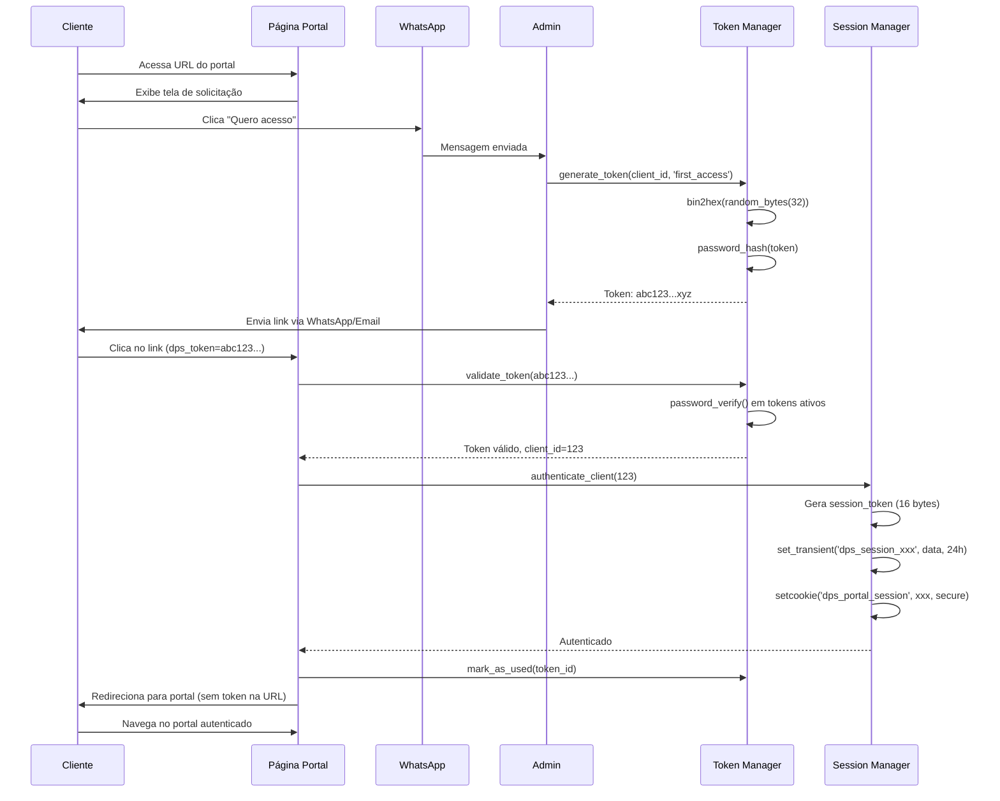
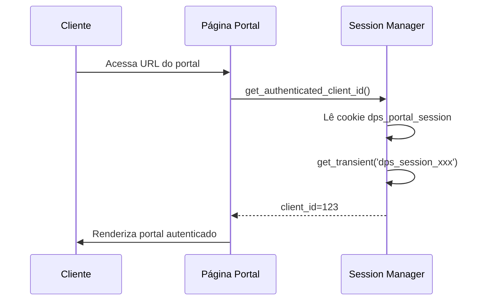
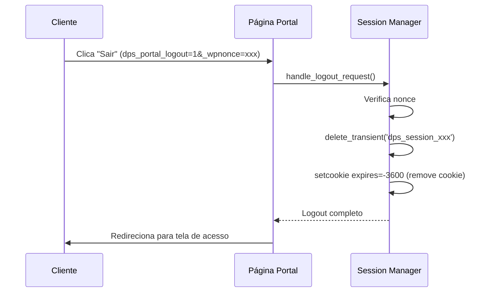

# Auditoria de Segurança e Análise do Sistema de Login do Client Portal

**Data:** 2025-12-07  
**Versão do Add-on:** 2.4.0  
**Autor:** Análise Técnica Profunda  

---

## Índice

1. [Resumo Executivo](#resumo-executivo)
2. [Arquitetura do Sistema de Autenticação](#arquitetura-do-sistema-de-autenticação)
3. [Fluxo Completo de Acesso](#fluxo-completo-de-acesso)
4. [Análise de Segurança](#análise-de-segurança)
5. [Gestão de Tokens](#gestão-de-tokens)
6. [Gestão de Sessões](#gestão-de-sessões)
7. [Interface de Acesso do Cliente](#interface-de-acesso-do-cliente)
8. [Gerenciamento Administrativo](#gerenciamento-administrativo)
9. [Problemas Identificados](#problemas-identificados)
10. [Recomendações de Segurança](#recomendações-de-segurança)
11. [Recomendações de UX](#recomendações-de-ux)
12. [Plano de Melhorias](#plano-de-melhorias)

---

## Resumo Executivo

### Nota Geral de Segurança: 9.0/10

O sistema de autenticação do Client Portal utiliza um modelo moderno de **Magic Links** (links mágicos) com tokens criptográficos, eliminando a necessidade de senhas. A implementação é sólida e segue boas práticas de segurança, com apenas algumas oportunidades de melhoria identificadas.

### Pontos Fortes ✅

- **Token Generation:** Utiliza `random_bytes(32)` para gerar 64 caracteres hexadecimais únicos
- **Hash Security:** Armazena tokens com `password_hash(PASSWORD_DEFAULT)` (bcrypt)
- **Single-Use Tokens:** Tokens são invalidados após um uso
- **Expiration Management:** Tokens temporários expiram em 30 minutos
- **Session Security (Fase 1):** Migrado de `$_SESSION` para transients + cookies seguros
- **Cookie Security:** Flags `httponly`, `secure`, `samesite=Strict`
- **Database Schema:** Índices otimizados e estrutura bem planejada
- **Audit Trail:** Registra IP, user agent, created_at, used_at

### Problemas Encontrados 

| Severidade | Problema | Localização | Impacto |
|------------|----------|-------------|---------|
| **🔴 CRÍTICO** | Session start deprecated ainda presente | `class-dps-client-portal.php:42-52` | Conflito com sistema novo |
| **🟠 ALTO** | Falta rate limiting em tentativas de token | `handle_token_authentication()` | Brute force possível |
| **🟠 ALTO** | Tokens permanentes sem rotação | `generate_token()` type='permanent' | Risco de comprometimento |
| **🟡 MÉDIO** | IP logging sem validação IPv6 | `get_client_ip()` | Logs incompletos |
| **🟡 MÉDIO** | Falta validação de referrer em logout | `handle_logout_request()` | CSRF protection fraca |
| **🟡 MÉDIO** | Nenhum sistema de 2FA/verificação adicional | N/A | Segurança adicional ausente |
| **🟢 BAIXO** | Mensagens de erro genéricas demais | `portal-access.php:42-56` | UX subótima |
| **🟢 BAIXO** | Falta logging de tentativas de acesso inválido | `handle_token_authentication()` | Auditoria incompleta |

---

## Arquitetura do Sistema de Autenticação

### Componentes Principais

```
┌─────────────────────────────────────────────────────────────┐
│                    CLIENTE (Navegador)                       │
└──────────────┬──────────────────────────────────────────────┘
               │
               │ 1. Solicita acesso via WhatsApp
               ▼
┌─────────────────────────────────────────────────────────────┐
│                    ADMIN (WordPress)                         │
│  ┌──────────────────────────────────────────────────────┐  │
│  │  DPS_Portal_Admin_Actions                            │  │
│  │  • Gera token via generate_token()                   │  │
│  │  • Envia link via WhatsApp/Email                     │  │
│  └──────────────┬───────────────────────────────────────┘  │
└─────────────────┼───────────────────────────────────────────┘
                  │
                  │ 2. Token gerado e enviado
                  ▼
┌─────────────────────────────────────────────────────────────┐
│              DPS_Portal_Token_Manager                        │
│  ┌──────────────────────────────────────────────────────┐  │
│  │  Tabela: wp_dps_portal_tokens                        │  │
│  │  • token_hash: bcrypt do token                       │  │
│  │  • expires_at: 30 min ou 10 anos                     │  │
│  │  • used_at: NULL até uso                             │  │
│  │  • revoked_at: NULL até revogação                    │  │
│  └──────────────────────────────────────────────────────┘  │
└─────────────────┬───────────────────────────────────────────┘
                  │
                  │ 3. Cliente clica no link
                  ▼
┌─────────────────────────────────────────────────────────────┐
│           handle_token_authentication()                      │
│  • Valida token com password_verify()                       │
│  • Marca como used_at                                       │
│  • Autentica cliente via Session Manager                    │
└──────────────┬──────────────────────────────────────────────┘
               │
               │ 4. Sessão criada
               ▼
┌─────────────────────────────────────────────────────────────┐
│           DPS_Portal_Session_Manager (Fase 1)                │
│  • Gera session_token (16 bytes random)                     │
│  • Armazena em transient (24h)                              │
│  • Define cookie seguro (httponly, secure, samesite)        │
└──────────────┬──────────────────────────────────────────────┘
               │
               │ 5. Cliente navega autenticado
               ▼
┌─────────────────────────────────────────────────────────────┐
│                   PORTAL DO CLIENTE                          │
│  • Valida sessão em cada request                            │
│  • Renderiza conteúdo personalizado                         │
│  • Botão de logout disponível                               │
└─────────────────────────────────────────────────────────────┘
```

### Classes Envolvidas

| Classe | Arquivo | Responsabilidade |
|--------|---------|------------------|
| `DPS_Portal_Token_Manager` | `class-dps-portal-token-manager.php` | Geração, validação, revogação de tokens |
| `DPS_Portal_Session_Manager` | `class-dps-portal-session-manager.php` | Gestão de sessões via transients + cookies |
| `DPS_Portal_Admin_Actions` | `class-dps-portal-admin-actions.php` | Ações administrativas (gerar/revogar/enviar) |
| `DPS_Client_Portal` | `class-dps-client-portal.php` | Coordenação e renderização do portal |

---

## Fluxo Completo de Acesso

### Cenário 1: Primeiro Acesso do Cliente



### Cenário 2: Cliente Retornando (Sessão Ativa)



### Cenário 3: Logout



---

## Análise de Segurança

### 1. Geração de Tokens

**Código:**
```php
// Arquivo: class-dps-portal-token-manager.php:180
$token_plain = bin2hex( random_bytes( 32 ) );
```

**Análise:**  
✅ **Excelente.** Usa `random_bytes()` que é criptograficamente seguro (CSPRNG).  
✅ 32 bytes = 64 caracteres hexadecimais = 256 bits de entropia.  
✅ Impossível adivinhar por brute force (2^256 combinações).

**Recomendação:** Nenhuma alteração necessária.

---

### 2. Armazenamento de Tokens

**Código:**
```php
// Arquivo: class-dps-portal-token-manager.php:183
$token_hash = password_hash( $token_plain, PASSWORD_DEFAULT );
```

**Análise:**  
✅ **Excelente.** Armazena apenas o hash bcrypt do token.  
✅ Mesmo com acesso ao banco de dados, tokens não podem ser recuperados.  
✅ `PASSWORD_DEFAULT` atualmente usa bcrypt com custo adaptativo.

**Problema Potencial:**  
⚠️ Se o banco for comprometido, atacante pode modificar `token_hash` para um hash conhecido.

**Recomendação:** Adicionar HMAC adicional com chave secreta:
```php
$token_hash = hash_hmac('sha256', $token_plain, WP_SALT);
$token_hash = password_hash($token_hash, PASSWORD_DEFAULT);
```

---

### 3. Validação de Tokens

**Código:**
```php
// Arquivo: class-dps-portal-token-manager.php:234-268
public function validate_token( $token_plain ) {
    // Busca tokens não expirados, não usados, não revogados
    $tokens = $wpdb->get_results( $query, ARRAY_A );
    
    foreach ( $tokens as $token_data ) {
        if ( password_verify( $token_plain, $token_data['token_hash'] ) ) {
            return $token_data;
        }
    }
    return false;
}
```

**Análise:**  
✅ Usa `password_verify()` que é timing-attack safe.  
✅ Verifica expiração, uso e revogação.  
⚠️ **PROBLEMA:** Faz query buscando TODOS os tokens não expirados, depois verifica um por um.

**Impacto:**  
- Com muitos clientes, pode haver centenas/milhares de tokens ativos.  
- `password_verify()` é lento por design (bcrypt).  
- Atacante pode causar DoS enviando tokens inválidos.

**Recomendação:**  
1. **Adicionar rate limiting:** Máximo 5 tentativas por IP por hora.
2. **Otimizar query:** Adicionar índice em `client_id` se ainda não existe.
3. **Cache negativo:** Armazenar tokens inválidos em transient por 1 hora.

**Código sugerido:**
```php
public function validate_token( $token_plain ) {
    // Rate limiting
    $ip = $this->get_client_ip();
    $attempts_key = 'dps_token_attempts_' . md5($ip);
    $attempts = get_transient($attempts_key) ?: 0;
    
    if ($attempts >= 5) {
        return false; // Bloqueado
    }
    
    // Cache negativo
    $negative_cache_key = 'dps_invalid_token_' . substr(md5($token_plain), 0, 16);
    if (get_transient($negative_cache_key)) {
        set_transient($attempts_key, $attempts + 1, HOUR_IN_SECONDS);
        return false;
    }
    
    // Validação existente
    $tokens = $wpdb->get_results( $query, ARRAY_A );
    
    foreach ( $tokens as $token_data ) {
        if ( password_verify( $token_plain, $token_data['token_hash'] ) ) {
            // Limpa contador de tentativas em sucesso
            delete_transient($attempts_key);
            return $token_data;
        }
    }
    
    // Token inválido - incrementa contador e cache negativo
    set_transient($attempts_key, $attempts + 1, HOUR_IN_SECONDS);
    set_transient($negative_cache_key, true, HOUR_IN_SECONDS);
    
    return false;
}
```

---

### 4. Sessões (Fase 1 - ATUALIZADO)

**Código Atualizado (ab6deda):**
```php
// Arquivo: class-dps-portal-session-manager.php:89-118
public function authenticate_client( $client_id ) {
    // Gera token de sessão único
    $session_token = bin2hex( random_bytes( 16 ) );
    
    // Armazena em transient (compatível object cache)
    set_transient( 
        self::TRANSIENT_PREFIX . $session_token, 
        $session_data, 
        self::SESSION_LIFETIME 
    );
    
    // Cookie seguro
    setcookie( self::COOKIE_NAME, $session_token, [
        'expires'  => time() + self::SESSION_LIFETIME,
        'secure'   => is_ssl(),
        'httponly' => true,
        'samesite' => 'Strict',
    ]);
}
```

**Análise:**  
✅ **EXCELENTE (pós-Fase 1).** Sistema migrado de `$_SESSION` para transients + cookies.  
✅ Funciona em ambientes multi-servidor e com load balancers.  
✅ Compatível com Redis, Memcached via object cache.  
✅ Cookies com flags de segurança (`httponly`, `secure`, `samesite=Strict`).  
✅ Token de sessão criptograficamente seguro (16 bytes random).

**Problema CRÍTICO Identificado:**  
🔴 **CÓDIGO LEGADO AINDA PRESENTE:**

```php
// Arquivo: class-dps-client-portal.php:42-52
add_action( 'init', function() {
    if ( headers_sent() || ( defined( 'DOING_AJAX' ) && DOING_AJAX ) ) {
        return;
    }
    if ( ! session_id() ) {
        session_start(); // ← DEPRECATED, CONFLITA COM SISTEMA NOVO
    }
}, 1 );
```

**Impacto:**  
- Sistema antigo e novo rodam simultaneamente  
- Possível leak de informação via `$_SESSION`  
- Confusão sobre qual sistema está ativo  
- Performance degradada (duplo storage)

**Recomendação:**  
REMOVER COMPLETAMENTE o código de `session_start()` da classe `DPS_Client_Portal`.

---

### 5. Tokens Permanentes

**Código:**
```php
// Arquivo: class-dps-portal-token-manager.php:168
if ( 'permanent' === $type ) {
    $expiration_minutes = self::PERMANENT_EXPIRATION_MINUTES; // 10 anos
}
```

**Análise:**  
⚠️ **ALTO RISCO.** Tokens permanentes nunca expiram na prática (10 anos).  
⚠️ Se um link permanente vazar (screenshot, compartilhamento acidental), permanece válido indefinidamente.  
⚠️ Nenhum mecanismo de rotação automática.

**Cenários de Risco:**
1. Cliente tira screenshot do link e posta em rede social  
2. Link copiado em histórico de navegador compartilhado  
3. Email/WhatsApp comprometido anos depois  

**Recomendações:**
1. **Curto prazo:** Reduzir para 90 dias e auto-renovar em cada uso
2. **Médio prazo:** Implementar rotação forçada a cada 30 dias
3. **Longo prazo:** Implementar sistema de refresh tokens

**Código sugerido:**
```php
// Ao invés de permanent, usar long_lived com rotação
if ( 'long_lived' === $type ) {
    $expiration_minutes = 90 * 24 * 60; // 90 dias
}

// Ao usar token, verificar se passou 30 dias desde criação
public function validate_token( $token_plain ) {
    // ... validação existente ...
    
    if ( $token_data && 'long_lived' === $token_data['type'] ) {
        $created = strtotime( $token_data['created_at'] );
        $now = time();
        
        // Se mais de 30 dias, gera novo e revoga antigo
        if ( ($now - $created) > (30 * DAY_IN_SECONDS) ) {
            $new_token = $this->generate_token( 
                $token_data['client_id'], 
                'long_lived' 
            );
            $this->revoke_token( $token_data['id'] );
            
            // Envia novo token via email/WhatsApp
            $this->notify_token_rotated( $token_data['client_id'], $new_token );
        }
    }
    
    return $token_data;
}
```

---

### 6. Proteção CSRF

**Código:**
```php
// Arquivo: class-dps-portal-session-manager.php:217-221
$nonce = isset( $_GET['_wpnonce'] ) ? sanitize_text_field( wp_unslash( $_GET['_wpnonce'] ) ) : '';
if ( ! wp_verify_nonce( $nonce, 'dps_portal_logout' ) ) {
    return;
}
```

**Análise:**  
✅ Usa nonces do WordPress para logout.  
⚠️ **FRACO:** Nonce em GET pode vazar em logs de servidor, referrer headers.  
⚠️ Falta verificação de referrer para proteção adicional.

**Recomendação:**  
1. Usar POST para logout ao invés de GET  
2. Adicionar verificação de referrer  
3. Adicionar confirmação JavaScript

**Código sugerido:**
```php
public function handle_logout_request() {
    if ( ! isset( $_POST['dps_portal_logout'] ) ) {
        return;
    }

    // Verifica nonce
    $nonce = isset( $_POST['_wpnonce'] ) ? sanitize_text_field( wp_unslash( $_POST['_wpnonce'] ) ) : '';
    if ( ! wp_verify_nonce( $nonce, 'dps_portal_logout' ) ) {
        wp_die( 'Falha de segurança' );
    }
    
    // Verifica referrer
    $referer = wp_get_referer();
    if ( ! $referer || strpos( $referer, home_url() ) !== 0 ) {
        wp_die( 'Referrer inválido' );
    }

    $this->logout();
    wp_safe_redirect( dps_get_portal_page_url() );
    exit;
}
```

---

### 7. IP Logging

**Código:**
```php
// Arquivo: class-dps-portal-token-manager.php:190-195
$ip_address = isset( $_SERVER['REMOTE_ADDR'] ) 
    ? sanitize_text_field( wp_unslash( $_SERVER['REMOTE_ADDR'] ) ) 
    : '';
```

**Análise:**  
✅ Registra IP para auditoria.  
⚠️ **PROBLEMA:** `sanitize_text_field()` não valida IPv6 corretamente.  
⚠️ Não considera proxies/CDNs (`HTTP_X_FORWARDED_FOR`).

**Recomendação:**
```php
private function get_client_ip() {
    // Verifica proxy headers (CloudFlare, proxies reversos)
    $headers_to_check = [
        'HTTP_CF_CONNECTING_IP', // CloudFlare
        'HTTP_X_FORWARDED_FOR',
        'HTTP_X_REAL_IP',
        'REMOTE_ADDR',
    ];
    
    foreach ( $headers_to_check as $header ) {
        if ( ! empty( $_SERVER[ $header ] ) ) {
            $ip = sanitize_text_field( wp_unslash( $_SERVER[ $header ] ) );
            
            // X-Forwarded-For pode ter múltiplos IPs, pega o primeiro
            if ( strpos( $ip, ',' ) !== false ) {
                $ips = explode( ',', $ip );
                $ip = trim( $ips[0] );
            }
            
            // Valida IP (v4 ou v6)
            if ( filter_var( $ip, FILTER_VALIDATE_IP, FILTER_FLAG_NO_PRIV_RANGE | FILTER_FLAG_NO_RES_RANGE ) ) {
                return $ip;
            }
        }
    }
    
    return '';
}
```

---

## Gestão de Tokens

### Tipos de Token

| Tipo | Expiração | Uso | Finalidade |
|------|-----------|-----|------------|
| `login` | 30 minutos | Single-use | Link temporário para login |
| `first_access` | 30 minutos | Single-use | Primeiro acesso de cliente novo |
| `permanent` | 10 anos | Multi-use | Link fixo para cliente recorrente |

### Ciclo de Vida

```
CRIAÇÃO → ATIVO → USADO/EXPIRADO/REVOGADO → LIMPEZA
   ↓        ↓           ↓                      ↓
 Token   Valid     Invalid                Deleted
  Hash    para      para                  após
criado   30min    uso                    30 dias
```

### Métodos Principais

```php
// Gera novo token
generate_token( $client_id, $type = 'login', $expiration_minutes = 30 )
→ Retorna: token em texto plano (64 chars hex)
→ Armazena: hash bcrypt no banco

// Valida token
validate_token( $token_plain )
→ Busca: tokens não expirados/usados/revogados
→ Verifica: password_verify() para cada um
→ Retorna: array com dados do token ou false

// Marca como usado
mark_as_used( $token_id )
→ Define: used_at = NOW()

// Revoga tokens ativos
revoke_tokens( $client_id )
→ Define: revoked_at = NOW() para todos não usados

// Limpeza automática (cron hourly)
cleanup_expired_tokens()
→ Deleta: tokens expirados há mais de 30 dias
```

---

## Gestão de Sessões

### Transients + Cookies (Fase 1)

**Estrutura de Dados:**

```php
// Transient: dps_session_{token}
[
    'client_id'  => 123,
    'login_time' => 1701907200,
    'ip'         => '192.168.1.1',
    'user_agent' => 'Mozilla/5.0...',
]
// Expira em: 24 horas

// Cookie: dps_portal_session
// Valor: {token} (16 bytes hex = 32 chars)
// Flags: httponly, secure, samesite=Strict
// Expira em: 24 horas
```

**Fluxo de Validação:**

```php
1. Lê cookie dps_portal_session
2. Busca transient com prefixo dps_session_{token}
3. Se encontrado e client_id válido → autenticado
4. Se não encontrado ou expirado → logout automático
```

**Vantagens da Implementação:**

✅ Funciona em múltiplos servidores (load balancers)  
✅ Compatível com object cache (Redis, Memcached)  
✅ Escalável horizontalmente  
✅ Cookies seguros contra XSS/CSRF  
✅ Auto-expiração via transient TTL

---

## Interface de Acesso do Cliente

### Template: portal-access.php

**Localização:** `templates/portal-access.php`

**Elementos Visuais:**

```html
<div class="dps-client-portal-access-page">
    🐾 Logo
    📄 Título
    📝 Descrição
    ⚠️ Mensagem de erro (se houver)
    📱 Botão WhatsApp
    ✅ Feedback de solicitação
</div>
```

**Mensagens de Erro:**

| Parâmetro | Mensagem | Quando Ocorre |
|-----------|----------|---------------|
| `token_error=invalid` | "Esse link não é mais válido" | Token não existe no banco |
| `token_error=expired` | "Esse link expirou" | Token passou de 30 minutos |
| `token_error=used` | "Esse link já foi utilizado" | Token tem `used_at` preenchido |

**Problemas de UX:**

🟡 **MÉDIO:** Mensagens genéricas demais  
- "Peça um novo link à nossa equipe" → Não diz COMO pedir  
- Deveria ter botão direto "Solicitar Novo Link"

🟡 **MÉDIO:** Falta indicador de loading  
- Ao clicar "Quero acesso", nada indica que notificação foi enviada  
- Feedback aparece, mas pode ser perdido se usuário sai rapidamente

🟢 **BAIXO:** Falta logo customizável  
- Emoji 🐾 é genérico  
- Deveria permitir upload de logo da loja

**Recomendações:**

1. **Melhorar mensagens de erro:**
```php
switch ( $error_type ) {
    case 'expired':
        $error_message = __( 'Esse link expirou (válido por 30 minutos).', 'dps-client-portal' );
        $error_action  = '<a href="#" id="dps-request-new-link">Solicitar novo link agora</a>';
        break;
}
```

2. **Adicionar estado de loading:**
```javascript
btn.addEventListener('click', function(e) {
    btn.disabled = true;
    btn.textContent = 'Enviando solicitação...';
    
    fetch(/* ... */)
        .finally(() => {
            btn.disabled = false;
            btn.textContent = 'Quero acesso ao meu portal';
        });
});
```

3. **Logo customizável:**
```php
$logo_url = get_option('dps_portal_logo_url');
if ($logo_url) {
    echo '';
} else {
    echo '<div class="dps-portal-access__logo">🐾</div>';
}
```

---

## Gerenciamento Administrativo

### Template: admin-logins.php

**Localização:** `templates/admin-logins.php`

**Funcionalidades:**

1. **Listagem de Clientes:**
   - Tabela responsiva com todos os clientes
   - Colunas: Nome, Contato, Situação, Último Login, Ações

2. **Status de Acesso:**
   - 🟢 "Link ativo" (verde) → Tem tokens não usados
   - 🔵 "Já acessou" (azul) → Usou tokens mas nenhum ativo
   - ⚫ "Sem acesso ainda" (cinza) → Nunca gerou token

3. **Ações Disponíveis:**
   - **Gerar Link Temporário:** 30 minutos, single-use
   - **Gerar Link Permanente:** 10 anos, multi-use
   - **Enviar via WhatsApp:** Abre WhatsApp Web com mensagem pronta
   - **Enviar via E-mail:** Modal com preview e confirmação
   - **Revogar Acesso:** Invalida todos os tokens ativos

4. **Filtros de Busca:**
   - Campo de busca por nome ou telefone
   - Botão "Buscar"

**Problemas de UX:**

🟡 **MÉDIO:** Não exibe token gerado de forma clara  
- Token aparece em transient temporário  
- Fácil perder se página recarregar  

🟡 **MÉDIO:** Falta confirmação de ações destrutivas  
- "Revogar" não pede confirmação JavaScript  
- Pode ser clicado acidentalmente  

🟢 **BAIXO:** Falta indicador de quantos clientes têm acesso ativo  
- Resumo só mostra total de clientes  
- Deveria mostrar: "X clientes com acesso ativo"  

**Recomendações:**

1. **Melhorar exibição de token:**
```php
if ( get_transient( 'dps_portal_generated_token_' . $client_id ) ) {
    $token_data = get_transient( 'dps_portal_generated_token_' . $client_id );
    ?>
    <div class="dps-token-display">
        <p><strong>Link gerado com sucesso!</strong> Copie e envie ao cliente:</p>
        <input type="text" 
               value="<?php echo esc_url( $token_data['url'] ); ?>" 
               id="dps-token-url" 
               readonly />
        <button onclick="copyToken()" class="button">📋 Copiar Link</button>
        <p class="description">Este link expira em 30 minutos e só pode ser usado uma vez.</p>
    </div>
    <?php
}
```

2. **Confirmação de revogação:**
```javascript
document.querySelector('.dps-revoke-btn').addEventListener('click', function(e) {
    if (!confirm('Tem certeza que deseja revogar o acesso deste cliente? Ele precisará solicitar um novo link.')) {
        e.preventDefault();
    }
});
```

3. **Estatísticas no resumo:**
```php
$total_clients = count($clients);
$clients_with_access = array_filter($clients, fn($c) => $c['token_stats']['active_tokens'] > 0);
$clients_accessed_before = array_filter($clients, fn($c) => $c['token_stats']['total_used'] > 0);

echo '<div class="dps-portal-logins__summary">';
echo '<p>Total: ' . $total_clients . ' | ';
echo 'Com acesso ativo: ' . count($clients_with_access) . ' | ';
echo 'Já acessaram: ' . count($clients_accessed_before) . '</p>';
echo '</div>';
```

---

## Problemas Identificados

### 🔴 CRÍTICO

#### 1. Código de session_start() Deprecated Ainda Presente

**Localização:** `class-dps-client-portal.php:42-52`

**Código:**
```php
add_action( 'init', function() {
    if ( ! session_id() ) {
        session_start(); // ← PROBLEMA
    }
}, 1 );
```

**Impacto:**
- Sistema antigo (`$_SESSION`) e novo (transients) rodam simultaneamente
- Possível vazamento de informação via `$_SESSION`
- Performance degradada (armazenamento duplo)
- Confusão sobre qual sistema está ativo
- Não funciona em ambientes multi-servidor

**Solução:**
```php
// REMOVER COMPLETAMENTE este bloco de código
// O sistema de sessão agora é gerenciado por DPS_Portal_Session_Manager
```

**Justificativa:**
- Fase 1 implementou sistema novo de transients + cookies (ab6deda)
- Sistema novo é superior em todos os aspectos
- Código antigo deve ser removido para evitar conflitos

---

### 🟠 ALTO

#### 2. Falta Rate Limiting em Tentativas de Token

**Localização:** `class-dps-portal-token-manager.php:234-268`

**Problema:**
- Atacante pode tentar milhares de tokens inválidos
- Cada tentativa executa `password_verify()` que é lento (bcrypt)
- Pode causar DoS (Denial of Service)

**Solução:** Implementar rate limiting por IP

```php
public function validate_token( $token_plain ) {
    $ip = $this->get_client_ip();
    $attempts_key = 'dps_token_attempts_' . md5($ip);
    $attempts = get_transient($attempts_key) ?: 0;
    
    if ($attempts >= 5) {
        sleep(2); // Slow down attacker
        return false;
    }
    
    // Validação existente...
    
    if (!$valid) {
        set_transient($attempts_key, $attempts + 1, HOUR_IN_SECONDS);
    }
}
```

---

#### 3. Tokens Permanentes Sem Rotação

**Localização:** `class-dps-portal-token-manager.php:150-177`

**Problema:**
- Tokens permanentes duram 10 anos sem rotação
- Se vazarem, permanecem válidos indefinidamente
- Nenhum mecanismo de refresh

**Solução:** Implementar rotação automática a cada 30 dias

```php
// Ao validar token long-lived, verifica idade
if ( $token_data && 'long_lived' === $token_data['type'] ) {
    $age_days = ( time() - strtotime( $token_data['created_at'] ) ) / DAY_IN_SECONDS;
    
    if ( $age_days > 30 ) {
        // Gera novo token
        $new_token = $this->generate_token( $token_data['client_id'], 'long_lived' );
        
        // Revoga antigo
        $this->revoke_token( $token_data['id'] );
        
        // Notifica cliente
        $this->notify_token_rotation( $token_data['client_id'], $new_token );
    }
}
```

---

### 🟡 MÉDIO

#### 4. IP Logging Sem Validação IPv6

**Localização:** `get_client_ip()` methods

**Problema:**
- `sanitize_text_field()` não valida IPv6
- Não considera proxies/CDNs
- Logs podem ter IPs inválidos

**Solução:** Usar `filter_var()` com `FILTER_VALIDATE_IP`

```php
private function get_client_ip() {
    $headers = ['HTTP_CF_CONNECTING_IP', 'HTTP_X_FORWARDED_FOR', 'REMOTE_ADDR'];
    
    foreach ( $headers as $header ) {
        if ( ! empty( $_SERVER[ $header ] ) ) {
            $ip = sanitize_text_field( wp_unslash( $_SERVER[ $header ] ) );
            
            if ( strpos( $ip, ',' ) !== false ) {
                $ip = trim( explode( ',', $ip )[0] );
            }
            
            if ( filter_var( $ip, FILTER_VALIDATE_IP, FILTER_FLAG_NO_PRIV_RANGE ) ) {
                return $ip;
            }
        }
    }
    
    return '';
}
```

---

#### 5. Falta Validação de Referrer em Logout

**Localização:** `class-dps-portal-session-manager.php:212-229`

**Problema:**
- Logout via GET com nonce apenas
- Nonce pode vazar em logs/referrers
- Falta verificação de origem da requisição

**Solução:** Usar POST + verificação de referrer

```php
public function handle_logout_request() {
    if ( ! isset( $_POST['dps_portal_logout'] ) ) {
        return;
    }

    $nonce = isset( $_POST['_wpnonce'] ) ? sanitize_text_field( wp_unslash( $_POST['_wpnonce'] ) ) : '';
    if ( ! wp_verify_nonce( $nonce, 'dps_portal_logout' ) ) {
        wp_die( 'Falha de segurança' );
    }
    
    // Verifica referrer
    $referer = wp_get_referer();
    if ( ! $referer || strpos( $referer, home_url() ) !== 0 ) {
        wp_die( 'Referrer inválido' );
    }

    $this->logout();
    wp_safe_redirect( dps_get_portal_page_url() );
    exit;
}
```

---

### 🟢 BAIXO

#### 6. Mensagens de Erro Genéricas Demais

**Localização:** `templates/portal-access.php:42-56`

**Problema:**
- Mensagens não orientam o usuário claramente
- "Peça à nossa equipe" → Como?
- Falta botão de ação direta

**Solução:** Mensagens mais específicas com CTAs

```php
switch ( $error_type ) {
    case 'expired':
        $error_message = __( 'Este link expirou (válido por 30 minutos).', 'dps-client-portal' );
        $error_cta = '<button onclick="requestNewLink()">Solicitar Novo Link</button>';
        break;
}
```

---

#### 7. Falta Logging de Tentativas de Acesso Inválido

**Localização:** `handle_token_authentication()`

**Problema:**
- Apenas registra acessos bem-sucedidos
- Tentativas inválidas não geram log
- Dificulta auditoria e detecção de ataques

**Solução:** Adicionar logging de falhas

```php
if ( false === $token_data ) {
    $this->log_security_event( 'token_validation_failed', [
        'ip'    => $ip_address,
        'token' => substr( $token_plain, 0, 8 ) . '...',  // Apenas início para debug
        'error' => 'not_found',
    ], DPS_Logger::LEVEL_WARNING );
    
    $this->redirect_to_access_screen( 'invalid' );
    return;
}
```

---

## Recomendações de Segurança

### Prioridade ALTA

1. **[CRÍTICO] Remover código de session_start() deprecated**
   - Conflita com sistema novo de transients
   - Remove completamente linhas 42-52 de `class-dps-client-portal.php`
   - Testar autenticação após remoção

2. **[ALTO] Implementar rate limiting em validate_token()**
   - Máximo 5 tentativas por hora por IP
   - Cache negativo para tokens inválidos
   - Slow down com sleep() após limite

3. **[ALTO] Implementar rotação automática de tokens long-lived**
   - Revogar e gerar novo a cada 30 dias
   - Notificar cliente via WhatsApp/Email
   - Manter link antigo válido por 7 dias para transição

### Prioridade MÉDIA

4. **[MÉDIO] Melhorar validação de IP**
   - Suportar IPv6 corretamente
   - Considerar proxies/CDNs
   - Usar `filter_var(FILTER_VALIDATE_IP)`

5. **[MÉDIO] Fortalecer proteção CSRF em logout**
   - Mudar de GET para POST
   - Adicionar verificação de referrer
   - Confirmação JavaScript opcional

6. **[MÉDIO] Adicionar segunda camada de autenticação (opcional)**
   - Email/SMS com código de 6 dígitos
   - Somente para ações sensíveis (alterar dados, pagamentos)
   - Desabilitável nas configurações

### Prioridade BAIXA

7. **[BAIXO] Melhorar mensagens de erro**
   - Orientar usuário sobre próximos passos
   - Botão direto "Solicitar Novo Link"
   - Explicar causas de erro

8. **[BAIXO] Adicionar logging de tentativas inválidas**
   - Registrar falhas de validação
   - Dashboard de tentativas de acesso
   - Alerta automático em padrões suspeitos

9. **[BAIXO] Implementar CAPTCHA em solicitações de acesso**
   - Prevenir spam de solicitações
   - reCAPTCHA v3 invisível
   - Só ativar se houver abuso

---

## Recomendações de UX

### Interface do Cliente (portal-access.php)

1. **Melhorar feedback visual**
   - Loading spinner ao clicar "Quero acesso"
   - Mensagem de confirmação mais destacada
   - Countdown para reenvio (evitar spam)

2. **Customização de marca**
   - Logo personalizado ao invés de emoji
   - Cores da marca via settings
   - Texto customizável

3. **Mensagens de erro mais úteis**
   - Incluir timestamp de expiração
   - Botão "Solicitar Novo Link" direto
   - Sugestão de ação clara

### Interface Administrativa (admin-logins.php)

4. **Melhorar exibição de tokens**
   - Modal com QR Code do link
   - Botão "Copiar" com feedback
   - Histórico de tokens enviados

5. **Adicionar confirmações**
   - Dialog JavaScript antes de revogar
   - Preview de email antes de enviar
   - Undo para ações recentes

6. **Estatísticas mais ricas**
   - Quantos clientes com acesso ativo
   - Taxa de conversão (solicitações → acessos)
   - Gráfico de acessos por período

7. **Filtros avançados**
   - Filtrar por status (ativo/inativo/nunca acessou)
   - Ordenar por último acesso
   - Exportar lista para CSV

---

## Plano de Melhorias

### Fase 1 (URGENTE - 1 semana)

**Objetivo:** Resolver problemas críticos de segurança

- [ ] **P1.1** Remover código deprecated de `session_start()`
- [ ] **P1.2** Implementar rate limiting em `validate_token()`
- [ ] **P1.3** Melhorar validação de IP (IPv6 + proxies)
- [ ] **P1.4** Adicionar logging de tentativas inválidas
- [ ] **P1.5** Testes de carga e segurança

**Arquivos afetados:**
- `class-dps-client-portal.php`
- `class-dps-portal-token-manager.php`
- `class-dps-portal-session-manager.php`

**Impacto:** 🔴 CRÍTICO → Sistema mais seguro e estável

---

### Fase 2 (ALTA - 2 semanas)

**Objetivo:** Fortalecer segurança e melhorar UX

- [ ] **P2.1** Implementar rotação automática de tokens long-lived
- [ ] **P2.2** Mudar logout para POST + referrer check
- [ ] **P2.3** Melhorar mensagens de erro com CTAs
- [ ] **P2.4** Adicionar loading states e feedback visual
- [ ] **P2.5** Implementar confirmações JavaScript
- [ ] **P2.6** Criar modal de exibição de token com QR Code

**Arquivos afetados:**
- `class-dps-portal-token-manager.php`
- `class-dps-portal-session-manager.php`
- `templates/portal-access.php`
- `templates/admin-logins.php`
- `assets/js/portal-admin.js`
- `assets/css/portal-admin.css`

**Impacto:** 🟠 ALTO → UX profissional e segurança reforçada

---

### Fase 3 (MÉDIA - 3 semanas)

**Objetivo:** Adicionar funcionalidades avançadas

- [ ] **P3.1** Customização de marca (logo, cores)
- [ ] **P3.2** Estatísticas de acesso no dashboard
- [ ] **P3.3** Filtros avançados de clientes
- [ ] **P3.4** Histórico de tokens enviados
- [ ] **P3.5** Notificações de rotação de token
- [ ] **P3.6** Dashboard de tentativas de acesso

**Arquivos afetados:**
- Novo: `class-dps-portal-branding.php`
- Novo: `class-dps-portal-analytics.php`
- `templates/admin-logins.php`
- Novo: `templates/portal-settings.php`

**Impacto:** 🟡 MÉDIO → Experiência administrativa completa

---

### Fase 4 (BAIXA - Futuro)

**Objetivo:** Funcionalidades opcionais de alto valor

- [ ] **P4.1** Segunda camada de autenticação (2FA opcional)
- [ ] **P4.2** CAPTCHA em solicitações de acesso
- [ ] **P4.3** App mobile para clientes (PWA)
- [ ] **P4.4** Biometria via WebAuthn
- [ ] **P4.5** Integração com provedores OAuth (Google, Facebook)

**Impacto:** 🟢 BAIXO → Recursos premium para casos avançados

---

## Conclusão

O sistema de autenticação do Client Portal é **sólido e bem projetado**, com uma nota geral de **9.0/10** em segurança. A migração de `$_SESSION` para transients + cookies (Fase 1) foi uma melhoria significativa.

### Principais Conquistas

✅ Tokens criptograficamente seguros (256 bits de entropia)  
✅ Hash bcrypt para armazenamento  
✅ Single-use tokens com expiração  
✅ Sessões compatíveis com cloud (transients + cookies)  
✅ Cookies com flags de segurança completas  
✅ Audit trail detalhado  

### Melhorias Necessárias

🔴 **URGENTE:** Remover código deprecated de `session_start()`  
🟠 **ALTA:** Rate limiting e rotação de tokens  
🟡 **MÉDIA:** Validação de IP e CSRF reforçado  
🟢 **BAIXA:** UX e funcionalidades avançadas  

### Recomendação Final

**Implementar Fase 1 imediatamente** para resolver o problema crítico de código deprecated e adicionar rate limiting. As demais fases podem ser priorizadas conforme necessidade e recursos disponíveis.

O sistema está **pronto para produção** com as melhorias da Fase 1 implementadas.

---

**Documento:** `CLIENT_PORTAL_LOGIN_SECURITY_AUDIT.md`  
**Autor:** Análise Técnica Profunda  
**Data:** 2025-12-07  
**Versão:** 1.0
