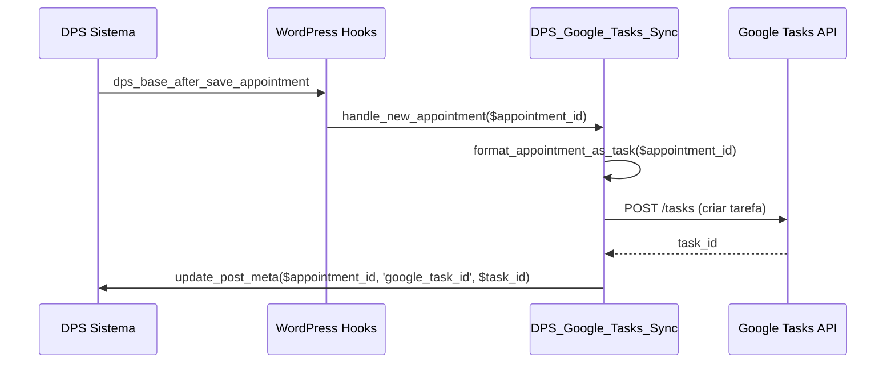

# Análise de Integração com Google Tarefas (Google Tasks API)

**Autor:** PRObst  
**Data:** 2026-01-19  
**Versão:** 1.0.0  
**Status:** Proposta de análise  

## Sumário Executivo

Este documento analisa a viabilidade e benefícios de integrar o sistema DPS (desi.pet by PRObst) com a **Google Tasks API**. A integração permitiria sincronizar atividades do sistema de gestão de pet shop com listas de tarefas do Google, melhorando a organização e follow-up de atividades administrativas.

### Conclusão Rápida

✅ **VIÁVEL e INTERESSANTE** - A integração com Google Tasks é tecnicamente viável e oferece benefícios práticos para o fluxo de trabalho da equipe administrativa, especialmente para:
- Lembretes e follow-ups de agendamentos
- Tarefas de gestão financeira (cobranças pendentes)
- Atividades de comunicação com clientes
- Gestão de estoque e tarefas operacionais

### Benefícios Principais

1. **Centralização de Tarefas**: Equipe pode gerenciar tarefas do pet shop no mesmo local onde já gerenciam outras atividades pessoais/profissionais
2. **Notificações Nativas**: Aproveita sistema de notificações do Google (mobile, desktop, email)
3. **Integração com Ecossistema Google**: Sincroniza automaticamente com Google Calendar, Gmail, Android, iOS
4. **Acessibilidade**: Tarefas acessíveis de qualquer dispositivo com conta Google
5. **Sem Custo Adicional**: Google Tasks API é gratuita (dentro de cotas generosas)

---

## 1. Visão Geral da Google Tasks API

### 1.1. O que é Google Tasks?

Google Tasks é um gerenciador de tarefas integrado ao ecossistema Google, disponível em:
- Web (tasks.google.com, integrado ao Gmail e Calendar)
- Android (app Google Tasks)
- iOS (app Google Tasks)
- APIs REST para integração programática

### 1.2. Recursos Principais da API

| Recurso | Descrição | Relevância para DPS |
|---------|-----------|---------------------|
| **Task Lists** | Listas de tarefas (ex: "Pet Shop - Agendamentos") | ✅ Organizar tarefas por categoria |
| **Tasks** | Tarefas individuais com título, descrição, data | ✅ Criar lembretes de agendamentos, cobranças |
| **Due Dates** | Data de vencimento com lembretes automáticos | ✅ Sincronizar datas de agendamentos |
| **Subtasks** | Tarefas aninhadas (hierarquia) | ✅ Quebrar tarefas complexas |
| **Completion Status** | Marcar como concluída | ✅ Rastrear status de follow-ups |
| **Notes** | Campo de texto livre para detalhes | ✅ Adicionar contexto (cliente, pet, serviço) |

### 1.3. Limitações Conhecidas

| Limitação | Impacto | Mitigação |
|-----------|---------|-----------|
| Sem suporte a anexos | Não é possível enviar fotos de pets | Incluir link para o portal DPS na descrição |
| Sem campos customizados | Impossível adicionar metadados estruturados | Usar formato padronizado nas notas |
| Quota: 50,000 requisições/dia | Limite global por projeto | Implementar cache e batch operations |
| Sem notificações webhook | API não envia notificações de mudanças | Polling periódico ou sincronização unidirecional |

---

## 2. Funcionalidades do DPS Compatíveis com Google Tasks

### 2.1. Agendamentos (Alta Prioridade)

**Add-on:** `desi-pet-shower-agenda`

**Casos de Uso:**

#### 2.1.1. Lembrete de Agendamento Confirmado
```
Título: 🐾 Agendamento: Rex (João Silva) - 15/12/2024 14:00
Descrição:
  Cliente: João Silva (11) 98765-4321
  Pet: Rex (Labrador, Grande)
  Serviços: Banho, Tosa
  Groomer: Maria Santos
  
  Link: https://petshop.com.br/admin/agendamento/123
Data de Vencimento: 15/12/2024
```

**Trigger:** Ao salvar novo agendamento com status "pendente"  
**Ação no Google Tasks:** Criar tarefa 1 dia antes da data do agendamento  
**Marcação como concluída:** Quando agendamento muda para status "realizado"  

#### 2.1.2. Follow-up Pós-Atendimento
```
Título: 📞 Follow-up: Rex (João Silva) - Pós-Atendimento
Descrição:
  Agendamento realizado em: 15/12/2024
  Serviços prestados: Banho, Tosa
  Ação: Ligar para verificar satisfação
  
Data de Vencimento: 17/12/2024 (2 dias após)
```

**Trigger:** Agendamento marcado como "realizado"  
**Ação no Google Tasks:** Criar tarefa de follow-up para 2 dias depois  

---

### 2.2. Financeiro (Alta Prioridade)

**Add-on:** `desi-pet-shower-finance`

**Casos de Uso:**

#### 2.2.1. Cobrança Pendente
```
Título: 💰 Cobrança: João Silva - R$ 150,00 (Venc. 20/12/2024)
Descrição:
  Cliente: João Silva (11) 98765-4321
  Valor: R$ 150,00
  Referência: Agendamento #123 - Banho e Tosa Rex
  Status: Pendente
  
  Ações:
  - [ ] Enviar lembrete via WhatsApp
  - [ ] Gerar link de pagamento Mercado Pago
  
  Link: https://petshop.com.br/admin/financeiro/transacao/456
Data de Vencimento: 20/12/2024
```

**Trigger:** Transação criada com status "pendente"  
**Ação no Google Tasks:** Criar tarefa 1 dia antes do vencimento  
**Marcação como concluída:** Quando transação muda para status "pago"  

#### 2.2.2. Renovação de Assinatura
```
Título: 🔄 Renovação Assinatura: Maria Santos - Pacote Mensal
Descrição:
  Cliente: Maria Santos
  Pet: Mel (Poodle)
  Pacote: Banho Semanal
  Valor: R$ 200,00/mês
  Vencimento: 01/01/2025
  
  Link: https://petshop.com.br/admin/assinaturas/789
Data de Vencimento: 27/12/2024 (5 dias antes)
```

**Trigger:** 5 dias antes do vencimento de ciclo de assinatura  
**Ação no Google Tasks:** Criar tarefa de renovação  

---

### 2.3. Comunicações (Média Prioridade)

**Add-on:** `desi-pet-shower-communications`

**Casos de Uso:**

#### 2.3.1. Responder Mensagem do Portal
```
Título: 💬 Responder: João Silva - Solicitação de Agendamento
Descrição:
  Cliente: João Silva
  Mensagem recebida em: 14/12/2024 10:30
  
  "Olá! Gostaria de agendar um banho para o Rex 
   na próxima semana. Quais horários disponíveis?"
  
  Link: https://petshop.com.br/admin/portal/mensagens/321
Data de Vencimento: 14/12/2024 (mesmo dia)
```

**Trigger:** Nova mensagem recebida no Portal do Cliente  
**Ação no Google Tasks:** Criar tarefa imediata  
**Marcação como concluída:** Quando mensagem recebe resposta  

---

### 2.4. Estoque (Média Prioridade)

**Add-on:** `desi-pet-shower-stock`

**Casos de Uso:**

#### 2.4.1. Alerta de Estoque Baixo
```
Título: 📦 Repor Estoque: Shampoo Hipoalergênico
Descrição:
  Item: Shampoo Hipoalergênico 5L
  Quantidade Atual: 2 unidades
  Quantidade Mínima: 5 unidades
  Fornecedor: Pet Supply LTDA
  
  Link: https://petshop.com.br/admin/estoque/item/55
Data de Vencimento: 16/12/2024 (em 2 dias)
```

**Trigger:** Estoque atinge quantidade mínima configurada  
**Ação no Google Tasks:** Criar tarefa de reposição  

---

### 2.5. Campanhas & Fidelidade (Baixa Prioridade)

**Add-on:** `desi-pet-shower-loyalty`

**Casos de Uso:**

#### 2.5.1. Executar Campanha
```
Título: 📣 Campanha: Natal 2024 - Enviar Cupons
Descrição:
  Campanha: Natal 2024 - 20% OFF
  Público-Alvo: 150 clientes ativos
  
  Ações:
  - [ ] Gerar cupons de desconto
  - [ ] Enviar via WhatsApp
  - [ ] Postar nas redes sociais
  
  Link: https://petshop.com.br/admin/campanhas/10
Data de Vencimento: 20/12/2024
```

**Trigger:** Data de início da campanha se aproxima (5 dias antes)  

---

## 3. Arquitetura Proposta

### 3.1. Novo Add-on: `desi-pet-shower-google-tasks`

**Estrutura de Diretório:**
```
plugins/desi-pet-shower-google-tasks/
├── desi-pet-shower-google-tasks-addon.php
├── includes/
│   ├── class-dps-google-tasks-client.php       # Cliente HTTP para Google Tasks API
│   ├── class-dps-google-tasks-auth.php         # Autenticação OAuth 2.0
│   ├── class-dps-google-tasks-sync.php         # Sincronização de tarefas
│   ├── class-dps-google-tasks-settings.php     # Interface administrativa
│   └── class-dps-google-tasks-formatter.php    # Formatação de tarefas
├── assets/
│   ├── css/
│   │   └── google-tasks-admin.css
│   └── js/
│       └── google-tasks-admin.js
├── languages/
│   └── dps-google-tasks-addon-pt_BR.po
└── README.md
```

### 3.2. Fluxo de Autenticação

```
1. Admin acessa: desi.pet by PRObst → Google Tasks
2. Clica em "Conectar com Google"
3. Redirecionado para tela de consentimento Google OAuth
4. Autoriza acesso às listas de tarefas
5. Google redireciona de volta com authorization code
6. Plugin troca code por access_token + refresh_token
7. Tokens armazenados em wp_options (criptografados)
8. Sincronização ativada
```

**Permissões OAuth necessárias:**
- `https://www.googleapis.com/auth/tasks` (leitura e escrita de tarefas)

### 3.3. Fluxo de Sincronização



### 3.4. Mapeamento de Entidades

| Entidade DPS | Google Tasks | Sincronização |
|--------------|--------------|---------------|
| Agendamento (pendente) | Task (lista "Agendamentos") | Unidirecional (DPS → Google) |
| Agendamento (realizado) | Task (marcada como concluída) | Status sincronizado |
| Transação (pendente) | Task (lista "Financeiro") | Unidirecional (DPS → Google) |
| Transação (paga) | Task (marcada como concluída) | Status sincronizado |
| Mensagem do Portal | Task (lista "Comunicações") | Unidirecional (DPS → Google) |
| Alerta de Estoque | Task (lista "Estoque") | Unidirecional (DPS → Google) |

**Decisão de Design:** Sincronização **unidirecional** (DPS → Google Tasks)
- Tarefas criadas no Google Tasks **não** criam agendamentos no DPS
- Marcar tarefa como concluída no Google Tasks **não** atualiza DPS
- DPS é a "fonte da verdade" (single source of truth)
- Google Tasks é uma **visualização auxiliar** para follow-up

---

## 4. Estrutura de Dados

### 4.1. Novas Tabelas

Nenhuma tabela customizada necessária. Usar metadados de posts existentes.

### 4.2. Metadados Adicionados

#### Em `dps_agendamento` (post meta):
- `_google_task_id` (string): ID da tarefa no Google Tasks
- `_google_task_synced_at` (datetime): Timestamp da última sincronização
- `_google_task_list_id` (string): ID da lista onde tarefa foi criada

#### Em `dps_transacoes` (post meta ou coluna):
- `google_task_id` (string): ID da tarefa no Google Tasks
- `google_task_synced_at` (datetime): Timestamp da última sincronização

### 4.3. Opções do WordPress

```php
[
    'dps_google_tasks_settings' => [
        'enabled'               => bool,    // Habilita/desabilita sincronização
        'access_token'          => string,  // Token de acesso (criptografado)
        'refresh_token'         => string,  // Token de atualização (criptografado)
        'token_expires_at'      => int,     // Timestamp de expiração do access_token
        'default_list_id'       => string,  // ID da lista padrão "Pet Shop - DPS"
        'sync_appointments'     => bool,    // Sincronizar agendamentos
        'sync_finances'         => bool,    // Sincronizar financeiro
        'sync_communications'   => bool,    // Sincronizar mensagens do portal
        'sync_stock'            => bool,    // Sincronizar alertas de estoque
        'appointment_lead_days' => int,     // Dias de antecedência para lembrete (padrão: 1)
        'finance_lead_days'     => int,     // Dias de antecedência para cobrança (padrão: 1)
    ],
    
    'dps_google_tasks_lists' => [
        'appointments'    => 'task_list_id_123',  // Lista "Agendamentos"
        'finances'        => 'task_list_id_456',  // Lista "Financeiro"
        'communications'  => 'task_list_id_789',  // Lista "Comunicações"
        'stock'           => 'task_list_id_012',  // Lista "Estoque"
    ],
]
```

---

## 5. Hooks do Sistema

### 5.1. Hooks Consumidos (do DPS)

```php
// Agendamentos
add_action( 'dps_base_after_save_appointment', [ $this, 'sync_appointment_created' ], 10, 1 );
add_action( 'dps_base_appointment_status_changed', [ $this, 'sync_appointment_status' ], 10, 2 );

// Financeiro
add_action( 'dps_finance_transaction_created', [ $this, 'sync_finance_task' ], 10, 1 );
add_action( 'dps_finance_booking_paid', [ $this, 'complete_finance_task' ], 10, 2 );

// Portal do Cliente (mensagens)
add_action( 'dps_client_portal_message_received', [ $this, 'sync_portal_message' ], 10, 1 );

// Estoque
add_action( 'dps_stock_low_alert', [ $this, 'sync_stock_alert' ], 10, 1 );
```

**NOTA:** Alguns desses hooks ainda não existem no sistema atual. Será necessário:
1. Adicionar hooks no DPS Base e add-ons relevantes
2. OU usar abordagem alternativa com `save_post_{post_type}` e verificação de mudanças

### 5.2. Hooks Expostos (pelo add-on)

```php
/**
 * Permite customizar tarefa antes de sincronizar.
 *
 * @param array  $task_data Dados formatados da tarefa
 * @param string $context   Contexto (appointment, finance, message, stock)
 * @param int    $entity_id ID da entidade DPS
 */
$task_data = apply_filters( 'dps_google_tasks_before_sync', $task_data, $context, $entity_id );

/**
 * Disparado após sincronização bem-sucedida.
 *
 * @param string $task_id   ID da tarefa criada no Google Tasks
 * @param string $context   Contexto da tarefa
 * @param int    $entity_id ID da entidade DPS
 */
do_action( 'dps_google_tasks_synced', $task_id, $context, $entity_id );

/**
 * Disparado quando sincronização falha.
 *
 * @param WP_Error $error     Erro detalhado
 * @param string   $context   Contexto
 * @param int      $entity_id ID da entidade DPS
 */
do_action( 'dps_google_tasks_sync_failed', $error, $context, $entity_id );
```

---

## 6. Interface Administrativa

### 6.1. Menu e Configurações

**Localização:** desi.pet by PRObst → Google Tasks

**Abas:**

#### 6.1.1. Conexão
- Status de conexão (conectado / desconectado)
- Botão "Conectar com Google" (inicia OAuth flow)
- Informações da conta conectada (email, nome)
- Botão "Desconectar" (revoga tokens)
- Botão "Reconectar" (renova autorização)

#### 6.1.2. Configurações de Sincronização
- ✅ Sincronizar Agendamentos (checkbox)
  - Dias de antecedência para lembrete (número)
  - Lista de destino (dropdown com listas do usuário)
- ✅ Sincronizar Financeiro (checkbox)
  - Dias de antecedência para cobrança (número)
  - Lista de destino (dropdown)
- ✅ Sincronizar Mensagens do Portal (checkbox)
  - Lista de destino (dropdown)
- ✅ Sincronizar Alertas de Estoque (checkbox)
  - Lista de destino (dropdown)

#### 6.1.3. Sincronização Manual
- Botão "Sincronizar Agora" (força sincronização de pendências)
- Tabela com últimas sincronizações:
  - Data/Hora
  - Tipo (agendamento, financeiro, etc.)
  - Entidade (nome do cliente, pet, valor)
  - Status (sucesso, erro)
  - Ações (ver tarefa no Google Tasks, retentar)

#### 6.1.4. Logs
- Histórico de sincronizações (últimos 100 registros)
- Filtros: tipo, status, data
- Exportar logs (CSV)

### 6.2. Indicadores Visuais

**Na lista de agendamentos:**
- Ícone do Google Tasks (✅) ao lado de agendamentos sincronizados
- Link "Ver no Google Tasks" (abre tarefa em nova aba)

**Na lista de transações:**
- Badge "Sincronizado" em transações com tarefa criada
- Link direto para tarefa no Google Tasks

---

## 7. Segurança

### 7.1. Autenticação OAuth 2.0

**Fluxo:**
1. Plugin registrado no Google Cloud Console
2. Client ID e Client Secret armazenados em constantes (`DPS_GOOGLE_TASKS_CLIENT_ID`, `DPS_GOOGLE_TASKS_CLIENT_SECRET`)
3. **NUNCA** commitar credenciais no código
4. Tokens OAuth criptografados antes de armazenar em `wp_options`
5. Refresh token usado para renovar access token expirado

**Classe de Criptografia:**
```php
class DPS_Google_Tasks_Encryption {
    /**
     * Criptografa string usando AES-256-CBC.
     * 
     * @param string $plaintext Texto a criptografar
     * @return string Texto criptografado (base64)
     */
    public static function encrypt( $plaintext ) {
        $key = self::get_encryption_key();
        $iv = openssl_random_pseudo_bytes( openssl_cipher_iv_length( 'aes-256-cbc' ) );
        $ciphertext = openssl_encrypt( $plaintext, 'aes-256-cbc', $key, 0, $iv );
        return base64_encode( $iv . $ciphertext );
    }
    
    private static function get_encryption_key() {
        if ( defined( 'DPS_ENCRYPTION_KEY' ) ) {
            return DPS_ENCRYPTION_KEY;
        }
        // Fallback: gerar e armazenar key baseada em AUTH_KEY
        return hash( 'sha256', AUTH_KEY . 'dps_google_tasks' );
    }
}
```

### 7.2. Validações

- ✅ Nonce em todas as ações admin (`dps_google_tasks_nonce`)
- ✅ Capability `manage_options` para acesso às configurações
- ✅ Sanitização de inputs (URLs de callback, IDs de listas)
- ✅ Validação de respostas da Google Tasks API
- ✅ Rate limiting interno (máx. 1 requisição/segundo)
- ✅ Logs de erro apenas server-side (não expostos ao front-end)

### 7.3. LGPD / GDPR

**Dados enviados ao Google:**
- Nome do cliente (apenas primeiro nome, se configurado)
- Nome do pet
- Data/hora do agendamento
- Valor da transação (opcional)
- Link de volta para o DPS (não contém dados sensíveis)

**Dados NÃO enviados:**
- CPF, RG, endereço completo
- Telefone completo (apenas se admin autorizar)
- E-mail (apenas se admin autorizar)
- Histórico médico do pet

**Configurações de Privacidade:**
```php
'privacy_settings' => [
    'include_client_full_name' => false,  // Enviar apenas primeiro nome
    'include_client_phone'     => false,  // Incluir telefone na descrição
    'include_client_email'     => false,  // Incluir e-mail na descrição
    'include_financial_value'  => false,  // Incluir valor de transações
]
```

---

## 8. Requisitos Técnicos

### 8.1. Dependências do PHP

```json
{
    "require": {
        "php": ">=8.4",
        "ext-openssl": "*",
        "ext-json": "*",
        "ext-curl": "*"
    }
}
```

**Bibliotecas PHP (via Composer):**
- `google/apiclient`: Cliente oficial do Google para PHP (^2.15)
- OU implementação HTTP nativa com `wp_remote_*` (preferível para reduzir dependências)

### 8.2. APIs Externas

**Google Tasks API v1:**
- Base URL: `https://tasks.googleapis.com/tasks/v1`
- Documentação: https://developers.google.com/tasks/reference/rest
- Quota: 50,000 requisições/dia (gratuito)

**Endpoints Utilizados:**
```
GET  /users/@me/lists                 # Listar listas de tarefas
POST /users/@me/lists                 # Criar nova lista
GET  /lists/{listId}/tasks            # Listar tarefas de uma lista
POST /lists/{listId}/tasks            # Criar tarefa
PATCH /lists/{listId}/tasks/{taskId}  # Atualizar tarefa
DELETE /lists/{listId}/tasks/{taskId} # Deletar tarefa
```

### 8.3. Configuração no Google Cloud Console

**Passos:**
1. Criar projeto no Google Cloud Console
2. Ativar Google Tasks API
3. Criar credenciais OAuth 2.0 (tipo: Web application)
4. Configurar URIs de redirecionamento autorizados:
   - `https://SITE_DO_CLIENTE/wp-admin/admin.php?page=dps-google-tasks&action=oauth_callback`
5. Obter Client ID e Client Secret
6. Definir constantes em `wp-config.php`:
   ```php
   define( 'DPS_GOOGLE_TASKS_CLIENT_ID', 'seu_client_id.apps.googleusercontent.com' );
   define( 'DPS_GOOGLE_TASKS_CLIENT_SECRET', 'seu_client_secret' );
   ```

---

## 9. Estimativa de Esforço

### 9.1. Breakdown de Tarefas

| Tarefa | Esforço | Prioridade |
|--------|---------|------------|
| **Fase 1: Infraestrutura** | | |
| 1.1. Criar estrutura do add-on | 2h | Alta |
| 1.2. Implementar cliente HTTP para Google Tasks API | 6h | Alta |
| 1.3. Implementar OAuth 2.0 (autenticação e refresh) | 8h | Alta |
| 1.4. Implementar criptografia de tokens | 3h | Alta |
| 1.5. Criar interface administrativa (configurações) | 6h | Alta |
| **Subtotal Fase 1** | **25h** | |
| | | |
| **Fase 2: Sincronização de Agendamentos** | | |
| 2.1. Classe de formatação de tarefas | 4h | Alta |
| 2.2. Sincronização de novos agendamentos | 5h | Alta |
| 2.3. Atualização de status (realizado → concluído) | 3h | Alta |
| 2.4. Criar hook `dps_base_appointment_status_changed` no Base | 2h | Alta |
| 2.5. Indicadores visuais na lista de agendamentos | 3h | Média |
| **Subtotal Fase 2** | **17h** | |
| | | |
| **Fase 3: Sincronização Financeira** | | |
| 3.1. Sincronização de transações pendentes | 4h | Alta |
| 3.2. Atualização de status (pago → concluído) | 2h | Alta |
| 3.3. Criar hook `dps_finance_transaction_created` no Finance | 2h | Média |
| 3.4. Indicadores visuais na lista de transações | 2h | Baixa |
| **Subtotal Fase 3** | **10h** | |
| | | |
| **Fase 4: Funcionalidades Extras** | | |
| 4.1. Sincronização de mensagens do Portal | 4h | Média |
| 4.2. Sincronização de alertas de estoque | 3h | Baixa |
| 4.3. Sincronização manual (botão "Sincronizar Agora") | 3h | Média |
| 4.4. Logs de sincronização | 4h | Média |
| **Subtotal Fase 4** | **14h** | |
| | | |
| **Fase 5: Testes e Documentação** | | |
| 5.1. Testes unitários (PHPUnit) | 8h | Média |
| 5.2. Testes de integração com API real | 6h | Alta |
| 5.3. Documentação (README, ANALYSIS.md) | 4h | Alta |
| 5.4. Guia de configuração para usuários | 3h | Alta |
| **Subtotal Fase 5** | **21h** | |
| | | |
| **TOTAL GERAL** | **87h** | |
| **(~11 dias úteis)** | | |

### 9.2. Roadmap Sugerido

**v1.0.0 - MVP (Fase 1 + 2)** - 42h (~5.5 dias)
- Autenticação OAuth funcionando
- Sincronização básica de agendamentos
- Interface administrativa mínima
- Documentação de instalação

**v1.1.0 - Financeiro (Fase 3)** - +10h (~1.5 dias)
- Sincronização de transações financeiras
- Atualização de status de pagamento

**v1.2.0 - Features Completas (Fase 4)** - +14h (~2 dias)
- Mensagens do Portal
- Alertas de Estoque
- Sincronização manual
- Logs detalhados

**v1.3.0 - Estabilização (Fase 5)** - +21h (~2.5 dias)
- Cobertura de testes
- Documentação completa
- Otimizações de performance

---

## 10. Alternativas Consideradas

### 10.1. Microsoft To Do

**Prós:**
- Integração com Outlook e Microsoft 365
- API similar à do Google Tasks

**Contras:**
- Menos popular no Brasil
- Requer conta Microsoft (menos pessoas têm)
- API menos documentada

**Decisão:** Não priorizar no MVP, considerar para v2.0

### 10.2. Todoist

**Prós:**
- Aplicativo dedicado com muitos recursos
- API robusta com webhooks

**Contras:**
- Requer assinatura paga para features avançadas
- Menor integração com ecossistema Google/Microsoft

**Decisão:** Não priorizar

### 10.3. Solução Interna (Custom Task Manager)

**Prós:**
- Controle total sobre funcionalidades
- Sem dependência de APIs externas
- Integração perfeita com DPS

**Contras:**
- Esforço de desenvolvimento muito maior (200+ horas)
- Necessidade de desenvolver app mobile
- Competir com apps consolidados (Google Tasks, Microsoft To Do)

**Decisão:** Inviável para escopo atual

---

## 11. Riscos e Mitigações

| Risco | Impacto | Probabilidade | Mitigação |
|-------|---------|---------------|-----------|
| **Mudanças na API do Google** | Alto | Baixa | Monitorar changelog oficial, implementar versionamento |
| **Revogação de tokens** | Médio | Média | Detectar erros 401, notificar admin, facilitar reconexão |
| **Limite de quota atingido** | Alto | Baixa | Implementar rate limiting, batch operations, cache local |
| **Dados sensíveis vazados** | Alto | Baixa | Criptografia de tokens, configurações de privacidade granulares |
| **Sincronização inconsistente** | Médio | Média | Logs detalhados, sincronização manual, retry automático |
| **Usuário desconecta conta Google** | Baixo | Alta | Graceful degradation, notificação clara, não quebrar DPS |

---

## 12. Casos de Uso Detalhados

### 12.1. Caso de Uso 1: Groomer Verifica Agenda do Dia

**Ator:** Maria (Groomer)

**Cenário:**
1. Maria acorda às 7h e abre o app Google Tasks no celular
2. Vê lista "Pet Shop - Agendamentos" com 4 tarefas para hoje:
   - 09:00 - Rex (João Silva) - Banho
   - 11:00 - Mel (Maria Santos) - Tosa
   - 14:00 - Thor (Carlos Lima) - Banho e Tosa
   - 16:00 - Princesa (Ana Souza) - Banho
3. Marca primeira tarefa como concluída após atender Rex
4. Google Tasks envia notificação 15min antes do próximo agendamento
5. No fim do dia, todas as tarefas estão concluídas

**Benefício:** Maria gerencia agenda sem precisar abrir o sistema DPS constantemente

### 12.2. Caso de Uso 2: Administrativo Acompanha Cobranças

**Ator:** José (Administrativo)

**Cenário:**
1. José abre Google Tasks no desktop (integrado ao Gmail)
2. Vê lista "Pet Shop - Financeiro" com 3 cobranças pendentes:
   - João Silva - R$ 150,00 (vence amanhã)
   - Maria Santos - R$ 200,00 (vence em 3 dias)
   - Carlos Lima - R$ 120,00 (vence em 5 dias)
3. Clica na tarefa de João Silva
4. Descrição contém telefone e link para transação no DPS
5. José envia lembrete via WhatsApp usando template do DPS
6. João paga via PIX
7. Sistema DPS marca tarefa no Google Tasks como concluída automaticamente
8. José vê visualmente que cobrança foi resolvida

**Benefício:** José não perde cobranças de vista, acompanha status em tempo real

### 12.3. Caso de Uso 3: Dono do Pet Shop Gerencia Follow-ups

**Ator:** Ricardo (Proprietário)

**Cenário:**
1. Ricardo usa Google Tasks há anos para gerenciar tarefas pessoais
2. Agora também vê tarefas do pet shop nas mesmas listas
3. Recebe notificação: "Follow-up: Rex (João Silva) - Pós-Atendimento"
4. Liga para João 2 dias após o banho
5. João relata que Rex ficou ótimo, está muito satisfeito
6. Ricardo marca tarefa como concluída
7. Adiciona comentário: "Cliente satisfeito, possível indicação"

**Benefício:** Ricardo centraliza gestão pessoal e profissional em uma ferramenta que já domina

---

## 13. Métricas de Sucesso

### 13.1. KPIs Técnicos

| Métrica | Meta | Como Medir |
|---------|------|------------|
| Taxa de sincronização bem-sucedida | > 99% | Logs de sincronização |
| Tempo médio de sincronização | < 2s | Timestamp antes/depois de API call |
| Uptime da conexão OAuth | > 99.5% | Monitorar erros 401 (token inválido) |
| Cobertura de testes | > 80% | PHPUnit coverage report |

### 13.2. KPIs de Negócio

| Métrica | Meta | Como Medir |
|---------|------|------------|
| Adoção pelos usuários | > 60% dos admins conectam conta Google | Option `dps_google_tasks_settings['enabled']` |
| Tarefas sincronizadas/dia | > 20 | Contagem em logs |
| Redução de agendamentos esquecidos | -30% | Comparar no-shows antes/depois |
| Satisfação do usuário | > 4.5/5 | Survey após 30 dias de uso |

---

## 14. Considerações de Implementação

### 14.1. Compatibilidade com Add-ons Existentes

**Add-ons Impactados:**
- ✅ `desi-pet-shower-agenda` - Precisa expor hook `dps_base_appointment_status_changed`
- ✅ `desi-pet-shower-finance` - Precisa expor hook `dps_finance_transaction_created`
- ⚠️  `desi-pet-shower-client-portal` - Opcional: hook para mensagens recebidas
- ⚠️  `desi-pet-shower-stock` - Opcional: hook para alertas de estoque

**Mudanças Necessárias no Core:**
```php
// Em desi-pet-shower-base/includes/class-dps-base-frontend.php

// Adicionar hook após mudar status de agendamento
public function update_appointment_status() {
    // ... código existente ...
    
    $old_status = get_post_meta( $appointment_id, 'appointment_status', true );
    update_post_meta( $appointment_id, 'appointment_status', $new_status );
    
    // Novo hook para add-ons reagirem a mudança de status
    do_action( 'dps_base_appointment_status_changed', $appointment_id, $new_status, $old_status );
}
```

### 14.2. Estratégia de Rollout

**Fase Beta (1 mês):**
1. Implementar v1.0.0 (MVP) com apenas agendamentos
2. Instalar em 3-5 pet shops piloto
3. Coletar feedback semanal via Google Forms
4. Ajustar bugs e melhorias UX

**Fase v1.1.0 (2 semanas):**
1. Adicionar sincronização financeira
2. Expandir para 10 pet shops
3. Monitorar métricas de performance

**Fase v1.2.0 (lançamento geral):**
1. Features completas (mensagens, estoque, logs)
2. Documentação final
3. Disponibilizar para todos os clientes DPS

### 14.3. Suporte e Manutenção

**Documentação Necessária:**
- README.md do add-on (português)
- Guia de instalação e configuração (passo a passo com screenshots)
- FAQ de troubleshooting
- Vídeo tutorial (5-10min)

**Suporte:**
- Canal dedicado no suporte DPS
- Checklist de diagnóstico para problemas comuns:
  - Token expirado
  - Quota excedida
  - Conectividade com Google
  - Permissões OAuth revogadas

---

## 15. Conclusão

### 15.1. Recomendação

✅ **RECOMENDA-SE IMPLEMENTAR** a integração com Google Tasks como novo add-on do DPS.

**Justificativa:**
1. **Viabilidade Técnica:** API bem documentada, OAuth 2.0 seguro, sem custos adicionais
2. **Benefício Real:** Melhora organização da equipe, reduz tarefas esquecidas, centraliza gestão
3. **Baixo Risco:** Sincronização unidirecional não afeta dados do DPS, falhas degradam gracefully
4. **ROI Positivo:** Esforço de 87h (~11 dias) com benefício contínuo para todos os clientes
5. **Escalabilidade:** Base sólida para futuras integrações (Microsoft To Do, Trello, etc.)

### 15.2. Priorização

**ALTA PRIORIDADE (Implementar no Q1 2026):**
- Fase 1: Infraestrutura e autenticação
- Fase 2: Sincronização de agendamentos

**MÉDIA PRIORIDADE (Implementar no Q2 2026):**
- Fase 3: Sincronização financeira
- Fase 4: Mensagens do Portal

**BAIXA PRIORIDADE (Avaliar demanda):**
- Alertas de estoque
- Sincronização bidirecional (marcar tarefa no Google → atualiza DPS)
- Integração com Microsoft To Do
- App mobile dedicado

### 15.3. Próximos Passos

1. **Aprovar proposta** com stakeholders (proprietário do DPS, equipe de desenvolvimento)
2. **Criar projeto no Google Cloud Console** e obter credenciais OAuth
3. **Prototipar MVP** (Fase 1 + 2) em ambiente de desenvolvimento
4. **Testar com beta testers** (3-5 pet shops)
5. **Iterar baseado em feedback** antes do lançamento geral
6. **Documentar e lançar** para todos os clientes DPS

---

## Anexos

### A. Exemplo de Tarefa Sincronizada (JSON)

```json
{
  "kind": "tasks#task",
  "id": "MTY4NjE2NzY4NzAwMDAwMDA",
  "title": "🐾 Agendamento: Rex (João Silva) - 15/12/2024 14:00",
  "notes": "Cliente: João Silva (11) 98765-4321\nPet: Rex (Labrador, Grande)\nServiços: Banho, Tosa\nGroomer: Maria Santos\n\nLink: https://petshop.com.br/admin/agendamento/123",
  "status": "needsAction",
  "due": "2024-12-15T14:00:00.000Z",
  "updated": "2024-12-14T10:30:00.000Z",
  "selfLink": "https://www.googleapis.com/tasks/v1/lists/MTY4NjE2NzY4NzAwMDAwMDA/tasks/MTY4NjE2NzY4NzAwMDAwMDA"
}
```

### B. Fluxograma de Autenticação OAuth 2.0

```
[Admin clica "Conectar"]
        ↓
[Redireciona para Google OAuth Consent]
        ↓
[Usuário autoriza acesso]
        ↓
[Google redireciona com code]
        ↓
[Plugin troca code por tokens]
        ↓
[Criptografa e armazena tokens]
        ↓
[Busca listas existentes do usuário]
        ↓
[Cria listas "Pet Shop - *" se não existem]
        ↓
[Salva IDs das listas]
        ↓
[Habilita sincronização]
        ↓
[Exibe "Conectado com sucesso"]
```

### C. Exemplo de Configuração em wp-config.php

```php
/**
 * Google Tasks API - Credenciais OAuth 2.0
 * 
 * Obtenha estas credenciais no Google Cloud Console:
 * https://console.cloud.google.com/apis/credentials
 */
define( 'DPS_GOOGLE_TASKS_CLIENT_ID', '123456789-abcdef.apps.googleusercontent.com' );
define( 'DPS_GOOGLE_TASKS_CLIENT_SECRET', 'GOCSPX-abcdefghijklmnop' );

/**
 * Chave de criptografia para tokens OAuth
 * Gere uma chave aleatória segura: https://api.wordpress.org/secret-key/1.1/salt/
 */
define( 'DPS_ENCRYPTION_KEY', 'sua-chave-aleatoria-de-64-caracteres-aqui' );
```

### D. Referências

- Google Tasks API Documentation: https://developers.google.com/tasks
- OAuth 2.0 for Web Server Applications: https://developers.google.com/identity/protocols/oauth2/web-server
- WordPress HTTP API: https://developer.wordpress.org/plugins/http-api/
- WordPress REST API: https://developer.wordpress.org/rest-api/

---

**Documento criado por:** Agente Copilot  
**Revisão necessária por:** Equipe de desenvolvimento DPS  
**Status:** Aguardando aprovação  
**Última atualização:** 2026-01-19
