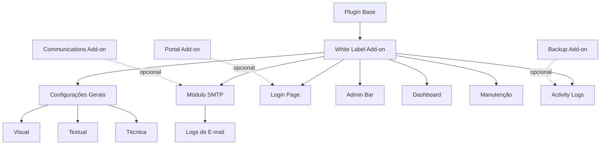

# Análise de Implementação White Label para o DPS

**Autor:** PRObst  
**Data:** 2025-12-03  
**Versão do documento:** 1.0.0

## 1. Sumário Executivo

Este documento analisa a viabilidade, segurança e funcionalidades de uma implementação White Label para o sistema DPS by PRObst. O objetivo é permitir que parceiros e revendedores personalizem o sistema com sua própria marca, mantendo a funcionalidade e a segurança do sistema base.

### 1.1 Definição de White Label

**White Label** é um modelo de negócio onde um produto/serviço é desenvolvido por uma empresa e vendido para outra, que pode personalizá-lo com sua própria marca. No contexto do DPS:

- **Licenciador (PRObst)**: Desenvolve e mantém o sistema DPS
- **Licenciado/Parceiro**: Revende ou utiliza o sistema com sua própria marca
- **Cliente final**: Pet shops e estabelecimentos que utilizam o sistema

### 1.2 Resposta às Perguntas do Problema

| Pergunta | Resposta Resumida |
|----------|-------------------|
| Como introduzir White Label? | Via novo add-on dedicado + configurações centralizadas |
| É seguro? | **Sim**, com implementação adequada (veja Seção 4) |
| Quais funcionalidades? | Personalização visual, textual, técnica, SMTP e admin customization (veja Seção 3) |

---

## 1.3 Inspiração e Referências

### WP Adminify - Referência Principal

O plugin [WP Adminify](https://wpadminify.com/) serve como inspiração para funcionalidades avançadas de White Label. Principais funcionalidades que podemos incorporar:

| Funcionalidade WP Adminify | Aplicação no DPS White Label |
|---------------------------|------------------------------|
| **Admin Bar Customizer** | Personalizar admin bar do WordPress |
| **Login Page Customizer** | Página de login com marca do parceiro |
| **Dashboard Widget Manager** | Controlar widgets exibidos no dashboard |
| **Admin Columns** | Personalizar colunas nas listagens |
| **Menu Editor** | Reorganizar e personalizar menu admin |
| **Admin Notice Manager** | Controlar notificações exibidas |
| **Quick Menu** | Acesso rápido a funcionalidades |
| **Folder Management** | Organização de mídia com pastas |
| **Activity Logs** | Registro de atividades no sistema |

### WP Mail SMTP - Integração de E-mail

O plugin WP Mail SMTP fornece funcionalidades robustas de envio de e-mail que devem ser integradas ao White Label:

| Recurso SMTP | Benefício |
|--------------|-----------|
| **Configuração de SMTP** | Envio confiável de e-mails |
| **Múltiplos mailers** | SMTP, SendGrid, Mailgun, Amazon SES, etc. |
| **Logs de e-mail** | Registro e depuração de envios |
| **Verificação de domínio** | SPF, DKIM para melhor deliverability |
| **Fallback automático** | Se um mailer falha, usa outro |

---

## 2. Arquitetura Proposta

### 2.1 Estrutura de Add-on Dedicado

Seguindo o padrão do DPS, a funcionalidade White Label seria implementada como um add-on opcional com módulos expandidos:

```
add-ons/desi-pet-shower-whitelabel_addon/
├── desi-pet-shower-whitelabel-addon.php        # Arquivo principal
├── includes/
│   ├── class-dps-whitelabel-settings.php       # Gerenciamento de configurações gerais
│   ├── class-dps-whitelabel-branding.php       # Aplicação de branding
│   ├── class-dps-whitelabel-assets.php         # Gestão de assets personalizados
│   ├── class-dps-whitelabel-license.php        # Validação de licença
│   ├── class-dps-whitelabel-smtp.php           # Configurações SMTP (NOVO)
│   ├── class-dps-whitelabel-login-page.php     # Personalização da página de login (NOVO)
│   ├── class-dps-whitelabel-admin-bar.php      # Personalização da admin bar (NOVO)
│   ├── class-dps-whitelabel-dashboard.php      # Widgets e dashboard customizado (NOVO)
│   ├── class-dps-whitelabel-menu-editor.php    # Editor de menus (NOVO)
│   ├── class-dps-whitelabel-activity-log.php   # Logs de atividade (NOVO)
│   └── class-dps-whitelabel-maintenance.php    # Modo manutenção (NOVO)
├── assets/
│   ├── css/
│   │   ├── whitelabel-admin.css                # Estilos da interface admin
│   │   └── whitelabel-login.css                # Estilos da página de login
│   └── js/
│       ├── whitelabel-admin.js                 # Scripts da interface admin
│       ├── whitelabel-color-picker.js          # Seletor de cores
│       └── whitelabel-media-uploader.js        # Upload de mídia
├── templates/
│   ├── admin-settings.php                      # Template principal de configurações
│   ├── admin-smtp.php                          # Template de configurações SMTP
│   ├── admin-login-page.php                    # Template de personalização de login
│   ├── admin-dashboard.php                     # Template de configurações do dashboard
│   ├── admin-activity-log.php                  # Template de logs de atividade
│   └── login-template.php                      # Template da página de login customizada
└── uninstall.php                               # Limpeza na desinstalação
```

### 2.2 Modelo de Configurações

As configurações White Label seriam armazenadas em múltiplas options organizadas por módulo:

```php
// Option: dps_whitelabel_settings (Configurações Gerais)
[
    // Identidade Visual
    'brand_name'           => 'Minha Pet Shop Sistemas',
    'brand_tagline'        => 'Gestão completa para seu pet shop',
    'brand_logo_url'       => 'https://example.com/logo.png',
    'brand_logo_dark_url'  => 'https://example.com/logo-dark.png',
    'brand_favicon_url'    => 'https://example.com/favicon.ico',
    
    // Cores do tema
    'color_primary'        => '#0ea5e9',  // Azul padrão DPS
    'color_secondary'      => '#10b981',
    'color_accent'         => '#f59e0b',
    'color_background'     => '#f9fafb',
    'color_text'           => '#374151',
    
    // Informações de contato
    'contact_email'        => 'suporte@meusistema.com',
    'contact_phone'        => '+55 11 99999-9999',
    'contact_whatsapp'     => '5511999999999',
    'support_url'          => 'https://suporte.meusistema.com',
    
    // URLs personalizadas
    'website_url'          => 'https://meusistema.com',
    'docs_url'             => 'https://docs.meusistema.com',
    'terms_url'            => 'https://meusistema.com/termos',
    'privacy_url'          => 'https://meusistema.com/privacidade',
    
    // Opções de exibição
    'hide_powered_by'      => false,       // Oculta "Powered by DPS"
    'hide_author_links'    => false,       // Oculta links para PRObst
    'custom_footer_text'   => '',          // Texto customizado no footer
    'custom_css'           => '',          // CSS customizado adicional
    
    // E-mail e comunicações
    'email_from_name'      => 'Minha Pet Shop Sistemas',
    'email_from_address'   => 'noreply@meusistema.com',
    'email_footer_text'    => 'Copyright 2025 Minha Pet Shop Sistemas',
    
    // Licenciamento
    'license_key'          => '',          // Chave de licença (se aplicável)
    'license_expires'      => '',          // Data de expiração
    'license_tier'         => 'standard',  // standard, professional, enterprise
]

// Option: dps_whitelabel_smtp (Configurações SMTP - NOVO)
[
    'smtp_enabled'         => false,
    'smtp_host'            => 'smtp.gmail.com',
    'smtp_port'            => 587,
    'smtp_encryption'      => 'tls',       // none, ssl, tls
    'smtp_auth'            => true,
    'smtp_username'        => '',
    'smtp_password'        => '',          // Encriptado com defuse/php-encryption
    
    // Mailer alternativo
    'mailer_type'          => 'smtp',      // smtp, sendgrid, mailgun, ses, postmark, sparkpost
    'api_key'              => '',          // Para serviços API
    'region'               => '',          // Para Amazon SES
    
    // Configurações avançadas
    'return_path'          => '',
    'force_from_email'     => false,
    'force_from_name'      => false,
    
    // Logs de e-mail
    'log_emails'           => true,
    'log_retention_days'   => 30,
    
    // Teste
    'test_email_address'   => '',
]

// Option: dps_whitelabel_login (Personalização Login - NOVO)
[
    'login_enabled'            => false,
    'login_logo_url'           => '',
    'login_logo_width'         => 320,
    'login_logo_height'        => 80,
    'login_background_type'    => 'color',  // color, image, gradient
    'login_background_color'   => '#f9fafb',
    'login_background_image'   => '',
    'login_background_gradient' => 'linear-gradient(135deg, #0ea5e9 0%, #10b981 100%)',
    
    // Formulário
    'login_form_width'         => 320,
    'login_form_background'    => '#ffffff',
    'login_form_border_radius' => 8,
    'login_form_shadow'        => true,
    
    // Botão
    'login_button_color'       => '#0ea5e9',
    'login_button_text_color'  => '#ffffff',
    
    // Textos
    'login_custom_css'         => '',
    'login_custom_message'     => '',
    'login_footer_text'        => '',
    
    // Links
    'hide_register_link'       => false,
    'hide_lost_password_link'  => false,
    'custom_register_url'      => '',
]

// Option: dps_whitelabel_admin_bar (Admin Bar - NOVO)
[
    'admin_bar_enabled'        => false,
    'hide_wp_logo'             => true,
    'hide_updates_notice'      => false,
    'hide_comments_menu'       => false,
    'hide_new_content_menu'    => false,
    'custom_logo_url'          => '',
    'custom_logo_link'         => '',
    'custom_menu_items'        => [],      // Array de itens customizados
    'admin_bar_color'          => '#1d2327',
    'admin_bar_text_color'     => '#ffffff',
]

// Option: dps_whitelabel_dashboard (Dashboard Widgets - NOVO)
[
    'dashboard_enabled'        => false,
    'hide_welcome_panel'       => true,
    'hide_quick_press'         => false,
    'hide_activity_widget'     => false,
    'hide_primary_widget'      => true,    // WordPress Events
    'custom_welcome_panel'     => '',      // HTML customizado
    'custom_widgets'           => [],      // Array de widgets customizados
]

// Option: dps_whitelabel_maintenance (Modo Manutenção - NOVO)
[
    'maintenance_enabled'      => false,
    'maintenance_title'        => 'Em Manutenção',
    'maintenance_message'      => 'Estamos realizando atualizações. Voltamos em breve!',
    'maintenance_logo_url'     => '',
    'maintenance_background'   => '#f9fafb',
    'maintenance_bypass_roles' => ['administrator'],
    'maintenance_countdown'    => '',      // Data/hora de retorno
    'maintenance_social_links' => [],      // Links de redes sociais
]

// Option: dps_whitelabel_activity_log (Logs de Atividade - NOVO)
[
    'activity_log_enabled'     => true,
    'log_user_actions'         => true,
    'log_post_changes'         => true,
    'log_settings_changes'     => true,
    'log_plugin_changes'       => true,
    'log_login_attempts'       => true,
    'log_retention_days'       => 90,
    'notify_admin_on_critical' => false,
    'critical_email_address'   => '',
]
```

### 2.3 Filtros e Hooks Propostos

Para permitir customização granular, o add-on exporia os seguintes hooks:

```php
// Filtros de identidade
apply_filters( 'dps_whitelabel_brand_name', $brand_name );
apply_filters( 'dps_whitelabel_brand_logo', $logo_url, $context );
apply_filters( 'dps_whitelabel_brand_colors', $colors );

// Filtros de comunicação
apply_filters( 'dps_whitelabel_email_from', $from_email, $context );
apply_filters( 'dps_whitelabel_whatsapp_number', $phone, $context );

// Filtros de exibição
apply_filters( 'dps_whitelabel_footer_text', $footer_text );
apply_filters( 'dps_whitelabel_admin_menu_icon', $icon_url );
apply_filters( 'dps_whitelabel_custom_css', $css );

// Actions para extensibilidade
do_action( 'dps_whitelabel_settings_saved', $old_settings, $new_settings );
do_action( 'dps_whitelabel_after_branding_applied' );

// Hooks SMTP (NOVO)
apply_filters( 'dps_whitelabel_smtp_phpmailer', $phpmailer );
apply_filters( 'dps_whitelabel_smtp_host', $host );
apply_filters( 'dps_whitelabel_email_content_type', $content_type );
do_action( 'dps_whitelabel_email_sent', $to, $subject, $result );
do_action( 'dps_whitelabel_email_failed', $to, $subject, $error );

// Hooks Login Page (NOVO)
apply_filters( 'dps_whitelabel_login_logo_url', $logo_url );
apply_filters( 'dps_whitelabel_login_styles', $styles );
apply_filters( 'dps_whitelabel_login_message', $message );

// Hooks Admin Bar (NOVO)
apply_filters( 'dps_whitelabel_admin_bar_nodes', $nodes );
do_action( 'dps_whitelabel_admin_bar_before' );
do_action( 'dps_whitelabel_admin_bar_after' );

// Hooks Activity Log (NOVO)
do_action( 'dps_whitelabel_log_activity', $action, $object_type, $object_id, $details );
apply_filters( 'dps_whitelabel_should_log_action', $should_log, $action );

// Hooks Maintenance Mode (NOVO)
apply_filters( 'dps_whitelabel_maintenance_template', $template_path );
apply_filters( 'dps_whitelabel_maintenance_can_access', $can_access, $user );
```

---

## 3. Funcionalidades Propostas

### 3.1 Personalização Visual

| Funcionalidade | Descrição | Complexidade | Prioridade |
|----------------|-----------|--------------|------------|
| **Logo personalizado** | Substituir logo "DPS by PRObst" por logo do parceiro | Baixa | Alta |
| **Paleta de cores** | Alterar cores primária, secundária e de destaque | Média | Alta |
| **Favicon customizado** | Substituir favicon padrão | Baixa | Média |
| **CSS customizado** | Campo para CSS adicional/sobrescrito | Baixa | Média |
| **Tema dark/light** | Opção de tema claro ou escuro | Média | Baixa |

**Implementação proposta:**

```php
/**
 * Aplica estilos CSS customizados baseados nas configurações White Label.
 */
class DPS_WhiteLabel_Assets {
    
    public static function enqueue_custom_styles() {
        $settings = get_option( 'dps_whitelabel_settings', [] );
        
        if ( empty( $settings ) ) {
            return;
        }
        
        $custom_css = self::generate_custom_css( $settings );
        
        if ( ! empty( $custom_css ) ) {
            wp_add_inline_style( 'dps-base-style', $custom_css );
        }
    }
    
    private static function generate_custom_css( $settings ) {
        $css = ':root {';
        
        if ( ! empty( $settings['color_primary'] ) ) {
            $css .= '--dps-color-primary: ' . esc_attr( $settings['color_primary'] ) . ';';
        }
        if ( ! empty( $settings['color_secondary'] ) ) {
            $css .= '--dps-color-secondary: ' . esc_attr( $settings['color_secondary'] ) . ';';
        }
        // ... demais cores
        
        $css .= '}';
        
        // CSS customizado adicional
        if ( ! empty( $settings['custom_css'] ) ) {
            $css .= wp_strip_all_tags( $settings['custom_css'] );
        }
        
        return $css;
    }
}
```

### 3.2 Personalização Textual

| Funcionalidade | Descrição | Complexidade | Prioridade |
|----------------|-----------|--------------|------------|
| **Nome da marca** | Substituir "DPS by PRObst" em todo o sistema | Baixa | Alta |
| **Tagline/slogan** | Texto personalizado de apresentação | Baixa | Média |
| **Textos de e-mail** | Personalizar remetente e rodapé de e-mails | Baixa | Alta |
| **Mensagens WhatsApp** | Personalizar assinatura de mensagens | Baixa | Alta |
| **Footer do painel** | Texto customizado no rodapé | Baixa | Média |

**Integração com sistema de comunicações:**

```php
/**
 * Filtra o remetente de e-mails para usar configurações White Label.
 */
add_filter( 'wp_mail_from', function( $from_email ) {
    $settings = get_option( 'dps_whitelabel_settings', [] );
    
    if ( ! empty( $settings['email_from_address'] ) ) {
        return sanitize_email( $settings['email_from_address'] );
    }
    
    return $from_email;
} );

add_filter( 'wp_mail_from_name', function( $from_name ) {
    $settings = get_option( 'dps_whitelabel_settings', [] );
    
    if ( ! empty( $settings['email_from_name'] ) ) {
        return sanitize_text_field( $settings['email_from_name'] );
    }
    
    return $from_name;
} );
```

### 3.3 Configuração SMTP (NOVO)

O módulo SMTP permite configuração completa de envio de e-mails, inspirado no WP Mail SMTP:

| Funcionalidade | Descrição | Complexidade | Prioridade |
|----------------|-----------|--------------|------------|
| **SMTP básico** | Host, porta, autenticação, TLS/SSL | Média | Alta |
| **Múltiplos mailers** | SMTP, SendGrid, Mailgun, Amazon SES, Postmark | Alta | Média |
| **Logs de e-mail** | Registro de todos os e-mails enviados | Média | Alta |
| **Teste de e-mail** | Enviar e-mail de teste para verificar configuração | Baixa | Alta |
| **Fallback automático** | Se SMTP falha, tenta PHP mail | Média | Média |

**Implementação proposta:**

```php
/**
 * Configura PHPMailer para usar SMTP customizado.
 */
class DPS_WhiteLabel_SMTP {
    
    public function __construct() {
        add_action( 'phpmailer_init', [ $this, 'configure_phpmailer' ], 1000 );
        add_action( 'wp_mail_failed', [ $this, 'log_email_failure' ] );
        add_filter( 'wp_mail', [ $this, 'log_email_attempt' ] );
    }
    
    /**
     * Configura PHPMailer com as opções SMTP.
     *
     * @param PHPMailer $phpmailer Instância do PHPMailer.
     */
    public function configure_phpmailer( $phpmailer ) {
        $smtp = get_option( 'dps_whitelabel_smtp', [] );
        
        if ( empty( $smtp['smtp_enabled'] ) ) {
            return;
        }
        
        $phpmailer->isSMTP();
        $phpmailer->Host       = sanitize_text_field( $smtp['smtp_host'] ?? 'localhost' );
        $phpmailer->Port       = absint( $smtp['smtp_port'] ?? 587 );
        $phpmailer->SMTPAuth   = ! empty( $smtp['smtp_auth'] );
        
        if ( $phpmailer->SMTPAuth ) {
            $phpmailer->Username = sanitize_text_field( $smtp['smtp_username'] ?? '' );
            $phpmailer->Password = $this->decrypt_password( $smtp['smtp_password'] ?? '' );
        }
        
        // Encriptação
        $encryption = $smtp['smtp_encryption'] ?? 'tls';
        if ( 'tls' === $encryption ) {
            $phpmailer->SMTPSecure = PHPMailer::ENCRYPTION_STARTTLS;
        } elseif ( 'ssl' === $encryption ) {
            $phpmailer->SMTPSecure = PHPMailer::ENCRYPTION_SMTPS;
        }
        
        // Return-Path personalizado
        if ( ! empty( $smtp['return_path'] ) ) {
            $phpmailer->Sender = sanitize_email( $smtp['return_path'] );
        }
        
        // Timeout
        $phpmailer->Timeout = 30;
        
        $phpmailer = apply_filters( 'dps_whitelabel_smtp_phpmailer', $phpmailer );
    }
    
    /**
     * Registra tentativa de envio de e-mail.
     *
     * @param array $args Argumentos do wp_mail.
     * @return array Args inalterados.
     */
    public function log_email_attempt( $args ) {
        $smtp = get_option( 'dps_whitelabel_smtp', [] );
        
        if ( empty( $smtp['log_emails'] ) ) {
            return $args;
        }
        
        $this->insert_email_log( [
            'to'      => is_array( $args['to'] ) ? implode( ', ', $args['to'] ) : $args['to'],
            'subject' => $args['subject'] ?? '',
            'status'  => 'pending',
            'date'    => current_time( 'mysql' ),
        ] );
        
        return $args;
    }
    
    /**
     * Registra falha de envio de e-mail.
     *
     * @param WP_Error $error Erro do wp_mail.
     */
    public function log_email_failure( $error ) {
        $this->update_last_email_log( [
            'status' => 'failed',
            'error'  => $error->get_error_message(),
        ] );
        
        do_action( 'dps_whitelabel_email_failed', $error );
    }
    
    /**
     * Encripta senha SMTP antes de salvar.
     *
     * @param string $password Senha em texto plano.
     * @return string Senha encriptada.
     */
    public function encrypt_password( $password ) {
        if ( empty( $password ) ) {
            return '';
        }
        
        // Usa OPENSSL para encriptação
        $key = wp_salt( 'auth' );
        $iv  = openssl_random_pseudo_bytes( 16 );
        
        $encrypted = openssl_encrypt(
            $password,
            'AES-256-CBC',
            $key,
            0,
            $iv
        );
        
        return base64_encode( $iv . $encrypted );
    }
    
    /**
     * Decripta senha SMTP.
     *
     * @param string $encrypted Senha encriptada.
     * @return string Senha em texto plano.
     */
    private function decrypt_password( $encrypted ) {
        if ( empty( $encrypted ) ) {
            return '';
        }
        
        $key  = wp_salt( 'auth' );
        $data = base64_decode( $encrypted );
        $iv   = substr( $data, 0, 16 );
        $enc  = substr( $data, 16 );
        
        return openssl_decrypt( $enc, 'AES-256-CBC', $key, 0, $iv );
    }
    
    /**
     * Envia e-mail de teste.
     *
     * @param string $to Endereço de destino.
     * @return bool|WP_Error True em sucesso ou WP_Error.
     */
    public static function send_test_email( $to ) {
        $settings = get_option( 'dps_whitelabel_settings', [] );
        $brand    = $settings['brand_name'] ?? 'DPS by PRObst';
        
        $subject = sprintf(
            /* translators: %s: Nome da marca */
            __( '[%s] E-mail de Teste SMTP', 'dps-whitelabel-addon' ),
            $brand
        );
        
        $message = sprintf(
            /* translators: %1$s: Nome da marca, %2$s: Data/hora */
            __( 
                "Este é um e-mail de teste enviado pelo %1\$s.\n\n" .
                "Se você está lendo isso, a configuração SMTP está funcionando corretamente!\n\n" .
                "Data/hora do envio: %2\$s\n" .
                "Servidor: %3\$s",
                'dps-whitelabel-addon'
            ),
            $brand,
            current_time( 'mysql' ),
            home_url()
        );
        
        $sent = wp_mail( $to, $subject, $message );
        
        if ( ! $sent ) {
            global $phpmailer;
            return new WP_Error( 
                'smtp_test_failed', 
                $phpmailer->ErrorInfo ?? __( 'Falha desconhecida no envio.', 'dps-whitelabel-addon' )
            );
        }
        
        return true;
    }
}
```

**Tabela de logs de e-mail:**

```sql
CREATE TABLE {$wpdb->prefix}dps_email_logs (
    id bigint(20) UNSIGNED NOT NULL AUTO_INCREMENT,
    to_email varchar(320) NOT NULL,
    subject varchar(255) NOT NULL,
    status varchar(20) NOT NULL DEFAULT 'pending',
    error text,
    headers text,
    attachments text,
    created_at datetime NOT NULL,
    PRIMARY KEY (id),
    KEY status (status),
    KEY created_at (created_at)
) {$charset_collate};
```

### 3.4 Personalização da Página de Login (NOVO)

Inspirado no WP Adminify Login Customizer:

| Funcionalidade | Descrição | Complexidade | Prioridade |
|----------------|-----------|--------------|------------|
| **Logo customizado** | Logo do parceiro na página de login | Baixa | Alta |
| **Background** | Cor, imagem ou gradiente de fundo | Baixa | Alta |
| **Estilo do formulário** | Cores, bordas, sombra | Média | Média |
| **CSS customizado** | CSS adicional para login | Baixa | Média |
| **Mensagem personalizada** | Texto abaixo do formulário | Baixa | Baixa |

**Implementação proposta:**

```php
/**
 * Personaliza a página de login do WordPress.
 */
class DPS_WhiteLabel_Login_Page {
    
    public function __construct() {
        add_action( 'login_enqueue_scripts', [ $this, 'enqueue_login_styles' ] );
        add_filter( 'login_headerurl', [ $this, 'filter_login_logo_url' ] );
        add_filter( 'login_headertext', [ $this, 'filter_login_logo_text' ] );
        add_action( 'login_footer', [ $this, 'add_login_footer' ] );
        add_filter( 'login_message', [ $this, 'filter_login_message' ] );
    }
    
    /**
     * Enfileira estilos customizados para o login.
     */
    public function enqueue_login_styles() {
        $login = get_option( 'dps_whitelabel_login', [] );
        
        if ( empty( $login['login_enabled'] ) ) {
            return;
        }
        
        $css = $this->generate_login_css( $login );
        
        wp_add_inline_style( 'login', $css );
    }
    
    /**
     * Gera CSS para a página de login.
     *
     * @param array $login Configurações de login.
     * @return string CSS gerado.
     */
    private function generate_login_css( $login ) {
        $css = '';
        
        // Background
        $bg_type = $login['login_background_type'] ?? 'color';
        switch ( $bg_type ) {
            case 'color':
                $css .= 'body.login { background-color: ' . esc_attr( $login['login_background_color'] ?? '#f9fafb' ) . '; }';
                break;
            case 'image':
                $css .= 'body.login { background-image: url(' . esc_url( $login['login_background_image'] ) . '); background-size: cover; background-position: center; }';
                break;
            case 'gradient':
                $css .= 'body.login { background: ' . esc_attr( $login['login_background_gradient'] ) . '; }';
                break;
        }
        
        // Logo
        if ( ! empty( $login['login_logo_url'] ) ) {
            $width  = absint( $login['login_logo_width'] ?? 320 );
            $height = absint( $login['login_logo_height'] ?? 80 );
            
            $css .= sprintf(
                '#login h1 a, .login h1 a {
                    background-image: url(%s);
                    width: %dpx;
                    height: %dpx;
                    background-size: contain;
                    background-repeat: no-repeat;
                    background-position: center;
                }',
                esc_url( $login['login_logo_url'] ),
                $width,
                $height
            );
        }
        
        // Formulário
        $form_bg     = $login['login_form_background'] ?? '#ffffff';
        $form_radius = absint( $login['login_form_border_radius'] ?? 8 );
        $form_shadow = ! empty( $login['login_form_shadow'] );
        
        $css .= sprintf(
            '.login form {
                background: %s;
                border-radius: %dpx;
                %s
            }',
            esc_attr( $form_bg ),
            $form_radius,
            $form_shadow ? 'box-shadow: 0 4px 6px -1px rgba(0,0,0,0.1);' : ''
        );
        
        // Botão
        $btn_color      = $login['login_button_color'] ?? '#0ea5e9';
        $btn_text_color = $login['login_button_text_color'] ?? '#ffffff';
        
        $css .= sprintf(
            '.login .button-primary {
                background: %s !important;
                border-color: %s !important;
                color: %s !important;
            }',
            esc_attr( $btn_color ),
            esc_attr( $btn_color ),
            esc_attr( $btn_text_color )
        );
        
        // CSS customizado
        if ( ! empty( $login['login_custom_css'] ) ) {
            $css .= DPS_WhiteLabel_Settings::sanitize_custom_css( $login['login_custom_css'] );
        }
        
        return $css;
    }
    
    /**
     * Altera URL do logo no login.
     *
     * @return string URL do site.
     */
    public function filter_login_logo_url() {
        $settings = get_option( 'dps_whitelabel_settings', [] );
        return $settings['website_url'] ?? home_url();
    }
    
    /**
     * Altera texto do logo no login.
     *
     * @return string Nome da marca.
     */
    public function filter_login_logo_text() {
        $settings = get_option( 'dps_whitelabel_settings', [] );
        return $settings['brand_name'] ?? get_bloginfo( 'name' );
    }
}
```

### 3.5 Personalização Admin Bar (NOVO)

| Funcionalidade | Descrição | Complexidade | Prioridade |
|----------------|-----------|--------------|------------|
| **Ocultar logo WP** | Remover logo do WordPress da admin bar | Baixa | Alta |
| **Logo customizado** | Adicionar logo do parceiro | Baixa | Alta |
| **Itens customizados** | Adicionar links personalizados | Média | Média |
| **Cores da admin bar** | Alterar cores de fundo e texto | Baixa | Média |
| **Ocultar itens** | Remover itens específicos (updates, comments, etc.) | Baixa | Média |

**Implementação proposta:**

```php
/**
 * Personaliza a Admin Bar do WordPress.
 */
class DPS_WhiteLabel_Admin_Bar {
    
    public function __construct() {
        add_action( 'admin_bar_menu', [ $this, 'customize_admin_bar' ], 999 );
        add_action( 'wp_head', [ $this, 'add_admin_bar_styles' ] );
        add_action( 'admin_head', [ $this, 'add_admin_bar_styles' ] );
    }
    
    /**
     * Customiza a admin bar.
     *
     * @param WP_Admin_Bar $wp_admin_bar Instância da admin bar.
     */
    public function customize_admin_bar( $wp_admin_bar ) {
        $admin_bar = get_option( 'dps_whitelabel_admin_bar', [] );
        
        if ( empty( $admin_bar['admin_bar_enabled'] ) ) {
            return;
        }
        
        do_action( 'dps_whitelabel_admin_bar_before', $wp_admin_bar );
        
        // Remover logo do WordPress
        if ( ! empty( $admin_bar['hide_wp_logo'] ) ) {
            $wp_admin_bar->remove_node( 'wp-logo' );
        }
        
        // Remover avisos de atualização
        if ( ! empty( $admin_bar['hide_updates_notice'] ) ) {
            $wp_admin_bar->remove_node( 'updates' );
        }
        
        // Remover menu de comentários
        if ( ! empty( $admin_bar['hide_comments_menu'] ) ) {
            $wp_admin_bar->remove_node( 'comments' );
        }
        
        // Remover menu "Novo"
        if ( ! empty( $admin_bar['hide_new_content_menu'] ) ) {
            $wp_admin_bar->remove_node( 'new-content' );
        }
        
        // Adicionar logo customizado
        if ( ! empty( $admin_bar['custom_logo_url'] ) ) {
            $settings = get_option( 'dps_whitelabel_settings', [] );
            $link     = $admin_bar['custom_logo_link'] ?? admin_url();
            
            $wp_admin_bar->add_node( [
                'id'    => 'dps-whitelabel-logo',
                'title' => sprintf(
                    '',
                    esc_url( $admin_bar['custom_logo_url'] ),
                    esc_attr( $settings['brand_name'] ?? '' )
                ),
                'href'  => esc_url( $link ),
                'meta'  => [
                    'class' => 'dps-whitelabel-logo-node',
                ],
            ] );
        }
        
        // Adicionar itens customizados
        if ( ! empty( $admin_bar['custom_menu_items'] ) && is_array( $admin_bar['custom_menu_items'] ) ) {
            foreach ( $admin_bar['custom_menu_items'] as $index => $item ) {
                $wp_admin_bar->add_node( [
                    'id'     => 'dps-custom-item-' . $index,
                    'title'  => esc_html( $item['title'] ?? '' ),
                    'href'   => esc_url( $item['url'] ?? '#' ),
                    'parent' => $item['parent'] ?? false,
                    'meta'   => [
                        'target' => $item['target'] ?? '_self',
                    ],
                ] );
            }
        }
        
        do_action( 'dps_whitelabel_admin_bar_after', $wp_admin_bar );
    }
    
    /**
     * Adiciona estilos customizados para a admin bar.
     */
    public function add_admin_bar_styles() {
        if ( ! is_admin_bar_showing() ) {
            return;
        }
        
        $admin_bar = get_option( 'dps_whitelabel_admin_bar', [] );
        
        if ( empty( $admin_bar['admin_bar_enabled'] ) ) {
            return;
        }
        
        $bg_color   = $admin_bar['admin_bar_color'] ?? '#1d2327';
        $text_color = $admin_bar['admin_bar_text_color'] ?? '#ffffff';
        
        ?>
        <style>
            #wpadminbar {
                background: <?php echo esc_attr( $bg_color ); ?> !important;
            }
            #wpadminbar .ab-item,
            #wpadminbar a.ab-item,
            #wpadminbar > #wp-toolbar span.ab-label,
            #wpadminbar > #wp-toolbar span.noticon {
                color: <?php echo esc_attr( $text_color ); ?> !important;
            }
        </style>
        <?php
    }
}
```

### 3.6 Modo Manutenção (NOVO)

| Funcionalidade | Descrição | Complexidade | Prioridade |
|----------------|-----------|--------------|------------|
| **Ativar/desativar** | Toggle simples para modo manutenção | Baixa | Alta |
| **Página customizada** | Template visual personalizado | Média | Alta |
| **Countdown** | Timer até retorno do sistema | Baixa | Média |
| **Bypass por role** | Admins podem acessar normalmente | Baixa | Alta |
| **Links sociais** | Redes sociais na página de manutenção | Baixa | Baixa |

### 3.7 Logs de Atividade (NOVO)

| Funcionalidade | Descrição | Complexidade | Prioridade |
|----------------|-----------|--------------|------------|
| **Log de logins** | Registrar tentativas de login | Baixa | Alta |
| **Log de alterações** | Registrar mudanças em posts/settings | Média | Alta |
| **Filtros e busca** | Pesquisar nos logs | Média | Média |
| **Exportação** | Exportar logs em CSV | Baixa | Baixa |
| **Alertas críticos** | Notificar admin de ações críticas | Média | Média |

### 3.8 Personalização Técnica

| Funcionalidade | Descrição | Complexidade | Prioridade |
|----------------|-----------|--------------|------------|
| **WhatsApp da equipe** | Número próprio do parceiro | Baixa | Alta |
| **URL de suporte** | Link para suporte do parceiro | Baixa | Alta |
| **Integração analytics** | Google Analytics / Meta Pixel | Média | Baixa |
| **Webhook customizado** | Notificar sistema do parceiro | Alta | Baixa |

### 3.9 Níveis de Personalização (Tiers) - Atualizado

Modelo expandido de tiers para comercialização:

| Tier | Funcionalidades | Caso de Uso | Preço Sugerido |
|------|-----------------|-------------|----------------|
| **Starter** | Logo, nome, cores básicas | Testes e avaliação | Gratuito (limitado) |
| **Standard** | Starter + e-mails, WhatsApp, favicon | Freelancers | R$ 297/site |
| **Professional** | Standard + SMTP, Login customizado, CSS | Agências médias | R$ 597/site |
| **Enterprise** | Professional + Admin Bar, Dashboard, Logs, hide powered-by | Grandes revendedores | R$ 1.497/ilimitado |
| **Agency** | Enterprise + Multi-site, API, Suporte prioritário | Agências enterprise | Sob consulta |

---

## 4. Análise de Segurança

### 4.1 Avaliação Geral: **SEGURO COM RESSALVAS**

A implementação de White Label **é segura** desde que sejam observadas as práticas abaixo:

### 4.2 Riscos Identificados e Mitigações

#### Risco 1: Injeção de CSS Malicioso

| Aspecto | Detalhe |
|---------|---------|
| **Risco** | Campo de CSS customizado pode ser usado para injetar código malicioso |
| **Gravidade** | Média |
| **Mitigação** | Sanitização rigorosa com `wp_strip_all_tags()` e validação de propriedades |
| **Exemplo de ataque** | `background-image: url("javascript:alert('XSS')")` |

**Implementação segura:**

```php
/**
 * Sanitiza CSS customizado removendo construções potencialmente perigosas.
 *
 * @param string $css CSS a ser sanitizado.
 * @return string CSS sanitizado.
 */
public static function sanitize_custom_css( $css ) {
    // Remove tags HTML
    $css = wp_strip_all_tags( $css );
    
    // Remove expressões JavaScript
    $css = preg_replace( '/javascript\s*:/i', '', $css );
    $css = preg_replace( '/expression\s*\(/i', '', $css );
    $css = preg_replace( '/behavior\s*:/i', '', $css );
    $css = preg_replace( '/-moz-binding\s*:/i', '', $css );
    
    // Remove URLs data: (podem conter código)
    $css = preg_replace( '/url\s*\(\s*["\']?\s*data:/i', 'url(blocked:', $css );
    
    // Remove @import (pode carregar CSS externo malicioso)
    $css = preg_replace( '/@import/i', '/* blocked: @import */', $css );
    
    return $css;
}
```

#### Risco 2: Upload de Arquivos Maliciosos

| Aspecto | Detalhe |
|---------|---------|
| **Risco** | Upload de logo/favicon pode conter malware |
| **Gravidade** | Alta |
| **Mitigação** | Usar biblioteca de mídia WordPress + validação de MIME type |

**Implementação segura:**

```php
/**
 * Valida URL de logo para garantir que é uma imagem válida.
 *
 * @param string $url URL da imagem.
 * @return bool True se válida.
 */
public static function validate_logo_url( $url ) {
    // Se é um attachment do WordPress, validar via Media Library
    $attachment_id = attachment_url_to_postid( $url );
    if ( $attachment_id ) {
        $mime_type = get_post_mime_type( $attachment_id );
        $allowed   = [ 'image/jpeg', 'image/png', 'image/gif', 'image/svg+xml', 'image/webp' ];
        return in_array( $mime_type, $allowed, true );
    }
    
    // Se é URL externa, validar extensão e headers
    $parsed = wp_parse_url( $url );
    if ( empty( $parsed['path'] ) ) {
        return false;
    }
    
    $ext = strtolower( pathinfo( $parsed['path'], PATHINFO_EXTENSION ) );
    $allowed_ext = [ 'jpg', 'jpeg', 'png', 'gif', 'svg', 'webp', 'ico' ];
    
    return in_array( $ext, $allowed_ext, true );
}
```

#### Risco 3: Falsificação de Identidade (Phishing)

| Aspecto | Detalhe |
|---------|---------|
| **Risco** | Parceiro pode usar White Label para criar sistema falso e capturar dados |
| **Gravidade** | Alta (reputacional) |
| **Mitigação** | Sistema de licenciamento + termos de uso claros |

**Recomendações:**

1. **Termos de Uso Claros**: Proibir uso para phishing ou fraude
2. **Registro de Licenças**: Manter banco de dados de licenças ativas
3. **Auditoria Opcional**: Sistema de verificação de instalações

#### Risco 4: Exposição de Dados entre Tenants

| Aspecto | Detalhe |
|---------|---------|
| **Risco** | Em cenário multi-tenant, dados podem vazar entre instâncias |
| **Gravidade** | Crítica |
| **Mitigação** | Isolar configurações por site (multisite) ou por prefixo |

**Implementação segura para multisite:**

```php
/**
 * Obtém configurações White Label com suporte a multisite.
 *
 * @return array Configurações do site atual.
 */
public static function get_settings() {
    if ( is_multisite() ) {
        // Cada site tem suas próprias configurações
        return get_blog_option( get_current_blog_id(), 'dps_whitelabel_settings', [] );
    }
    
    return get_option( 'dps_whitelabel_settings', [] );
}
```

### 4.3 Checklist de Segurança

| Item | Status | Responsável |
|------|--------|-------------|
| ✅ Sanitização de todas as entradas | Obrigatório | Desenvolvimento |
| ✅ Escape de todas as saídas | Obrigatório | Desenvolvimento |
| ✅ Nonces em formulários | Obrigatório | Desenvolvimento |
| ✅ Capability check (manage_options) | Obrigatório | Desenvolvimento |
| ✅ Validação de uploads | Obrigatório | Desenvolvimento |
| ✅ CSS sanitizado | Obrigatório | Desenvolvimento |
| ⚠️ Sistema de licenciamento | Recomendado | PRObst |
| ⚠️ Logs de auditoria | Recomendado | PRObst |
| ⚠️ Termos de uso para parceiros | Recomendado | Jurídico |

### 4.4 Conclusão de Segurança

**A implementação de White Label É SEGURA quando:**

1. ✅ Todas as entradas são sanitizadas antes de salvar
2. ✅ Todas as saídas são escapadas antes de renderizar
3. ✅ Uploads são validados via biblioteca de mídia WordPress
4. ✅ CSS customizado é filtrado contra código malicioso
5. ✅ Acesso às configurações requer `manage_options`
6. ✅ Nonces são verificados em todas as ações

**Nível de risco residual:** Baixo (com implementação adequada)

---

## 5. Integração com Componentes Existentes

### 5.1 Integração com Plugin Base

O add-on White Label interage com o plugin base nos seguintes pontos:

```php
// 1. Menu administrativo (prioridade 20 após menu pai existir)
add_action( 'admin_menu', [ $this, 'register_admin_menu' ], 20 );

// 2. Estilos do frontend
add_action( 'wp_enqueue_scripts', [ $this, 'enqueue_custom_styles' ], 100 );

// 3. Estilos do admin
add_action( 'admin_enqueue_scripts', [ $this, 'enqueue_admin_styles' ], 100 );

// 4. Filtro do nome da marca no painel
add_filter( 'dps_brand_name', [ $this, 'filter_brand_name' ] );
```

### 5.2 Integração com Communications Add-on

```php
// Filtra remetente de e-mails
add_filter( 'dps_comm_email_from', [ $this, 'filter_email_from' ] );
add_filter( 'dps_comm_email_from_name', [ $this, 'filter_email_from_name' ] );

// Filtra número de WhatsApp da equipe
add_filter( 'dps_team_whatsapp_number', [ $this, 'filter_whatsapp_number' ] );
```

### 5.3 Integração com Portal do Cliente

```php
// Personaliza portal do cliente
add_filter( 'dps_portal_brand_logo', [ $this, 'filter_portal_logo' ] );
add_filter( 'dps_portal_footer_text', [ $this, 'filter_portal_footer' ] );
```

### 5.4 Modificações Necessárias no Núcleo

Para suportar White Label completamente, algumas modificações são necessárias no plugin base:

| Componente | Modificação | Esforço |
|------------|-------------|---------|
| `class-dps-base-frontend.php` | Adicionar filtro para nome da marca no header | 1h |
| `class-dps-whatsapp-helper.php` | Adicionar filtro para número da equipe | 0.5h |
| `dps-base.css` | Usar CSS variables para cores | 2h |
| Templates de e-mail | Adicionar filtros para header/footer | 1h |
| Página de login/portal | Adicionar suporte a logo customizado | 1h |

**Total estimado de modificações no núcleo: ~5.5h**

---

## 6. Plano de Implementação

### 6.1 Fases de Desenvolvimento - Atualizado

| Fase | Descrição | Duração | Entregáveis |
|------|-----------|---------|-------------|
| **Fase 1** | Estrutura base e configurações | 8h | Add-on funcional com interface admin |
| **Fase 2** | Personalização visual | 6h | Logo, cores, CSS customizado, favicon |
| **Fase 3** | Personalização textual | 4h | Nome, e-mails, mensagens |
| **Fase 4** | Módulo SMTP | 10h | Configuração SMTP, logs de e-mail, teste |
| **Fase 5** | Página de Login customizada | 6h | Background, logo, estilos do formulário |
| **Fase 6** | Admin Bar customizada | 4h | Ocultar itens, logo, cores |
| **Fase 7** | Dashboard e Widgets | 6h | Welcome panel, widgets customizados |
| **Fase 8** | Modo Manutenção | 4h | Página de manutenção, bypass por role |
| **Fase 9** | Logs de Atividade | 8h | Registro de ações, filtros, exportação |
| **Fase 10** | Licenciamento | 8h | Sistema de chaves de licença |
| **Fase 11** | Integrações | 6h | Communications, Portal, etc. |
| **Fase 12** | Documentação e testes | 8h | README, exemplos, testes |

**Total estimado: 70-85h**

### 6.2 Priorização de Funcionalidades

**MVP (Mínimo Produto Viável) - Fases 1-3:**
- ✅ Logo personalizado
- ✅ Nome da marca
- ✅ Cores primárias
- ✅ WhatsApp da equipe
- ✅ Remetente de e-mail básico

**Versão Standard - Fases 1-5:**
- ✅ Todas as funcionalidades do MVP
- ✅ SMTP configurável
- ✅ Logs de e-mail
- ✅ Página de login customizada

**Versão Professional - Fases 1-8:**
- ✅ Todas as funcionalidades Standard
- ✅ Admin Bar customizada
- ✅ Dashboard widgets
- ✅ Modo Manutenção
- ✅ CSS customizado avançado

**Versão Enterprise - Todas as fases:**
- ✅ Todas as funcionalidades Professional
- ✅ Logs de atividade
- ✅ Sistema de licenciamento
- ✅ Hide "Powered by"
- ✅ Suporte prioritário

### 6.3 Dependências - Atualizado



### 6.4 Cronograma Sugerido

| Sprint | Duração | Fases | Marco |
|--------|---------|-------|-------|
| Sprint 1 | 2 semanas | 1, 2, 3 | MVP funcional |
| Sprint 2 | 2 semanas | 4, 5 | SMTP + Login |
| Sprint 3 | 2 semanas | 6, 7, 8 | Admin completo |
| Sprint 4 | 2 semanas | 9, 10 | Logs + Licença |
| Sprint 5 | 1 semana | 11, 12 | Documentação e release |

**Total: 9 semanas (~2 meses)**

---

## 7. Modelo de Negócio

### 7.1 Opções de Comercialização

| Modelo | Descrição | Vantagens | Desvantagens |
|--------|-----------|-----------|--------------|
| **Licença única** | Pagamento único por instalação | Simples, receita imediata | Sem recorrência |
| **Assinatura** | Pagamento mensal/anual | Receita recorrente | Complexidade |
| **Por tier** | Preços diferentes por funcionalidade | Escalonável | Suporte múltiplo |
| **OEM** | Licença para revendedores | Volume | Menor margem |

### 7.2 Preços Sugeridos - Atualizado

| Tier | Preço Sugerido (BRL) | Funcionalidades |
|------|----------------------|-----------------|
| Starter | Gratuito | Logo, nome (limitado, com marca DPS) |
| Standard | R$ 297/site único | Logo, cores, nome, e-mail básico |
| Professional | R$ 597/site único | Standard + SMTP, Login, Admin Bar |
| Enterprise | R$ 1.497/ilimitado | Professional + Logs, hide powered-by, suporte |
| Agency | Sob consulta | Enterprise + Multi-site, API, Suporte prioritário |

### 7.3 Considerações Jurídicas

1. **Contrato de licenciamento**: Definir termos claros de uso
2. **Marca registrada**: Proteger "DPS by PRObst" e permitir uso limitado
3. **Responsabilidade**: Definir limites de responsabilidade do licenciador
4. **Revogação**: Condições para cancelamento de licença

---

## 8. Alternativas Consideradas

### 8.1 Opção A: Configurações no Plugin Base

**Descrição:** Adicionar configurações White Label diretamente no plugin base.

| Prós | Contras |
|------|---------|
| Simplicidade | Aumenta complexidade do núcleo |
| Sempre disponível | Difícil de comercializar separadamente |
| Menos arquivos | Mistura funcionalidades opcionais com essenciais |

**Decisão:** ❌ Rejeitada - viola princípio de modularidade do DPS

### 8.2 Opção B: Filtros Apenas (Sem Interface)

**Descrição:** Expor apenas filtros para desenvolvedores personalizarem via código.

| Prós | Contras |
|------|---------|
| Muito simples | Requer conhecimento técnico |
| Sem interface admin | Não acessível para não-desenvolvedores |
| Flexibilidade total | Difícil de suportar |

**Decisão:** ❌ Rejeitada - não atende parceiros não-técnicos

### 8.3 Opção C: Add-on Dedicado (Escolhida)

**Descrição:** Add-on separado com interface administrativa completa.

| Prós | Contras |
|------|---------|
| Modular | Adiciona mais um add-on |
| Comercializável | Desenvolvimento adicional |
| Interface amigável | - |
| Manutenção isolada | - |

**Decisão:** ✅ Aprovada - alinha com arquitetura existente do DPS

---

## 9. Conclusões e Recomendações

### 9.1 Viabilidade

| Aspecto | Avaliação | Justificativa |
|---------|-----------|---------------|
| **Técnica** | ✅ Viável | Arquitetura do DPS suporta bem extensões |
| **Segurança** | ✅ Seguro | Com implementação adequada (seção 4) |
| **Comercial** | ✅ Viável | Modelo SaaS/licenciamento bem estabelecido |
| **Manutenção** | ✅ Viável | Add-on isolado facilita atualizações |

### 9.2 Recomendações Finais

1. **Implementar como add-on separado** seguindo estrutura proposta
2. **Começar com MVP** (logo, cores, nome) e expandir iterativamente
3. **Priorizar segurança** com sanitização rigorosa
4. **Documentar extensivamente** para parceiros
5. **Considerar licenciamento** para controle e monetização

### 9.3 Próximos Passos

1. [ ] Aprovar escopo do MVP
2. [ ] Desenvolver estrutura base do add-on
3. [ ] Implementar interface de configurações
4. [ ] Adicionar filtros ao plugin base
5. [ ] Testar com parceiros piloto
6. [ ] Documentar e lançar

---

## Apêndice A: Código de Exemplo Completo

### A.1 Estrutura Principal do Add-on

```php
<?php
/**
 * Plugin Name:       DPS by PRObst – White Label
 * Plugin URI:        https://www.probst.pro
 * Description:       Personalize o sistema DPS com sua própria marca, cores e identidade visual.
 * Version:           1.0.0
 * Author:            PRObst
 * Author URI:        https://www.probst.pro
 * Text Domain:       dps-whitelabel-addon
 * Domain Path:       /languages
 * Requires at least: 6.0
 * Requires PHP:      7.4
 *
 * NOTA: O requisito PHP 7.4 mantém consistência com o plugin base DPS.
 * Recomenda-se que ambientes de produção utilizem PHP 8.1+ para melhor
 * segurança e performance. PHP 7.4 atingiu fim de vida em novembro de 2022.
 */

// Impede acesso direto
if ( ! defined( 'ABSPATH' ) ) {
    exit;
}

// Define constantes
define( 'DPS_WHITELABEL_VERSION', '1.0.0' );
define( 'DPS_WHITELABEL_DIR', plugin_dir_path( __FILE__ ) );
define( 'DPS_WHITELABEL_URL', plugin_dir_url( __FILE__ ) );

/**
 * Inicializa o add-on White Label.
 */
function dps_whitelabel_init() {
    // Verifica dependência do plugin base
    if ( ! class_exists( 'DPS_Base_Plugin' ) ) {
        add_action( 'admin_notices', 'dps_whitelabel_missing_base_notice' );
        return;
    }
    
    // Carrega classes
    require_once DPS_WHITELABEL_DIR . 'includes/class-dps-whitelabel-settings.php';
    require_once DPS_WHITELABEL_DIR . 'includes/class-dps-whitelabel-branding.php';
    require_once DPS_WHITELABEL_DIR . 'includes/class-dps-whitelabel-assets.php';
    
    // Inicializa componentes
    new DPS_WhiteLabel_Settings();
    new DPS_WhiteLabel_Branding();
    DPS_WhiteLabel_Assets::init();
}
add_action( 'plugins_loaded', 'dps_whitelabel_init' );

/**
 * Exibe aviso quando plugin base não está ativo.
 */
function dps_whitelabel_missing_base_notice() {
    ?>
    <div class="notice notice-error">
        <p>
            <?php esc_html_e( 'O add-on DPS White Label requer o plugin base DPS by PRObst para funcionar.', 'dps-whitelabel-addon' ); ?>
        </p>
    </div>
    <?php
}
```

### A.2 Classe de Configurações

```php
<?php
/**
 * Gerencia as configurações White Label.
 */
class DPS_WhiteLabel_Settings {
    
    /**
     * Nome da option onde as configurações são armazenadas.
     */
    const OPTION_NAME = 'dps_whitelabel_settings';
    
    /**
     * Configurações padrão.
     */
    private static $defaults = [
        'brand_name'          => '',
        'brand_tagline'       => '',
        'brand_logo_url'      => '',
        'color_primary'       => '#0ea5e9',
        'color_secondary'     => '#10b981',
        'contact_whatsapp'    => '',
        'email_from_name'     => '',
        'email_from_address'  => '',
        'hide_powered_by'     => false,
        'custom_css'          => '',
    ];
    
    public function __construct() {
        add_action( 'admin_menu', [ $this, 'register_admin_menu' ], 20 );
        add_action( 'admin_init', [ $this, 'handle_settings_save' ] );
    }
    
    /**
     * Registra submenu sob DPS by PRObst.
     */
    public function register_admin_menu() {
        add_submenu_page(
            'desi-pet-shower',
            __( 'White Label', 'dps-whitelabel-addon' ),
            __( 'White Label', 'dps-whitelabel-addon' ),
            'manage_options',
            'dps-whitelabel',
            [ $this, 'render_settings_page' ]
        );
    }
    
    /**
     * Renderiza página de configurações.
     */
    public function render_settings_page() {
        if ( ! current_user_can( 'manage_options' ) ) {
            wp_die( esc_html__( 'Acesso negado.', 'dps-whitelabel-addon' ) );
        }
        
        $settings = self::get_settings();
        include DPS_WHITELABEL_DIR . 'templates/admin-settings.php';
    }
    
    /**
     * Processa salvamento de configurações.
     */
    public function handle_settings_save() {
        if ( ! isset( $_POST['dps_whitelabel_save'] ) ) {
            return;
        }
        
        // Verificação segura de nonce - usa isset() para garantir que campo existe
        if ( ! isset( $_POST['dps_whitelabel_nonce'] ) || ! wp_verify_nonce( sanitize_text_field( wp_unslash( $_POST['dps_whitelabel_nonce'] ) ), 'dps_whitelabel_settings' ) ) {
            wp_die( esc_html__( 'Nonce inválido.', 'dps-whitelabel-addon' ) );
        }
        
        if ( ! current_user_can( 'manage_options' ) ) {
            wp_die( esc_html__( 'Acesso negado.', 'dps-whitelabel-addon' ) );
        }
        
        $old_settings = self::get_settings();
        
        $new_settings = [
            'brand_name'         => sanitize_text_field( wp_unslash( $_POST['brand_name'] ?? '' ) ),
            'brand_tagline'      => sanitize_text_field( wp_unslash( $_POST['brand_tagline'] ?? '' ) ),
            'brand_logo_url'     => esc_url_raw( wp_unslash( $_POST['brand_logo_url'] ?? '' ) ),
            'color_primary'      => sanitize_hex_color( wp_unslash( $_POST['color_primary'] ?? '' ) ),
            'color_secondary'    => sanitize_hex_color( wp_unslash( $_POST['color_secondary'] ?? '' ) ),
            'contact_whatsapp'   => sanitize_text_field( wp_unslash( $_POST['contact_whatsapp'] ?? '' ) ),
            'email_from_name'    => sanitize_text_field( wp_unslash( $_POST['email_from_name'] ?? '' ) ),
            'email_from_address' => sanitize_email( wp_unslash( $_POST['email_from_address'] ?? '' ) ),
            'hide_powered_by'    => isset( $_POST['hide_powered_by'] ),
            'custom_css'         => self::sanitize_custom_css( wp_unslash( $_POST['custom_css'] ?? '' ) ),
        ];
        
        update_option( self::OPTION_NAME, $new_settings );
        
        do_action( 'dps_whitelabel_settings_saved', $old_settings, $new_settings );
        
        add_settings_error(
            'dps_whitelabel',
            'settings_saved',
            __( 'Configurações salvas com sucesso!', 'dps-whitelabel-addon' ),
            'success'
        );
    }
    
    /**
     * Obtém configurações atuais.
     *
     * @return array Configurações mescladas com padrões.
     */
    public static function get_settings() {
        $saved = get_option( self::OPTION_NAME, [] );
        return wp_parse_args( $saved, self::$defaults );
    }
    
    /**
     * Obtém valor de uma configuração específica.
     *
     * @param string $key     Nome da configuração.
     * @param mixed  $default Valor padrão se não existir.
     * @return mixed Valor da configuração.
     */
    public static function get( $key, $default = '' ) {
        $settings = self::get_settings();
        return isset( $settings[ $key ] ) ? $settings[ $key ] : $default;
    }
    
    /**
     * Sanitiza CSS customizado.
     *
     * @param string $css CSS a sanitizar.
     * @return string CSS sanitizado.
     */
    public static function sanitize_custom_css( $css ) {
        // Remove tags HTML
        $css = wp_strip_all_tags( $css );
        
        // Remove expressões perigosas
        $css = preg_replace( '/javascript\s*:/i', '', $css );
        $css = preg_replace( '/expression\s*\(/i', '', $css );
        $css = preg_replace( '/behavior\s*:/i', '', $css );
        $css = preg_replace( '/-moz-binding\s*:/i', '', $css );
        $css = preg_replace( '/url\s*\(\s*["\']?\s*data:/i', 'url(blocked:', $css );
        $css = preg_replace( '/@import/i', '/* @import blocked */', $css );
        
        return $css;
    }
}
```

---

## Apêndice B: Glossário

| Termo | Definição |
|-------|-----------|
| **White Label** | Produto genérico que pode ser rebatizado por terceiros |
| **OEM** | Original Equipment Manufacturer - revenda sob marca própria |
| **Multi-tenant** | Múltiplos clientes compartilhando mesma instalação |
| **Tier** | Nível de funcionalidades em modelo de preços escalonado |
| **CSS Variables** | Propriedades CSS customizáveis via `--nome-variavel` |
| **SMTP** | Simple Mail Transfer Protocol - protocolo para envio de e-mails |
| **Mailer** | Serviço de envio de e-mails (SendGrid, Mailgun, etc.) |
| **Admin Bar** | Barra administrativa do WordPress no topo do site |
| **Activity Log** | Registro de atividades e ações no sistema |

---

## Apêndice C: Referências

### Plugins de Referência
1. [WP Adminify](https://wpadminify.com/) - Inspiração para funcionalidades de admin customization
2. [WP Mail SMTP](https://wordpress.org/plugins/wp-mail-smtp/) - Referência para implementação SMTP
3. [White Label CMS](https://developer.developer.developer/) - Referência para branding

### Documentação Técnica
4. [WordPress Coding Standards](https://developer.wordpress.org/coding-standards/)
5. [WordPress Plugin Security](https://developer.wordpress.org/plugins/security/)
6. [OWASP CSS Injection](https://owasp.org/www-project-web-security-testing-guide/)
7. [PHPMailer Documentation](https://github.com/PHPMailer/PHPMailer)

### Documentação DPS
8. [DPS by PRObst - ANALYSIS.md](../ANALYSIS.md)
9. [DPS by PRObst - AGENTS.md](../../AGENTS.md)
10. [DPS by PRObst - API_DOCUMENTATION.md](API_DOCUMENTATION.md)

---

## Apêndice D: Funcionalidades Inspiradas no WP Adminify

O WP Adminify oferece diversas funcionalidades que podem ser adaptadas para o White Label DPS:

| Funcionalidade WP Adminify | Status no DPS White Label | Notas |
|---------------------------|---------------------------|-------|
| **Admin Bar Customizer** | ✅ Incluído na Fase 6 | Personalização completa |
| **Login Page Customizer** | ✅ Incluído na Fase 5 | Background, logo, estilos |
| **Dashboard Widget Manager** | ✅ Incluído na Fase 7 | Ocultar/mostrar widgets |
| **Admin Columns** | ⚠️ Futuro | Personalizar colunas nas listagens |
| **Menu Editor** | ⚠️ Futuro | Reorganizar e personalizar menus |
| **Admin Notice Manager** | ✅ Incluído na Fase 6 | Via Admin Bar config |
| **Quick Menu** | ⚠️ Futuro | Acesso rápido flutuante |
| **Folder Management** | ❌ Fora do escopo | Biblioteca de mídia específica |
| **Activity Logs** | ✅ Incluído na Fase 9 | Registro completo |
| **Custom CSS/JS** | ✅ Incluído na Fase 2 | CSS customizado |
| **Maintenance Mode** | ✅ Incluído na Fase 8 | Página de manutenção |
| **Google Fonts** | ⚠️ Futuro | Tipografia customizada |
| **Sidebar Generator** | ❌ Fora do escopo | Específico para themes |

### Funcionalidades Adicionais Propostas

Além das inspirações do WP Adminify, o DPS White Label pode incluir:

| Funcionalidade | Descrição | Prioridade |
|----------------|-----------|------------|
| **Multi-language Support** | Textos da interface em múltiplos idiomas | Média |
| **Dark Mode Toggle** | Alternar entre tema claro e escuro | Baixa |
| **Custom Admin Footer** | Texto e links customizados no rodapé | Alta |
| **Role-based Visibility** | Mostrar/ocultar funcionalidades por role | Média |
| **API REST** | Endpoints para integração externa | Baixa |
| **Webhooks** | Notificar sistemas externos de eventos | Média |
| **Analytics Integration** | Google Analytics, Meta Pixel | Baixa |
| **Custom Error Pages** | 404, 500 com marca do parceiro | Baixa |

---

## Apêndice E: Integração com WP Mail SMTP

O módulo SMTP do DPS White Label foi projetado para ser compatível com o WP Mail SMTP, permitindo:

### Cenário 1: Uso Standalone
O DPS White Label gerencia SMTP diretamente, sem necessidade de plugins externos.

```php
// Configuração básica no DPS White Label
$smtp_settings = [
    'smtp_enabled'    => true,
    'smtp_host'       => 'smtp.gmail.com',
    'smtp_port'       => 587,
    'smtp_encryption' => 'tls',
    'smtp_auth'       => true,
    'smtp_username'   => 'user@gmail.com',
    'smtp_password'   => 'encrypted_password',
];
```

### Cenário 2: Coexistência com WP Mail SMTP
Se o usuário já tem WP Mail SMTP instalado, o DPS White Label detecta e desativa seu próprio módulo SMTP.

```php
// Detecção de WP Mail SMTP
if ( class_exists( 'WPMailSMTP\Core' ) ) {
    // WP Mail SMTP está ativo - não sobrescrever
    return;
}
```

### Cenário 3: Migração de Configurações
Importar configurações do WP Mail SMTP para o DPS White Label:

```php
/**
 * Importa configurações do WP Mail SMTP.
 *
 * @return array Configurações importadas.
 */
public static function import_from_wp_mail_smtp() {
    $wpms_options = get_option( 'wp_mail_smtp', [] );
    
    if ( empty( $wpms_options ) ) {
        return [];
    }
    
    return [
        'smtp_enabled'    => true,
        'smtp_host'       => $wpms_options['smtp']['host'] ?? '',
        'smtp_port'       => $wpms_options['smtp']['port'] ?? 587,
        'smtp_encryption' => $wpms_options['smtp']['encryption'] ?? 'tls',
        'smtp_auth'       => ! empty( $wpms_options['smtp']['auth'] ),
        'smtp_username'   => $wpms_options['smtp']['user'] ?? '',
        // Senha não é importável por segurança
    ];
}
```

### Mailers Suportados

| Mailer | Suporte DPS | Configuração |
|--------|-------------|--------------|
| **SMTP Padrão** | ✅ Completo | Host, porta, auth |
| **Gmail** | ✅ Completo | Via SMTP ou OAuth |
| **Outlook/Office 365** | ✅ Completo | Via SMTP |
| **SendGrid** | ✅ API | API Key |
| **Mailgun** | ✅ API | API Key, domínio |
| **Amazon SES** | ✅ API | Access Key, Secret, Region |
| **Postmark** | ⚠️ Futuro | API Token |
| **SparkPost** | ⚠️ Futuro | API Key |

---

**Documento preparado por:** PRObst  
**Versão:** 2.0.0 (expandida)  
**Data atualização:** 2025-12-03  
**Revisão:** Pendente  
**Próxima atualização:** Após aprovação do escopo
