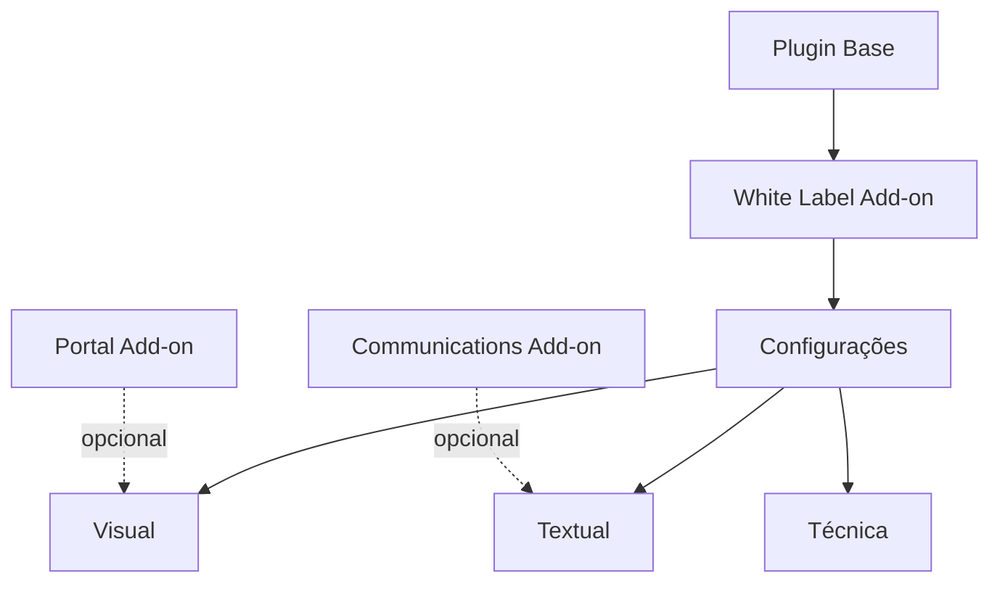

# Análise de Implementação White Label para o DPS

**Autor:** PRObst  
**Data:** 2025-12-03  
**Versão do documento:** 1.0.0

## 1. Sumário Executivo

Este documento analisa a viabilidade, segurança e funcionalidades de uma implementação White Label para o sistema DPS by PRObst. O objetivo é permitir que parceiros e revendedores personalizem o sistema com sua própria marca, mantendo a funcionalidade e a segurança do sistema base.

### 1.1 Definição de White Label

**White Label** é um modelo de negócio onde um produto/serviço é desenvolvido por uma empresa e vendido para outra, que pode personalizá-lo com sua própria marca. No contexto do DPS:

- **Licenciador (PRObst)**: Desenvolve e mantém o sistema DPS
- **Licenciado/Parceiro**: Revende ou utiliza o sistema com sua própria marca
- **Cliente final**: Pet shops e estabelecimentos que utilizam o sistema

### 1.2 Resposta às Perguntas do Problema

| Pergunta | Resposta Resumida |
|----------|-------------------|
| Como introduzir White Label? | Via novo add-on dedicado + configurações centralizadas |
| É seguro? | **Sim**, com implementação adequada (veja Seção 4) |
| Quais funcionalidades? | Personalização visual, textual, técnica e de identidade (veja Seção 3) |

---

## 2. Arquitetura Proposta

### 2.1 Estrutura de Add-on Dedicado

Seguindo o padrão do DPS, a funcionalidade White Label seria implementada como um add-on opcional:

```
add-ons/desi-pet-shower-whitelabel_addon/
├── desi-pet-shower-whitelabel-addon.php    # Arquivo principal
├── includes/
│   ├── class-dps-whitelabel-settings.php   # Gerenciamento de configurações
│   ├── class-dps-whitelabel-branding.php   # Aplicação de branding
│   ├── class-dps-whitelabel-assets.php     # Gestão de assets personalizados
│   └── class-dps-whitelabel-license.php    # Validação de licença (opcional)
├── assets/
│   ├── css/
│   │   └── whitelabel-admin.css            # Estilos da interface admin
│   └── js/
│       └── whitelabel-admin.js             # Scripts da interface admin
├── templates/
│   └── admin-settings.php                  # Template da página de configurações
└── uninstall.php                           # Limpeza na desinstalação
```

### 2.2 Modelo de Configurações

As configurações White Label seriam armazenadas em uma única option serializada:

```php
// Option: dps_whitelabel_settings
[
    // Identidade Visual
    'brand_name'           => 'Minha Pet Shop Sistemas',
    'brand_tagline'        => 'Gestão completa para seu pet shop',
    'brand_logo_url'       => 'https://example.com/logo.png',
    'brand_logo_dark_url'  => 'https://example.com/logo-dark.png',
    'brand_favicon_url'    => 'https://example.com/favicon.ico',
    
    // Cores do tema
    'color_primary'        => '#0ea5e9',  // Azul padrão DPS
    'color_secondary'      => '#10b981',
    'color_accent'         => '#f59e0b',
    'color_background'     => '#f9fafb',
    'color_text'           => '#374151',
    
    // Informações de contato
    'contact_email'        => 'suporte@meusistema.com',
    'contact_phone'        => '+55 11 99999-9999',
    'contact_whatsapp'     => '5511999999999',
    'support_url'          => 'https://suporte.meusistema.com',
    
    // URLs personalizadas
    'website_url'          => 'https://meusistema.com',
    'docs_url'             => 'https://docs.meusistema.com',
    'terms_url'            => 'https://meusistema.com/termos',
    'privacy_url'          => 'https://meusistema.com/privacidade',
    
    // Opções de exibição
    'hide_powered_by'      => false,       // Oculta "Powered by DPS"
    'hide_author_links'    => false,       // Oculta links para PRObst
    'custom_footer_text'   => '',          // Texto customizado no footer
    'custom_css'           => '',          // CSS customizado adicional
    
    // E-mail e comunicações
    'email_from_name'      => 'Minha Pet Shop Sistemas',
    'email_from_address'   => 'noreply@meusistema.com',
    'email_footer_text'    => 'Copyright 2025 Minha Pet Shop Sistemas',
    
    // Licenciamento
    'license_key'          => '',          // Chave de licença (se aplicável)
    'license_expires'      => '',          // Data de expiração
    'license_tier'         => 'standard',  // standard, professional, enterprise
]
```

### 2.3 Filtros e Hooks Propostos

Para permitir customização granular, o add-on exporia os seguintes hooks:

```php
// Filtros de identidade
apply_filters( 'dps_whitelabel_brand_name', $brand_name );
apply_filters( 'dps_whitelabel_brand_logo', $logo_url, $context );
apply_filters( 'dps_whitelabel_brand_colors', $colors );

// Filtros de comunicação
apply_filters( 'dps_whitelabel_email_from', $from_email, $context );
apply_filters( 'dps_whitelabel_whatsapp_number', $phone, $context );

// Filtros de exibição
apply_filters( 'dps_whitelabel_footer_text', $footer_text );
apply_filters( 'dps_whitelabel_admin_menu_icon', $icon_url );
apply_filters( 'dps_whitelabel_custom_css', $css );

// Actions para extensibilidade
do_action( 'dps_whitelabel_settings_saved', $old_settings, $new_settings );
do_action( 'dps_whitelabel_after_branding_applied' );
```

---

## 3. Funcionalidades Propostas

### 3.1 Personalização Visual

| Funcionalidade | Descrição | Complexidade | Prioridade |
|----------------|-----------|--------------|------------|
| **Logo personalizado** | Substituir logo "DPS by PRObst" por logo do parceiro | Baixa | Alta |
| **Paleta de cores** | Alterar cores primária, secundária e de destaque | Média | Alta |
| **Favicon customizado** | Substituir favicon padrão | Baixa | Média |
| **CSS customizado** | Campo para CSS adicional/sobrescrito | Baixa | Média |
| **Tema dark/light** | Opção de tema claro ou escuro | Média | Baixa |

**Implementação proposta:**

```php
/**
 * Aplica estilos CSS customizados baseados nas configurações White Label.
 */
class DPS_WhiteLabel_Assets {
    
    public static function enqueue_custom_styles() {
        $settings = get_option( 'dps_whitelabel_settings', [] );
        
        if ( empty( $settings ) ) {
            return;
        }
        
        $custom_css = self::generate_custom_css( $settings );
        
        if ( ! empty( $custom_css ) ) {
            wp_add_inline_style( 'dps-base-style', $custom_css );
        }
    }
    
    private static function generate_custom_css( $settings ) {
        $css = ':root {';
        
        if ( ! empty( $settings['color_primary'] ) ) {
            $css .= '--dps-color-primary: ' . esc_attr( $settings['color_primary'] ) . ';';
        }
        if ( ! empty( $settings['color_secondary'] ) ) {
            $css .= '--dps-color-secondary: ' . esc_attr( $settings['color_secondary'] ) . ';';
        }
        // ... demais cores
        
        $css .= '}';
        
        // CSS customizado adicional
        if ( ! empty( $settings['custom_css'] ) ) {
            $css .= wp_strip_all_tags( $settings['custom_css'] );
        }
        
        return $css;
    }
}
```

### 3.2 Personalização Textual

| Funcionalidade | Descrição | Complexidade | Prioridade |
|----------------|-----------|--------------|------------|
| **Nome da marca** | Substituir "DPS by PRObst" em todo o sistema | Baixa | Alta |
| **Tagline/slogan** | Texto personalizado de apresentação | Baixa | Média |
| **Textos de e-mail** | Personalizar remetente e rodapé de e-mails | Baixa | Alta |
| **Mensagens WhatsApp** | Personalizar assinatura de mensagens | Baixa | Alta |
| **Footer do painel** | Texto customizado no rodapé | Baixa | Média |

**Integração com sistema de comunicações:**

```php
/**
 * Filtra o remetente de e-mails para usar configurações White Label.
 */
add_filter( 'wp_mail_from', function( $from_email ) {
    $settings = get_option( 'dps_whitelabel_settings', [] );
    
    if ( ! empty( $settings['email_from_address'] ) ) {
        return sanitize_email( $settings['email_from_address'] );
    }
    
    return $from_email;
} );

add_filter( 'wp_mail_from_name', function( $from_name ) {
    $settings = get_option( 'dps_whitelabel_settings', [] );
    
    if ( ! empty( $settings['email_from_name'] ) ) {
        return sanitize_text_field( $settings['email_from_name'] );
    }
    
    return $from_name;
} );
```

### 3.3 Personalização Técnica

| Funcionalidade | Descrição | Complexidade | Prioridade |
|----------------|-----------|--------------|------------|
| **WhatsApp da equipe** | Número próprio do parceiro | Baixa | Alta |
| **URL de suporte** | Link para suporte do parceiro | Baixa | Alta |
| **Integração analytics** | Google Analytics / Meta Pixel | Média | Baixa |
| **Webhook customizado** | Notificar sistema do parceiro | Alta | Baixa |

### 3.4 Níveis de Personalização (Tiers)

Sugere-se um modelo de tiers para comercialização:

| Tier | Funcionalidades | Caso de Uso |
|------|-----------------|-------------|
| **Standard** | Logo, cores básicas, nome da marca | Freelancers e pequenas agências |
| **Professional** | Standard + e-mails, WhatsApp, CSS customizado | Agências médias |
| **Enterprise** | Professional + hide powered by, webhooks, multi-tenant | Grandes revendedores |

---

## 4. Análise de Segurança

### 4.1 Avaliação Geral: **SEGURO COM RESSALVAS**

A implementação de White Label **é segura** desde que sejam observadas as práticas abaixo:

### 4.2 Riscos Identificados e Mitigações

#### Risco 1: Injeção de CSS Malicioso

| Aspecto | Detalhe |
|---------|---------|
| **Risco** | Campo de CSS customizado pode ser usado para injetar código malicioso |
| **Gravidade** | Média |
| **Mitigação** | Sanitização rigorosa com `wp_strip_all_tags()` e validação de propriedades |
| **Exemplo de ataque** | `background-image: url("javascript:alert('XSS')")` |

**Implementação segura:**

```php
/**
 * Sanitiza CSS customizado removendo construções potencialmente perigosas.
 *
 * @param string $css CSS a ser sanitizado.
 * @return string CSS sanitizado.
 */
public static function sanitize_custom_css( $css ) {
    // Remove tags HTML
    $css = wp_strip_all_tags( $css );
    
    // Remove expressões JavaScript
    $css = preg_replace( '/javascript\s*:/i', '', $css );
    $css = preg_replace( '/expression\s*\(/i', '', $css );
    $css = preg_replace( '/behavior\s*:/i', '', $css );
    $css = preg_replace( '/-moz-binding\s*:/i', '', $css );
    
    // Remove URLs data: (podem conter código)
    $css = preg_replace( '/url\s*\(\s*["\']?\s*data:/i', 'url(blocked:', $css );
    
    // Remove @import (pode carregar CSS externo malicioso)
    $css = preg_replace( '/@import/i', '/* blocked: @import */', $css );
    
    return $css;
}
```

#### Risco 2: Upload de Arquivos Maliciosos

| Aspecto | Detalhe |
|---------|---------|
| **Risco** | Upload de logo/favicon pode conter malware |
| **Gravidade** | Alta |
| **Mitigação** | Usar biblioteca de mídia WordPress + validação de MIME type |

**Implementação segura:**

```php
/**
 * Valida URL de logo para garantir que é uma imagem válida.
 *
 * @param string $url URL da imagem.
 * @return bool True se válida.
 */
public static function validate_logo_url( $url ) {
    // Se é um attachment do WordPress, validar via Media Library
    $attachment_id = attachment_url_to_postid( $url );
    if ( $attachment_id ) {
        $mime_type = get_post_mime_type( $attachment_id );
        $allowed   = [ 'image/jpeg', 'image/png', 'image/gif', 'image/svg+xml', 'image/webp' ];
        return in_array( $mime_type, $allowed, true );
    }
    
    // Se é URL externa, validar extensão e headers
    $parsed = wp_parse_url( $url );
    if ( empty( $parsed['path'] ) ) {
        return false;
    }
    
    $ext = strtolower( pathinfo( $parsed['path'], PATHINFO_EXTENSION ) );
    $allowed_ext = [ 'jpg', 'jpeg', 'png', 'gif', 'svg', 'webp', 'ico' ];
    
    return in_array( $ext, $allowed_ext, true );
}
```

#### Risco 3: Falsificação de Identidade (Phishing)

| Aspecto | Detalhe |
|---------|---------|
| **Risco** | Parceiro pode usar White Label para criar sistema falso e capturar dados |
| **Gravidade** | Alta (reputacional) |
| **Mitigação** | Sistema de licenciamento + termos de uso claros |

**Recomendações:**

1. **Termos de Uso Claros**: Proibir uso para phishing ou fraude
2. **Registro de Licenças**: Manter banco de dados de licenças ativas
3. **Auditoria Opcional**: Sistema de verificação de instalações

#### Risco 4: Exposição de Dados entre Tenants

| Aspecto | Detalhe |
|---------|---------|
| **Risco** | Em cenário multi-tenant, dados podem vazar entre instâncias |
| **Gravidade** | Crítica |
| **Mitigação** | Isolar configurações por site (multisite) ou por prefixo |

**Implementação segura para multisite:**

```php
/**
 * Obtém configurações White Label com suporte a multisite.
 *
 * @return array Configurações do site atual.
 */
public static function get_settings() {
    if ( is_multisite() ) {
        // Cada site tem suas próprias configurações
        return get_blog_option( get_current_blog_id(), 'dps_whitelabel_settings', [] );
    }
    
    return get_option( 'dps_whitelabel_settings', [] );
}
```

### 4.3 Checklist de Segurança

| Item | Status | Responsável |
|------|--------|-------------|
| ✅ Sanitização de todas as entradas | Obrigatório | Desenvolvimento |
| ✅ Escape de todas as saídas | Obrigatório | Desenvolvimento |
| ✅ Nonces em formulários | Obrigatório | Desenvolvimento |
| ✅ Capability check (manage_options) | Obrigatório | Desenvolvimento |
| ✅ Validação de uploads | Obrigatório | Desenvolvimento |
| ✅ CSS sanitizado | Obrigatório | Desenvolvimento |
| ⚠️ Sistema de licenciamento | Recomendado | PRObst |
| ⚠️ Logs de auditoria | Recomendado | PRObst |
| ⚠️ Termos de uso para parceiros | Recomendado | Jurídico |

### 4.4 Conclusão de Segurança

**A implementação de White Label É SEGURA quando:**

1. ✅ Todas as entradas são sanitizadas antes de salvar
2. ✅ Todas as saídas são escapadas antes de renderizar
3. ✅ Uploads são validados via biblioteca de mídia WordPress
4. ✅ CSS customizado é filtrado contra código malicioso
5. ✅ Acesso às configurações requer `manage_options`
6. ✅ Nonces são verificados em todas as ações

**Nível de risco residual:** Baixo (com implementação adequada)

---

## 5. Integração com Componentes Existentes

### 5.1 Integração com Plugin Base

O add-on White Label interage com o plugin base nos seguintes pontos:

```php
// 1. Menu administrativo (prioridade 20 após menu pai existir)
add_action( 'admin_menu', [ $this, 'register_admin_menu' ], 20 );

// 2. Estilos do frontend
add_action( 'wp_enqueue_scripts', [ $this, 'enqueue_custom_styles' ], 100 );

// 3. Estilos do admin
add_action( 'admin_enqueue_scripts', [ $this, 'enqueue_admin_styles' ], 100 );

// 4. Filtro do nome da marca no painel
add_filter( 'dps_brand_name', [ $this, 'filter_brand_name' ] );
```

### 5.2 Integração com Communications Add-on

```php
// Filtra remetente de e-mails
add_filter( 'dps_comm_email_from', [ $this, 'filter_email_from' ] );
add_filter( 'dps_comm_email_from_name', [ $this, 'filter_email_from_name' ] );

// Filtra número de WhatsApp da equipe
add_filter( 'dps_team_whatsapp_number', [ $this, 'filter_whatsapp_number' ] );
```

### 5.3 Integração com Portal do Cliente

```php
// Personaliza portal do cliente
add_filter( 'dps_portal_brand_logo', [ $this, 'filter_portal_logo' ] );
add_filter( 'dps_portal_footer_text', [ $this, 'filter_portal_footer' ] );
```

### 5.4 Modificações Necessárias no Núcleo

Para suportar White Label completamente, algumas modificações são necessárias no plugin base:

| Componente | Modificação | Esforço |
|------------|-------------|---------|
| `class-dps-base-frontend.php` | Adicionar filtro para nome da marca no header | 1h |
| `class-dps-whatsapp-helper.php` | Adicionar filtro para número da equipe | 0.5h |
| `dps-base.css` | Usar CSS variables para cores | 2h |
| Templates de e-mail | Adicionar filtros para header/footer | 1h |
| Página de login/portal | Adicionar suporte a logo customizado | 1h |

**Total estimado de modificações no núcleo: ~5.5h**

---

## 6. Plano de Implementação

### 6.1 Fases de Desenvolvimento

| Fase | Descrição | Duração | Entregáveis |
|------|-----------|---------|-------------|
| **Fase 1** | Estrutura base e configurações | 8h | Add-on funcional com interface admin |
| **Fase 2** | Personalização visual | 6h | Logo, cores, CSS customizado |
| **Fase 3** | Personalização textual | 4h | Nome, e-mails, mensagens |
| **Fase 4** | Integrações | 6h | Communications, Portal, etc. |
| **Fase 5** | Licenciamento (opcional) | 8h | Sistema de chaves de licença |
| **Fase 6** | Documentação e testes | 6h | README, exemplos, testes |

**Total estimado: 30-38h**

### 6.2 Priorização de Funcionalidades

**MVP (Mínimo Produto Viável) - Fase 1+2:**
- ✅ Logo personalizado
- ✅ Nome da marca
- ✅ Cores primárias
- ✅ WhatsApp da equipe

**Versão Completa - Todas as fases:**
- ✅ Todas as funcionalidades visuais
- ✅ Personalização de comunicações
- ✅ CSS customizado
- ✅ Sistema de licenciamento

### 6.3 Dependências



---

## 7. Modelo de Negócio

### 7.1 Opções de Comercialização

| Modelo | Descrição | Vantagens | Desvantagens |
|--------|-----------|-----------|--------------|
| **Licença única** | Pagamento único por instalação | Simples, receita imediata | Sem recorrência |
| **Assinatura** | Pagamento mensal/anual | Receita recorrente | Complexidade |
| **Por tier** | Preços diferentes por funcionalidade | Escalonável | Suporte múltiplo |
| **OEM** | Licença para revendedores | Volume | Menor margem |

### 7.2 Preços Sugeridos

| Tier | Preço Sugerido (BRL) | Funcionalidades |
|------|----------------------|-----------------|
| Standard | R$ 297/site único | Logo, cores, nome |
| Professional | R$ 597/site único | Standard + e-mails, CSS |
| Enterprise | R$ 1.497/ilimitado | Professional + sem "powered by", suporte |

### 7.3 Considerações Jurídicas

1. **Contrato de licenciamento**: Definir termos claros de uso
2. **Marca registrada**: Proteger "DPS by PRObst" e permitir uso limitado
3. **Responsabilidade**: Definir limites de responsabilidade do licenciador
4. **Revogação**: Condições para cancelamento de licença

---

## 8. Alternativas Consideradas

### 8.1 Opção A: Configurações no Plugin Base

**Descrição:** Adicionar configurações White Label diretamente no plugin base.

| Prós | Contras |
|------|---------|
| Simplicidade | Aumenta complexidade do núcleo |
| Sempre disponível | Difícil de comercializar separadamente |
| Menos arquivos | Mistura funcionalidades opcionais com essenciais |

**Decisão:** ❌ Rejeitada - viola princípio de modularidade do DPS

### 8.2 Opção B: Filtros Apenas (Sem Interface)

**Descrição:** Expor apenas filtros para desenvolvedores personalizarem via código.

| Prós | Contras |
|------|---------|
| Muito simples | Requer conhecimento técnico |
| Sem interface admin | Não acessível para não-desenvolvedores |
| Flexibilidade total | Difícil de suportar |

**Decisão:** ❌ Rejeitada - não atende parceiros não-técnicos

### 8.3 Opção C: Add-on Dedicado (Escolhida)

**Descrição:** Add-on separado com interface administrativa completa.

| Prós | Contras |
|------|---------|
| Modular | Adiciona mais um add-on |
| Comercializável | Desenvolvimento adicional |
| Interface amigável | - |
| Manutenção isolada | - |

**Decisão:** ✅ Aprovada - alinha com arquitetura existente do DPS

---

## 9. Conclusões e Recomendações

### 9.1 Viabilidade

| Aspecto | Avaliação | Justificativa |
|---------|-----------|---------------|
| **Técnica** | ✅ Viável | Arquitetura do DPS suporta bem extensões |
| **Segurança** | ✅ Seguro | Com implementação adequada (seção 4) |
| **Comercial** | ✅ Viável | Modelo SaaS/licenciamento bem estabelecido |
| **Manutenção** | ✅ Viável | Add-on isolado facilita atualizações |

### 9.2 Recomendações Finais

1. **Implementar como add-on separado** seguindo estrutura proposta
2. **Começar com MVP** (logo, cores, nome) e expandir iterativamente
3. **Priorizar segurança** com sanitização rigorosa
4. **Documentar extensivamente** para parceiros
5. **Considerar licenciamento** para controle e monetização

### 9.3 Próximos Passos

1. [ ] Aprovar escopo do MVP
2. [ ] Desenvolver estrutura base do add-on
3. [ ] Implementar interface de configurações
4. [ ] Adicionar filtros ao plugin base
5. [ ] Testar com parceiros piloto
6. [ ] Documentar e lançar

---

## Apêndice A: Código de Exemplo Completo

### A.1 Estrutura Principal do Add-on

```php
<?php
/**
 * Plugin Name:       DPS by PRObst – White Label
 * Plugin URI:        https://www.probst.pro
 * Description:       Personalize o sistema DPS com sua própria marca, cores e identidade visual.
 * Version:           1.0.0
 * Author:            PRObst
 * Author URI:        https://www.probst.pro
 * Text Domain:       dps-whitelabel-addon
 * Domain Path:       /languages
 * Requires at least: 6.0
 * Requires PHP:      7.4
 *
 * NOTA: O requisito PHP 7.4 mantém consistência com o plugin base DPS.
 * Recomenda-se que ambientes de produção utilizem PHP 8.1+ para melhor
 * segurança e performance. PHP 7.4 atingiu fim de vida em novembro de 2022.
 */

// Impede acesso direto
if ( ! defined( 'ABSPATH' ) ) {
    exit;
}

// Define constantes
define( 'DPS_WHITELABEL_VERSION', '1.0.0' );
define( 'DPS_WHITELABEL_DIR', plugin_dir_path( __FILE__ ) );
define( 'DPS_WHITELABEL_URL', plugin_dir_url( __FILE__ ) );

/**
 * Inicializa o add-on White Label.
 */
function dps_whitelabel_init() {
    // Verifica dependência do plugin base
    if ( ! class_exists( 'DPS_Base_Plugin' ) ) {
        add_action( 'admin_notices', 'dps_whitelabel_missing_base_notice' );
        return;
    }
    
    // Carrega classes
    require_once DPS_WHITELABEL_DIR . 'includes/class-dps-whitelabel-settings.php';
    require_once DPS_WHITELABEL_DIR . 'includes/class-dps-whitelabel-branding.php';
    require_once DPS_WHITELABEL_DIR . 'includes/class-dps-whitelabel-assets.php';
    
    // Inicializa componentes
    new DPS_WhiteLabel_Settings();
    new DPS_WhiteLabel_Branding();
    DPS_WhiteLabel_Assets::init();
}
add_action( 'plugins_loaded', 'dps_whitelabel_init' );

/**
 * Exibe aviso quando plugin base não está ativo.
 */
function dps_whitelabel_missing_base_notice() {
    ?>
    <div class="notice notice-error">
        <p>
            <?php esc_html_e( 'O add-on DPS White Label requer o plugin base DPS by PRObst para funcionar.', 'dps-whitelabel-addon' ); ?>
        </p>
    </div>
    <?php
}
```

### A.2 Classe de Configurações

```php
<?php
/**
 * Gerencia as configurações White Label.
 */
class DPS_WhiteLabel_Settings {
    
    /**
     * Nome da option onde as configurações são armazenadas.
     */
    const OPTION_NAME = 'dps_whitelabel_settings';
    
    /**
     * Configurações padrão.
     */
    private static $defaults = [
        'brand_name'          => '',
        'brand_tagline'       => '',
        'brand_logo_url'      => '',
        'color_primary'       => '#0ea5e9',
        'color_secondary'     => '#10b981',
        'contact_whatsapp'    => '',
        'email_from_name'     => '',
        'email_from_address'  => '',
        'hide_powered_by'     => false,
        'custom_css'          => '',
    ];
    
    public function __construct() {
        add_action( 'admin_menu', [ $this, 'register_admin_menu' ], 20 );
        add_action( 'admin_init', [ $this, 'handle_settings_save' ] );
    }
    
    /**
     * Registra submenu sob DPS by PRObst.
     */
    public function register_admin_menu() {
        add_submenu_page(
            'desi-pet-shower',
            __( 'White Label', 'dps-whitelabel-addon' ),
            __( 'White Label', 'dps-whitelabel-addon' ),
            'manage_options',
            'dps-whitelabel',
            [ $this, 'render_settings_page' ]
        );
    }
    
    /**
     * Renderiza página de configurações.
     */
    public function render_settings_page() {
        if ( ! current_user_can( 'manage_options' ) ) {
            wp_die( esc_html__( 'Acesso negado.', 'dps-whitelabel-addon' ) );
        }
        
        $settings = self::get_settings();
        include DPS_WHITELABEL_DIR . 'templates/admin-settings.php';
    }
    
    /**
     * Processa salvamento de configurações.
     */
    public function handle_settings_save() {
        if ( ! isset( $_POST['dps_whitelabel_save'] ) ) {
            return;
        }
        
        // Verificação segura de nonce - usa isset() para garantir que campo existe
        if ( ! isset( $_POST['dps_whitelabel_nonce'] ) || ! wp_verify_nonce( sanitize_text_field( wp_unslash( $_POST['dps_whitelabel_nonce'] ) ), 'dps_whitelabel_settings' ) ) {
            wp_die( esc_html__( 'Nonce inválido.', 'dps-whitelabel-addon' ) );
        }
        
        if ( ! current_user_can( 'manage_options' ) ) {
            wp_die( esc_html__( 'Acesso negado.', 'dps-whitelabel-addon' ) );
        }
        
        $old_settings = self::get_settings();
        
        $new_settings = [
            'brand_name'         => sanitize_text_field( wp_unslash( $_POST['brand_name'] ?? '' ) ),
            'brand_tagline'      => sanitize_text_field( wp_unslash( $_POST['brand_tagline'] ?? '' ) ),
            'brand_logo_url'     => esc_url_raw( wp_unslash( $_POST['brand_logo_url'] ?? '' ) ),
            'color_primary'      => sanitize_hex_color( wp_unslash( $_POST['color_primary'] ?? '' ) ),
            'color_secondary'    => sanitize_hex_color( wp_unslash( $_POST['color_secondary'] ?? '' ) ),
            'contact_whatsapp'   => sanitize_text_field( wp_unslash( $_POST['contact_whatsapp'] ?? '' ) ),
            'email_from_name'    => sanitize_text_field( wp_unslash( $_POST['email_from_name'] ?? '' ) ),
            'email_from_address' => sanitize_email( wp_unslash( $_POST['email_from_address'] ?? '' ) ),
            'hide_powered_by'    => isset( $_POST['hide_powered_by'] ),
            'custom_css'         => self::sanitize_custom_css( wp_unslash( $_POST['custom_css'] ?? '' ) ),
        ];
        
        update_option( self::OPTION_NAME, $new_settings );
        
        do_action( 'dps_whitelabel_settings_saved', $old_settings, $new_settings );
        
        add_settings_error(
            'dps_whitelabel',
            'settings_saved',
            __( 'Configurações salvas com sucesso!', 'dps-whitelabel-addon' ),
            'success'
        );
    }
    
    /**
     * Obtém configurações atuais.
     *
     * @return array Configurações mescladas com padrões.
     */
    public static function get_settings() {
        $saved = get_option( self::OPTION_NAME, [] );
        return wp_parse_args( $saved, self::$defaults );
    }
    
    /**
     * Obtém valor de uma configuração específica.
     *
     * @param string $key     Nome da configuração.
     * @param mixed  $default Valor padrão se não existir.
     * @return mixed Valor da configuração.
     */
    public static function get( $key, $default = '' ) {
        $settings = self::get_settings();
        return isset( $settings[ $key ] ) ? $settings[ $key ] : $default;
    }
    
    /**
     * Sanitiza CSS customizado.
     *
     * @param string $css CSS a sanitizar.
     * @return string CSS sanitizado.
     */
    public static function sanitize_custom_css( $css ) {
        // Remove tags HTML
        $css = wp_strip_all_tags( $css );
        
        // Remove expressões perigosas
        $css = preg_replace( '/javascript\s*:/i', '', $css );
        $css = preg_replace( '/expression\s*\(/i', '', $css );
        $css = preg_replace( '/behavior\s*:/i', '', $css );
        $css = preg_replace( '/-moz-binding\s*:/i', '', $css );
        $css = preg_replace( '/url\s*\(\s*["\']?\s*data:/i', 'url(blocked:', $css );
        $css = preg_replace( '/@import/i', '/* @import blocked */', $css );
        
        return $css;
    }
}
```

---

## Apêndice B: Glossário

| Termo | Definição |
|-------|-----------|
| **White Label** | Produto genérico que pode ser rebatizado por terceiros |
| **OEM** | Original Equipment Manufacturer - revenda sob marca própria |
| **Multi-tenant** | Múltiplos clientes compartilhando mesma instalação |
| **Tier** | Nível de funcionalidades em modelo de preços escalonado |
| **CSS Variables** | Propriedades CSS customizáveis via `--nome-variavel` |

---

## Apêndice C: Referências

1. [WordPress Coding Standards](https://developer.wordpress.org/coding-standards/)
2. [WordPress Plugin Security](https://developer.wordpress.org/plugins/security/)
3. [OWASP CSS Injection](https://owasp.org/www-project-web-security-testing-guide/)
4. [DPS by PRObst - ANALYSIS.md](../ANALYSIS.md)
5. [DPS by PRObst - AGENTS.md](../../AGENTS.md)

---

**Documento preparado por:** PRObst  
**Revisão:** Pendente  
**Próxima atualização:** Após aprovação do escopo
