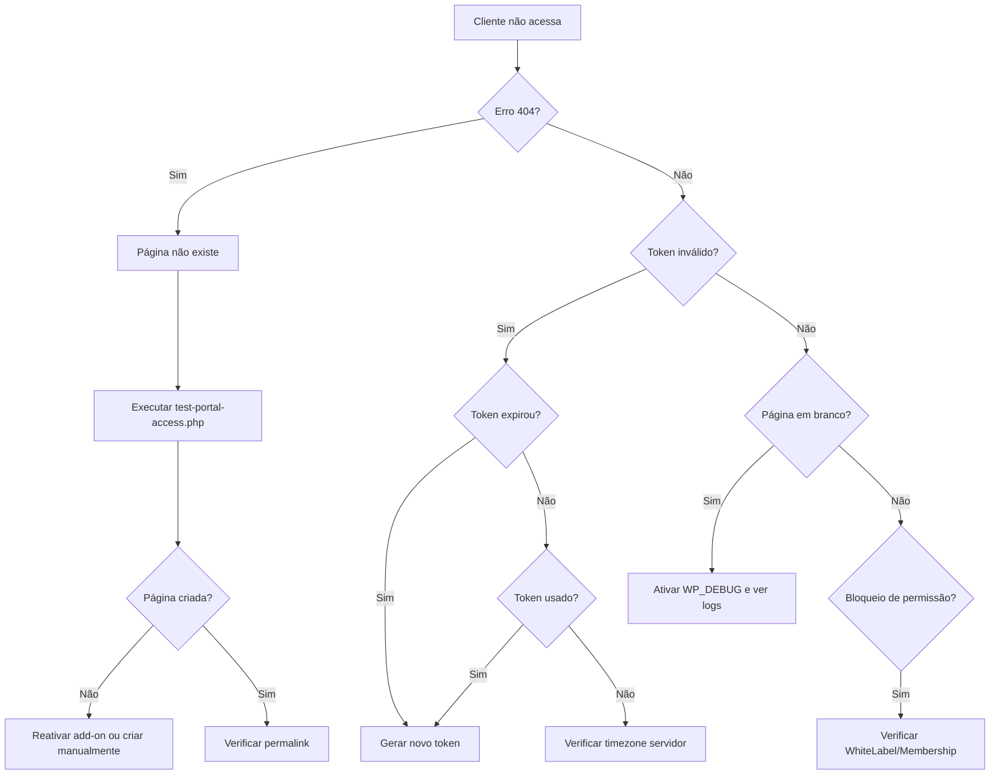

# Guia de Diagnóstico: Problemas de Acesso ao Portal do Cliente

**Autor:** PRObst  
**Data:** 2024-12-08  
**Versão:** 2.4.1

## Visão Geral

Este guia ajuda a diagnosticar e resolver problemas quando clientes não conseguem acessar o Portal do Cliente usando links de autenticação (magic links).

## Sintomas Comuns

### 1. "Página não encontrada" (404)

**Sintoma:** Ao clicar no link `?dps_token=...`, o WordPress exibe erro 404.

**Causas Possíveis:**
- Página do portal não existe
- Página foi deletada ou está na lixeira
- Permalink está incorreto

**Solução:**

```bash
# Opção 1: Via WP-CLI
wp eval-file plugins/desi-pet-shower-client-portal/test-portal-access.php

# Opção 2: Reativar o add-on (dispara criação automática)
wp plugin deactivate desi-pet-shower-client-portal
wp plugin activate desi-pet-shower-client-portal

# Opção 3: Verificar manualmente
wp post list --post_type=page --s="Portal do Cliente" --format=table
```

**Criação Manual:**
1. Acesse **Páginas → Adicionar Nova**
2. Título: "Portal do Cliente"
3. Slug: `portal-do-cliente`
4. Conteúdo: `[dps_client_portal]`
5. Publicar
6. Copie o ID da página
7. Acesse **Portal do Cliente → Configurações**
8. Selecione a página criada
9. Salvar

### 2. Link mostra "Token inválido"

**Sintoma:** Página carrega mas exibe mensagem "Esse link não é mais válido".

**Causas Possíveis:**
- Token expirou (padrão: 30 minutos)
- Token já foi usado (single-use)
- Token foi revogado manualmente
- Problema de timezone no servidor

**Diagnóstico:**

```sql
-- Verificar tokens do cliente (substitua 123 pelo ID)
SELECT 
    id,
    type,
    created_at,
    expires_at,
    used_at,
    revoked_at,
    TIMESTAMPDIFF(MINUTE, NOW(), expires_at) as minutes_remaining
FROM wp_dps_portal_tokens
WHERE client_id = 123
ORDER BY created_at DESC
LIMIT 10;
```

**Solução:**
1. Gere um novo link em **Portal do Cliente → Logins**
2. Envie o novo link ao cliente
3. Se problema persistir, verificar timezone do servidor:
   ```bash
   wp option get timezone_string
   wp option get gmt_offset
   ```

### 3. Página em branco após autenticação

**Sintoma:** Link autentica mas portal mostra página em branco.

**Causas Possíveis:**
- Erro fatal em PHP
- Shortcode removido da página
- Conflito com tema ou plugin

**Diagnóstico:**

```bash
# Ativar debug
wp config set WP_DEBUG true --raw
wp config set WP_DEBUG_LOG true --raw

# Acessar o portal e verificar logs
tail -f wp-content/debug.log

# Verificar se página tem shortcode
wp post get $(wp option get dps_portal_page_id) --field=post_content
```

**Solução:**
1. Verifique `wp-content/debug.log` para erros
2. Confirme que a página contém `[dps_client_portal]`
3. Teste com tema padrão (Twenty Twenty-Four)
4. Desative outros plugins temporariamente

### 4. "Você não tem permissão para visualizar esta página"

**Sintoma:** Página carrega mas bloqueia acesso com mensagem de permissão.

**Causas Possíveis:**
- Plugin de membership/restriction ativo
- `.htaccess` ou regras de servidor bloqueando
- WhiteLabel Add-on com regras muito restritivas

**Solução:**

```php
// Adicionar ao wp-config.php para debug
define( 'DPS_PORTAL_DEBUG', true );

// Verificar se WhiteLabel está bloqueando
wp option get dps_whitelabel_block_visitors
wp option get dps_whitelabel_allowed_urls
```

Se WhiteLabel Add-on estiver ativo, adicione exceção:
1. Acesse **Configurações → WhiteLabel**
2. Em "URLs permitidas", adicione:
   ```
   /portal-do-cliente/*
   ```

### 5. Token não é limpo da URL (risco de segurança)

**Sintoma:** Após autenticar, o token permanece visível na barra de endereço.

**Causa:** JavaScript desabilitado ou não carregou.

**Verificação:**
```javascript
// No console do navegador
console.log(window.dpsPortal);
```

**Solução:**
- Verifique se `client-portal.js` está carregando
- Confirme que não há erros JavaScript no console
- Teste em navegador sem extensões

## Ferramentas de Diagnóstico

### Script de Teste Automatizado

Execute o script de diagnóstico completo:

```bash
# Via WP-CLI
wp eval-file plugins/desi-pet-shower-client-portal/test-portal-access.php

# Via HTTP (apenas administradores)
https://seusite.com/?dps_test_portal=1
```

**Output Esperado:**
```
=== TESTE DE CONFIGURAÇÃO DO PORTAL DO CLIENTE ===

1. Verificando página configurada...
   ✓ Página configurada (ID: 42)
   ✓ Página existe: "Portal do Cliente"
   ✓ Status: publish
   ✓ URL: https://seusite.com/portal-do-cliente/
   ✓ Shortcode [dps_client_portal] presente

2. Verificando helper de URL...
   ✓ URL retornada: https://seusite.com/portal-do-cliente/

3. Verificando tabela de tokens...
   ✓ Tabela wp_dps_portal_tokens existe
   ✓ Total de tokens: 15
   ✓ Tokens ativos: 3

4. Verificando classes necessárias...
   ✓ DPS_Client_Portal
   ✓ DPS_Portal_Token_Manager
   ✓ DPS_Portal_Session_Manager

5. Testando geração de token...
   ✓ Cliente de teste encontrado: João Silva (ID: 89)
   ✓ Token gerado com sucesso
   ✓ URL de acesso:
     https://seusite.com/portal-do-cliente/?dps_token=abc123...
   ⚠  ATENÇÃO: Este token é real e válido por 30 minutos.

=== FIM DO TESTE ===
```

### Verificações Manuais no Banco de Dados

```sql
-- 1. Verificar configuração da página
SELECT option_value 
FROM wp_options 
WHERE option_name = 'dps_portal_page_id';

-- 2. Verificar se página existe
SELECT ID, post_title, post_status, post_content 
FROM wp_posts 
WHERE ID = (SELECT option_value FROM wp_options WHERE option_name = 'dps_portal_page_id');

-- 3. Listar tokens ativos
SELECT 
    t.id,
    t.client_id,
    p.post_title as client_name,
    t.type,
    t.created_at,
    TIMESTAMPDIFF(MINUTE, NOW(), t.expires_at) as minutes_left
FROM wp_dps_portal_tokens t
LEFT JOIN wp_posts p ON p.ID = t.client_id
WHERE t.expires_at > NOW()
  AND t.used_at IS NULL
  AND t.revoked_at IS NULL
ORDER BY t.created_at DESC;

-- 4. Ver histórico de acessos (últimos 24h)
SELECT 
    t.client_id,
    p.post_title as client_name,
    t.used_at as access_time,
    t.ip_created
FROM wp_dps_portal_tokens t
LEFT JOIN wp_posts p ON p.ID = t.client_id
WHERE t.used_at > DATE_SUB(NOW(), INTERVAL 24 HOUR)
ORDER BY t.used_at DESC;
```

## Avisos do Painel Administrativo

A partir da versão 2.4.1, o sistema exibe avisos automáticos no admin WordPress quando detecta problemas:

### Aviso: "Página não configurada"
```
Portal do Cliente: Nenhuma página configurada. Configure agora ou crie uma página 
com o shortcode [dps_client_portal].
```

**Ação:** Clique em "Configure agora" e selecione uma página.

### Erro: "Página não existe mais"
```
Portal do Cliente: A página configurada (ID #42) não existe mais. 
Configure uma nova página.
```

**Ação:** A página foi deletada. Crie uma nova ou selecione outra existente.

### Aviso: "Página não está publicada"
```
Portal do Cliente: A página "Portal do Cliente" não está publicada. Publicar agora.
```

**Ação:** Clique em "Publicar agora" para tornar a página pública.

### Erro: "Página sem shortcode"
```
Portal do Cliente: A página "Portal do Cliente" não contém o shortcode [dps_client_portal]. 
Adicionar shortcode agora.
```

**Ação:** Clique em "Adicionar shortcode agora" para editar a página e inserir o shortcode.

## Fluxo de Resolução de Problemas



## Checklist de Verificação Completa

Use esta checklist para diagnosticar problemas de acesso ao portal:

- [ ] **Página do Portal**
  - [ ] Página existe e está publicada
  - [ ] Slug é `portal-do-cliente` ou similar
  - [ ] Contém shortcode `[dps_client_portal]`
  - [ ] ID da página está em `dps_portal_page_id` option

- [ ] **Token de Acesso**
  - [ ] Token foi gerado corretamente
  - [ ] Token não expirou (< 30 min)
  - [ ] Token não foi usado antes
  - [ ] Token não foi revogado

- [ ] **Tabela de Tokens**
  - [ ] Tabela `wp_dps_portal_tokens` existe
  - [ ] Índices estão criados
  - [ ] Permissões de acesso ao banco OK

- [ ] **Classes e Add-on**
  - [ ] Add-on está ativo
  - [ ] Não há erros fatais em PHP
  - [ ] Classes carregadas: `DPS_Client_Portal`, `DPS_Portal_Token_Manager`, `DPS_Portal_Session_Manager`

- [ ] **Servidor e WordPress**
  - [ ] PHP >= 7.4
  - [ ] WordPress >= 6.0
  - [ ] Timezone configurado corretamente
  - [ ] Sessões PHP habilitadas
  - [ ] Cookies habilitados no navegador

- [ ] **Conflitos**
  - [ ] Tema compatível (teste com padrão)
  - [ ] Sem conflitos com outros plugins
  - [ ] WhiteLabel permite acesso a `/portal-do-cliente/`
  - [ ] `.htaccess` não bloqueia

## Contato para Suporte

Se após seguir este guia o problema persistir:

1. **Colete informações:**
   - Output do `test-portal-access.php`
   - Screenshot do erro
   - Conteúdo de `wp-content/debug.log`
   - Versão do WordPress, PHP e add-on

2. **Abra uma issue no repositório com:**
   - Título descritivo: "Portal: [descrição do problema]"
   - Informações coletadas no passo 1
   - Passos para reproduzir

3. **Ou entre em contato:**
   - E-mail: suporte@probst.pro
   - Site: www.probst.pro

## Changelog deste Guia

- **2024-12-08**: Versão inicial (v2.4.1) - Criado após implementação de criação automática de página e verificações administrativas
