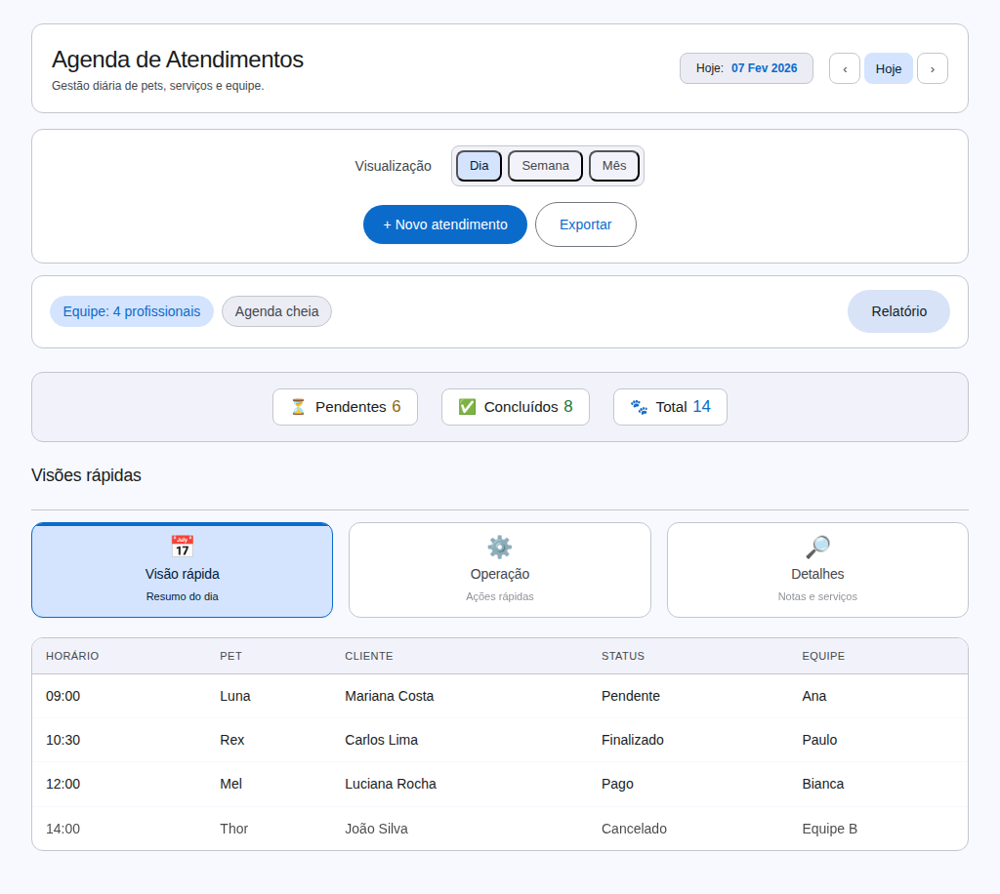
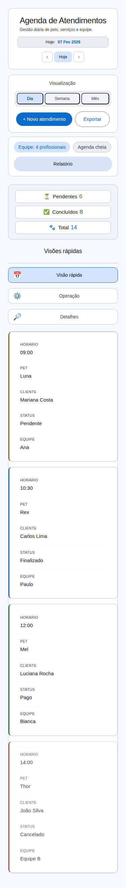

# Rebranding da Agenda — Registro Visual

## Contexto
- **Tela:** Agenda (admin)
- **Objetivo:** Registrar o novo visual alinhado à identidade M3 Expressive do DPS.
- **Data:** 2026-02-09
- **Fonte:** `plugins/desi-pet-shower-agenda/assets/css/agenda-addon.css`

## Viewports
- Desktop: 1440×900
- Tablet: 1024×768
- Mobile: 375×812

## Capturas

### Desktop — Visão geral

> **Nota:** o arquivo no repositório é um placeholder textual para evitar incompatibilidade com binários. A captura real fica registrada nos artifacts do build.

### Tablet — Tabs e tabela

> **Nota:** o arquivo no repositório é um placeholder textual para evitar incompatibilidade com binários. A captura real fica registrada nos artifacts do build.

### Mobile — Cartões responsivos

> **Nota:** o arquivo no repositório é um placeholder textual para evitar incompatibilidade com binários. A captura real fica registrada nos artifacts do build.

## Observações
- Capturas geradas a partir do arquivo de demo em `docs/screenshots/agenda-rebranding.html` com os estilos oficiais do add-on.
