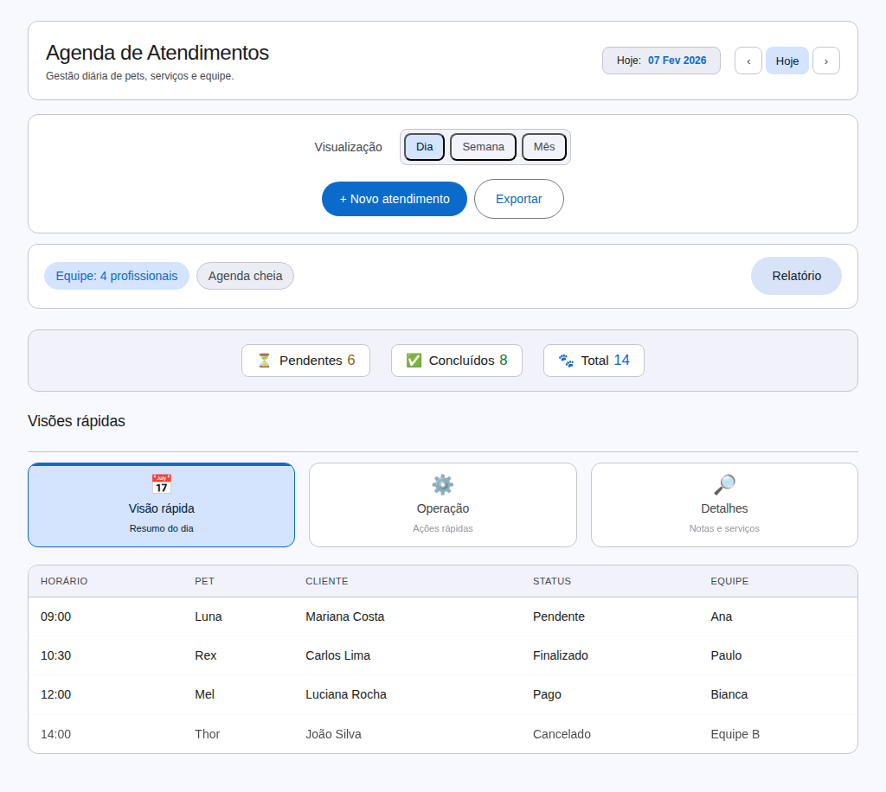

# Rebranding da Agenda — Registro Visual

## Contexto
- **Tela:** Agenda (admin)
- **Objetivo:** Registrar o novo visual alinhado à identidade DPS Signature do DPS.
- **Data:** 2026-02-09
- **Fonte:** `plugins/desi-pet-shower-agenda/assets/css/agenda-addon.css`

## Viewports
- Desktop: 1440×900
- Tablet: 1024×768
- Mobile: 375×812

## Capturas

### Desktop — Visão geral

### Tablet — Tabs e tabela

### Mobile — Cartões responsivos

## Observações
- Capturas geradas a partir do arquivo de demo em `docs/screenshots/agenda-rebranding.html` com os estilos oficiais do add-on.
