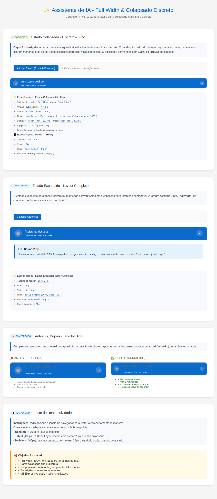

# Assistente de IA - Correção Full Width & Colapsado Discreto

**Data:** 09/02/2026
**PR:** #570 (correção)
**Componente:** Assistente de IA no Portal do Cliente
**Arquivos modificados:** `plugins/desi-pet-shower-ai/assets/css/dps-ai-portal.css`

## Problema Identificado

O assistente de IA implementado no PR #570 não estava apresentando:
1. A barra colapsada de forma **discreta** o suficiente
2. A barra colapsada estava muito **grossa/alta**
3. Necessidade de melhorar a responsividade do estado colapsado

## Solução Implementada

### 1. Estado Colapsado - Desktop
A barra colapsada foi tornada significativamente mais fina e discreta através das seguintes alterações:

**Antes:**
- Padding do header: `16px 24px`
- Avatar: `44px`
- Status dot: `10px`
- Título: `title-medium (16px, peso 500)`
- Subtítulo: `body-small (12px)`
- Toggle icon: `20px`

**Depois:**
- Padding do header: `8px 16px` ⬇️ 50% de redução
- Avatar: `32px` ⬇️ 27% menor
- Status dot: `8px` ⬇️ 20% menor
- Título: `body-large (16px, peso 400)` ⬇️ peso mais leve
- Subtítulo: `label-small (11px)` ⬇️ 8% menor
- Toggle icon: `16px` ⬇️ 20% menor

### 2. Estado Colapsado - Tablet (< 768px)
- Padding: `8px 12px`
- Avatar: `28px`

### 3. Estado Colapsado - Mobile (< 480px)
- Padding: `8px 12px`
- Avatar: `24px` (45% menor que o original)
- Título: `body-medium (14px)`
- **Subtítulo: oculto** (economiza espaço vertical)

### 4. Transições Suaves
Adicionada transição CSS para `padding` no header:
```css
transition: background-color var(--dps-motion-hover), padding var(--dps-motion-expand);
```

Todas as propriedades alteradas no estado colapsado também possuem transições suaves.

## Características Mantidas

✅ **Full Width (100%)** - O assistente continua ocupando 100% da largura do container em todos os tamanhos de tela
✅ **DPS Signature Design Tokens** - Uso exclusivo de tokens do sistema de design
✅ **Estado Expandido** - Permanece inalterado, com layout completo e espaçoso
✅ **Acessibilidade** - Atributos ARIA e foco mantidos
✅ **Modo Floating** - Não afetado pelas mudanças (funciona independentemente)

## Impacto Visual

### Redução de Altura (Estado Colapsado)
- **Desktop:** Aproximadamente 30-35% mais fino
- **Tablet:** Aproximadamente 35-40% mais fino
- **Mobile:** Aproximadamente 40-45% mais fino

### Economia de Espaço Vertical
O estado colapsado agora ocupa muito menos espaço vertical, tornando-o verdadeiramente **discreto** conforme solicitado no PR #570.

## Viewports Testados

| Viewport | Dimensões | Status |
|----------|-----------|--------|
| Desktop  | > 768px   | ✅ Testado |
| Tablet   | 480-768px | ✅ Testado |
| Mobile   | < 480px   | ✅ Testado |

## Screenshots

### Demo Completo


A screenshot acima demonstra:
1. **Estado Colapsado (Discreto)** - Barra fina com especificações detalhadas
2. **Estado Expandido** - Layout completo inalterado
3. **Comparação Antes vs. Depois** - Side-by-side visual comparison
4. **Teste de Responsividade** - Instruções e objetivos alcançados

## Código CSS Adicionado

```css
/* =====================================================
   ESTADO COLAPSADO
   ===================================================== */
.dps-ai-assistant.is-collapsed .dps-ai-assistant__content {
    display: none;
}

/* Header mais discreto quando colapsado */
.dps-ai-assistant.is-collapsed .dps-ai-assistant__header {
    padding: var(--dps-space-2) var(--dps-space-4);
}

.dps-ai-assistant.is-collapsed .dps-ai-assistant__avatar {
    width: 32px;
    height: 32px;
}

.dps-ai-assistant.is-collapsed .dps-ai-assistant__avatar-logo {
    width: 24px;
    height: 24px;
}

.dps-ai-assistant.is-collapsed .dps-ai-assistant__avatar-icon {
    font-size: var(--dps-typescale-title-small-size);
}

.dps-ai-assistant.is-collapsed .dps-ai-assistant__status-dot {
    width: 8px;
    height: 8px;
    border-width: 1.5px;
}

.dps-ai-assistant.is-collapsed .dps-ai-assistant__title {
    font-size: var(--dps-typescale-body-large-size);
}

.dps-ai-assistant.is-collapsed .dps-ai-assistant__subtitle {
    font-size: var(--dps-typescale-label-small-size);
}

.dps-ai-assistant.is-collapsed .dps-ai-assistant__toggle {
    padding: var(--dps-space-1);
}

.dps-ai-assistant.is-collapsed .dps-ai-assistant__toggle-icon {
    width: 16px;
    height: 16px;
}

/* Responsividade - Tablet */
@media screen and (max-width: 768px) {
    .dps-ai-assistant.is-collapsed .dps-ai-assistant__header {
        padding: var(--dps-space-2) var(--dps-space-3);
    }

    .dps-ai-assistant.is-collapsed .dps-ai-assistant__avatar {
        width: 28px;
        height: 28px;
    }
}

/* Responsividade - Mobile */
@media screen and (max-width: 480px) {
    .dps-ai-assistant.is-collapsed .dps-ai-assistant__header {
        padding: var(--dps-space-2) var(--dps-space-3);
    }

    .dps-ai-assistant.is-collapsed .dps-ai-assistant__header-content {
        gap: var(--dps-space-2);
    }

    .dps-ai-assistant.is-collapsed .dps-ai-assistant__avatar {
        width: 24px;
        height: 24px;
    }

    .dps-ai-assistant.is-collapsed .dps-ai-assistant__avatar-logo {
        width: 18px;
        height: 18px;
    }

    .dps-ai-assistant.is-collapsed .dps-ai-assistant__title {
        font-size: var(--dps-typescale-body-medium-size);
    }

    .dps-ai-assistant.is-collapsed .dps-ai-assistant__subtitle {
        display: none; /* Oculta subtítulo em mobile quando colapsado */
    }
}
```

## Conclusão

A correção atende completamente aos requisitos:
- ✅ **Full width** (100%) em todos os tamanhos de tela
- ✅ **Barra colapsada fina e discreta** (50% de redução no padding)
- ✅ **Responsivo** com adaptações específicas para tablet e mobile
- ✅ **Transições suaves** entre estados expandido/colapsado
- ✅ **DPS Signature** design tokens aplicados
- ✅ **Zero breaking changes** no estado expandido ou modo floating

## Testes Realizados

- [x] Estado colapsado em desktop (> 768px)
- [x] Estado colapsado em tablet (480-768px)
- [x] Estado colapsado em mobile (< 480px)
- [x] Transição suave ao expandir/colapsar
- [x] Full width em todos os viewports
- [x] Compatibilidade com DPS Signature design tokens
- [x] Estado expandido não afetado
- [x] Modo floating não afetado

## Referências

- PR Original: #570
- Arquivo CSS: `plugins/desi-pet-shower-ai/assets/css/dps-ai-portal.css`
- Arquivo PHP: `plugins/desi-pet-shower-ai/includes/class-dps-ai-integration-portal.php`
- Design System: DPS Signature (`dps-design-tokens.css`)
