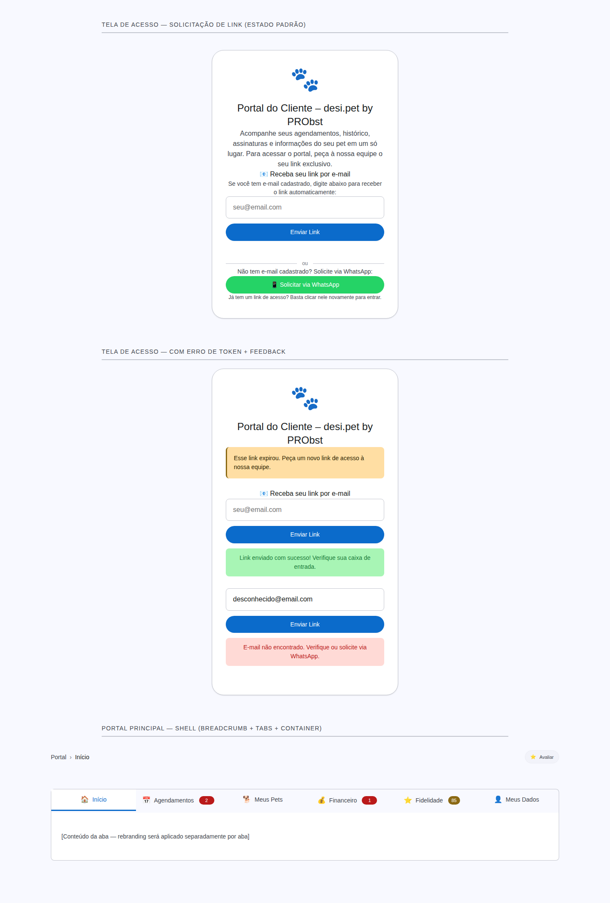

# Rebranding do Portal do Cliente — Registro Visual

## Contexto
- **Tela:** Portal do Cliente (tela de acesso + shell principal)
- **Objetivo:** Registrar o novo visual alinhado à identidade M3 Expressive do DPS, cobrindo a página de acesso (login link request) e o shell do portal (breadcrumb, tabs, container).
- **Data:** 2026-02-09
- **Fonte:** `plugins/desi-pet-shower-client-portal/assets/css/client-portal.css`

## Mudanças realizadas

### Tela de Acesso (Access Page)
- `font-weight: 600` → `var(--dps-typescale-*-weight)` (400 para headline, 500 para labels/botões)
- `#ffffff` → `var(--dps-color-on-primary)` em botões e elementos sobre primary
- Hardcoded `14px` → `var(--dps-typescale-body-medium-size)` em mensagens de erro
- Alert pattern: `border: 1px solid + border-left: 4px` → `border-left: 3px solid` (padrão M3 `.dps-alert`)
- Hardcoded px spacing (`12px`, `16px`, `24px`, `28px`, `40px`) → tokens `var(--dps-space-*)`

### Shell do Portal (Portal Main Page)
- Título H1: `font-size: 24px; font-weight: 600` → `var(--dps-typescale-headline-small-size/weight)`
- Breadcrumb: `font-size: 14px` → `var(--dps-typescale-body-medium-size)`, `font-weight: 600` → `500`
- Review link: `font-size: 13px` → `var(--dps-typescale-label-small-size)`
- Tabs: `font-size: 14px` → `var(--dps-typescale-body-medium-size)`, `font-weight: 600` (active) → `500`
- Tab icon: `font-size: 18px` → `var(--dps-typescale-title-medium-size)`
- Badge: `font-size: 11px; font-weight: 700; #fff` → `var(--dps-typescale-label-small-size); 500; var(--dps-color-on-primary)`
- Tab content padding: `24px` → `var(--dps-space-6)`
- Nav link hover: `#fff` → `var(--dps-color-on-primary)`
- Hardcoded px gaps/paddings → `var(--dps-space-*)` tokens

### Exceções intencionais
- WhatsApp brand colors (`#25d366`, `#1fb355`) mantidos — não há token DPS para cores de terceiros
- Logo emoji `font-size: 56px` mantido — não há token de typescale para emojis decorativos

## Escopo
- ✅ Tela de acesso (solicitação de link) — **completo**
- ✅ Shell do portal (breadcrumb, tabs, container) — **completo**
- ❌ Conteúdo interno das abas — **fora de escopo** (será feito em passes separados)

## Viewports
- Desktop: 1440×900

## Telas capturadas

| Página/Área | Descrição | Data | Imagem | Status | Notas |
|---|---|---|---|---|---|
| Tela de Acesso (padrão) | Formulário de solicitação de link por email + WhatsApp | 2026-02-09 | [Screenshot](assets/client-portal-rebranding/client-portal-desktop.png) | Completo | Todos tokens M3, zero hex hardcoded (exceto WhatsApp brand) |
| Tela de Acesso (erro + feedback) | Token expirado + feedback sucesso/erro | 2026-02-09 | [Screenshot](assets/client-portal-rebranding/client-portal-desktop.png) | Completo | Alert M3 border-left:3px pattern |
| Portal Shell (breadcrumb + tabs) | Navegação principal com badges | 2026-02-09 | [Screenshot](assets/client-portal-rebranding/client-portal-desktop.png) | Completo | Tabs com typescale tokens, badge weight 500 |

## Capturas

### Desktop (1440×900) — Todas as telas

## Observações
- Capturas geradas a partir do arquivo de demo em `docs/screenshots/client-portal-rebranding.html` com os estilos oficiais do add-on (`client-portal.css` + `dps-design-tokens.css`).
- O CSS do portal já possuía mapeamento de tokens M3 semânticos (variáveis intermediárias como `--dps-gray-*`, `--dps-primary`). O rebranding focou em: (1) eliminar `font-weight: 600/700` em favor de tokens weight, (2) substituir hex hardcoded por tokens de cor, (3) substituir px hardcoded por tokens de espaçamento/tipografia, e (4) corrigir o padrão de alerta M3.
- Conteúdo interno das abas mantém estilos anteriores — será rebranded em passes individuais por aba.
