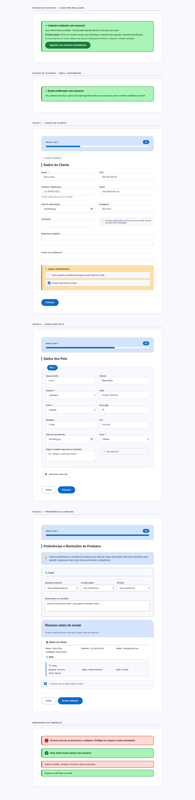
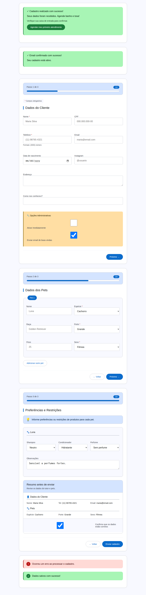

# Rebranding do Formulário de Cadastro — Registro Visual

## Contexto
- **Tela:** Formulário de cadastro público (shortcode `dps_registration_form`)
- **Objetivo:** Registrar o novo visual alinhado à identidade DPS Signature do DPS, eliminando estilos inline com cores hex hardcoded.
- **Data:** 2026-02-09
- **Fonte:** `plugins/desi-pet-shower-registration/assets/css/registration-addon.css`

## Mudanças realizadas
- Substituição de todas as cores hex hardcoded por tokens DPS Signature (`var(--dps-*)`)
- Criação de classes CSS semânticas: `.dps-reg-success`, `.dps-reg-message--error/--success`, `.dps-admin-options__title`
- Remoção de bloco `<style>` inline redundante (já coberto por regras CSS grid)
- Remoção de estilos inline em pet fieldsets (`style="border:1px solid #ddd"`)
- Mensagens de feedback (fallback) migradas de inline para classes CSS
- Alinhamento com `docs/visual/FRONTEND_DESIGN_INSTRUCTIONS.md` e `VISUAL_STYLE_GUIDE.md`:
  - `font-weight`: 700/600 → 500 (DPS Signature permite apenas 400 e 500)
  - Font-sizes base: px → `var(--dps-typescale-*)`
  - Espaçamentos: px → `var(--dps-space-*)`
  - Alertas: `border: 2px + border-left: 5px` → `border-left: 3px solid` (padrão `.dps-alert`)
  - Remoção de `letter-spacing` negativo (não DPS Signature)
  - Estilos inline PHP (`style="flex:1 1 100%"`) → classes CSS (`dps-field-full`)

## Viewports
- Desktop: 1440×900
- Tablet: 1024×768
- Mobile: 375×812

## Telas capturadas

Todas as telas do formulário de cadastro público (shortcode `dps_registration_form`):

1. **Estado de Sucesso** — Cadastro realizado com sucesso + CTA "Agendar"
2. **Email Confirmado** — Confirmação via link de email
3. **Passo 1 — Dados do Cliente** — Campos do tutor (nome, CPF, telefone, email, etc.) + opções administrativas
4. **Passo 2 — Dados dos Pets** — Fieldsets de pets com grid 2 colunas + botão "Adicionar outro pet"
5. **Passo 3 — Preferências e Resumo** — Preferências de produtos por pet + resumo completo antes do envio
6. **Mensagens de Feedback** — Alertas de erro e sucesso (DPS Signature border-left pattern)

## Capturas

### Desktop (1440×900) — Todas as telas

### Tablet (1024×768) — Layout responsivo

### Mobile (375×812) — Layout mobile-first

## Observações
- Capturas geradas a partir do arquivo de demo em `docs/screenshots/registration-rebranding.html` com os estilos oficiais do add-on (`registration-addon.css` + `dps-design-tokens.css`).
- O formulário já possuía CSS DPS Signature maduro (1900+ linhas). O rebranding focou em: (1) eliminar estilos inline hardcoded no PHP, e (2) alinhar com as orientações de `docs/visual/`.
- Templates de email mantêm estilos inline intencionalmente (necessário para compatibilidade com clientes de email).
- Página de configurações admin (escopo fora do shortcode público) mantém estilos WP admin padrão.
